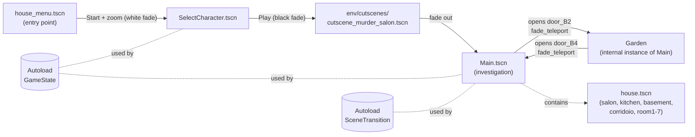
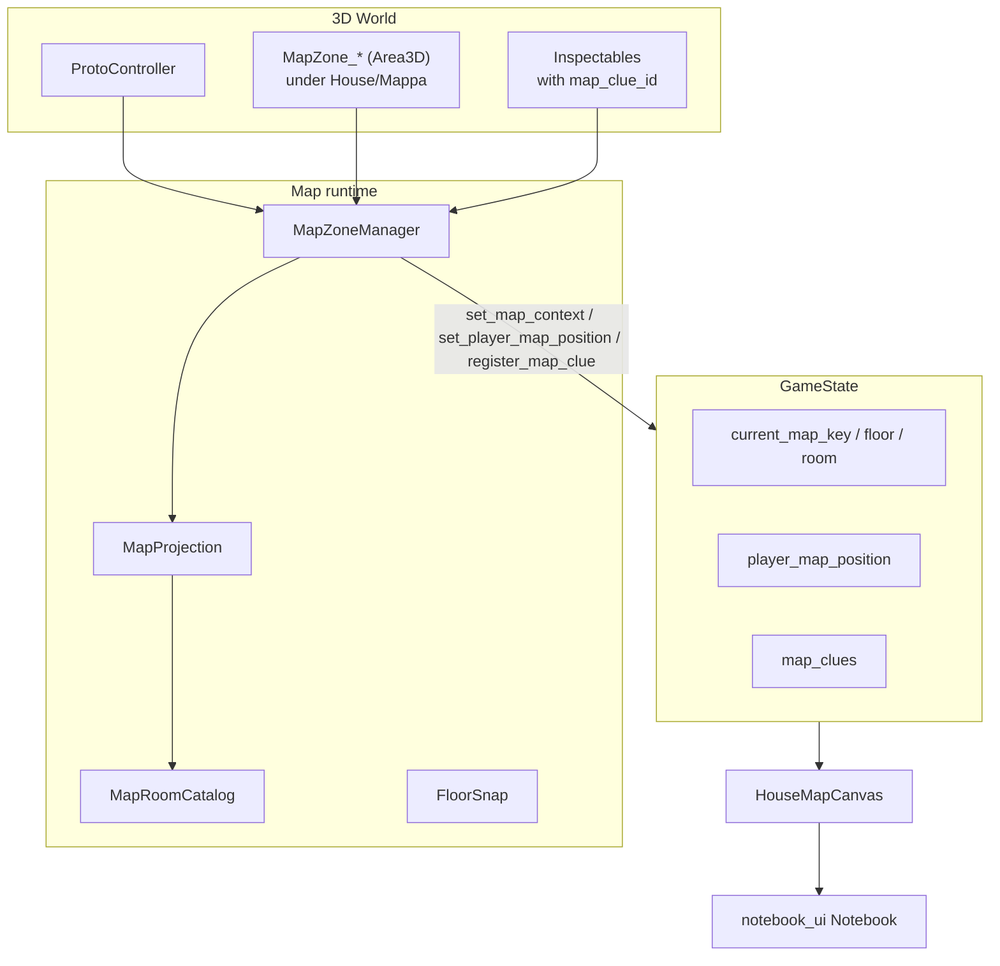
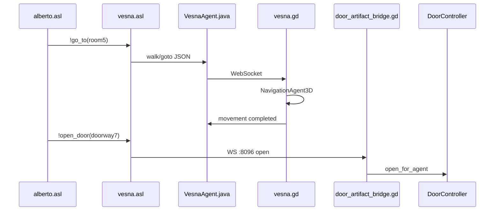
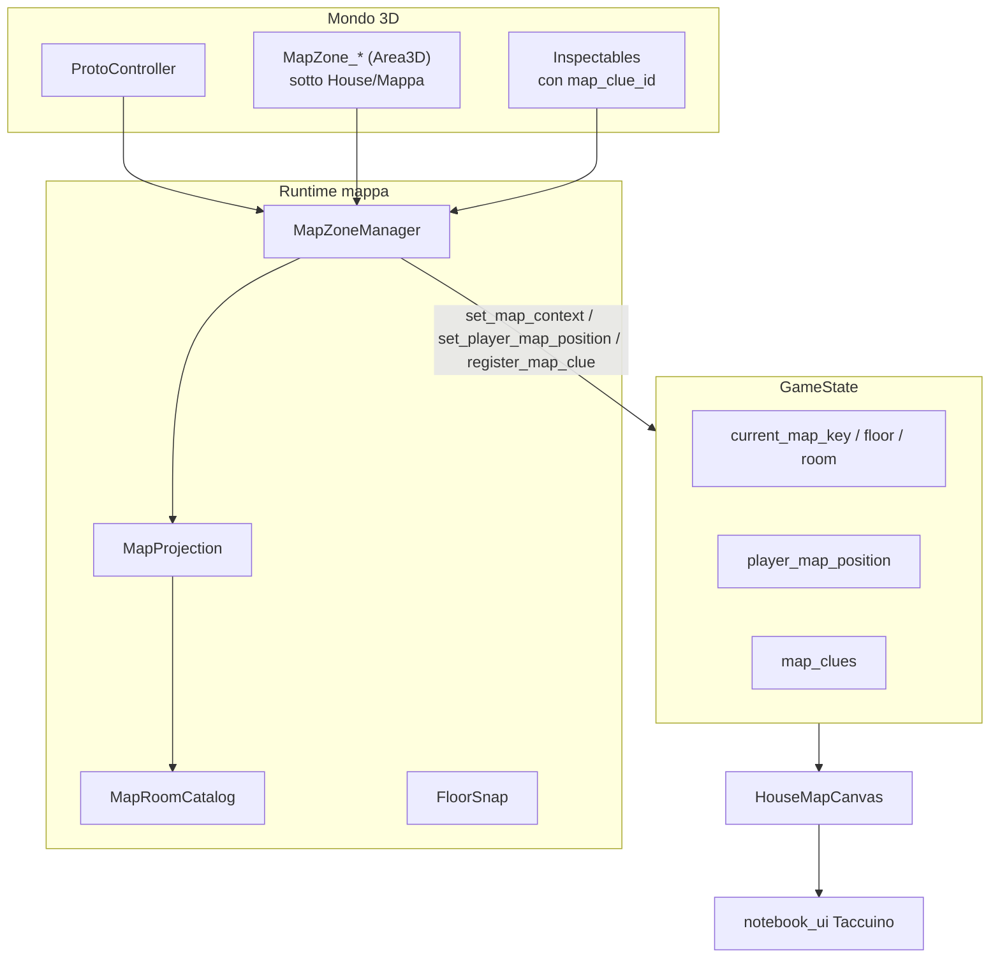

<a id="english"></a>
**🇬🇧 English** · [🇮🇹 Italiano](#italiano)

# ELABORATO — 3D Investigative Video Game Prototype

A 3D investigative video game prototype, developed with **Godot 4.6** (Forward+ renderer), built as a university internship project. The game is coupled with the `**mind/`** module (JaCaMo + **VEsNA**): four NPCs have 3D bodies in Godot driven by BDI (Belief-Desire-Intention) agents over WebSocket, with navmesh navigation, shared door opening and patrol routines.

The case revolves around a murder committed in a Victorian hotel — **Hotel Valtieri** — during its opening night. The player takes the role of the investigator and must reconstruct *who*, *with which weapon/method* and *with what motive* the crime was committed, exploring the building across three floors plus the garden, talking to the guests and inspecting clues (also via a **UV torch** that reveals hidden forensic traces).

---

## Table of contents

1. [Concept and plot](#1-concept-and-plot)
2. [Narrative design and solution (spoilers)](#2-narrative-design-and-solution-spoilers)
3. [General architecture](#3-general-architecture)
4. [Current state of the prototype](#4-current-state-of-the-prototype)
5. [Scene flow](#5-scene-flow)
6. [Controls](#6-controls)
7. [Characters and NPCs](#7-characters-and-npcs)
8. [Interaction system and UV torch](#8-interaction-system-and-uv-torch)
9. [Map and Localization subsystem](#9-map-and-localization-subsystem)
10. [Investigative UI overlay — Notebook](#10-investigative-ui-overlay--notebook)
11. [Autoload and global systems](#11-autoload-and-global-systems)
12. [Clue catalog](#12-clue-catalog)
13. [Project tree structure](#13-project-tree-structure)
14. [Key files — script table](#14-key-files--script-table)
15. [Technical architecture and design patterns](#15-technical-architecture-and-design-patterns)
16. [Repository cleanup](#16-repository-cleanup-june-2026)
17. [Project documents](#17-project-documents)
18. [JaCaMo / VEsNA integration](#18-jacamo--vesna-integration)
19. [How to run](#19-how-to-run)
20. [Next steps](#20-next-steps)
21. [ChatBDI dialogue (NPC + Game Master)](#21-chatbdi-dialogue-npc--game-master)
22. [Known issues (LLM models and routing)](#22-known-issues-llm-models-and-routing)

---

## 1. Concept and plot

In a **Victorian hotel** (**Hotel Valtieri**), on its opening night, a **murder** is committed. The player takes the role of the investigator in charge of the case and must discover **three things**:

1. **Who** the killer is, among the guests present.
2. **Which weapon / method** was used to commit the crime.
3. **What motive** drove the culprit to act.

### Core game mechanics

The investigation unfolds through three fundamental mechanics:

- **Dialogue with NPCs**: each non-player character tells their own version of the facts. Testimonies can be contradictory or incomplete. The text of every dialogue is automatically saved in the player's **Notebook**.
- **Object inspection**: the player can approach objects in the scene (clues, personal effects, furnishings), press the interaction key `E` and examine them up close in a **close-up, lit 3D view**.
- **Forensic investigation with the UV torch**: holding the **right mouse button** the player activates an ultraviolet torch that reveals otherwise invisible traces (fingerprints, liquid halos, stains). Some clues exist *only* under UV light; others reveal an **additional detail** under UV during close-up inspection.

The gathered clues are recorded and geolocated on an **interactive hotel map** (a Notebook tab) showing the floors, the rooms, the player's live position and the points where the clues were found.

### Multi-agent integration status

The prototype combines **Godot investigation** (FPS movement, clues, notebook, map) with **JaCaMo agents** in `[../mind/](../mind/README.md)`: each suspect under `Main/NPC` exposes a WebSocket server (`vesna.gd`) connected to the MAS; Alberto runs reactive patrol and clue-related missions, the other three agents do random patrol.

The **dialogues are in natural language** through the **ChatBDI** layer (via Ollama: **generation on Ollama Cloud**, **local embedding**): the player interrogates the four NPCs by typing in English and receives answers generated from each agent's belief base. There is also a **Game Master** agent (**ESC** key) to which you submit the **final accusation** (who/what/why): if it is at least 70% correct it reveals the full solution. Details in [§21](#21-chatbdi-dialogue-npc--game-master); limitations due to small LLM models in [§22](#22-known-issues-llm-models-and-routing).

---

## 2. Narrative design and solution (spoilers)

> This section documents the **canonical narrative design** of the case. **It contains the solution to the mystery**: it is meant for thesis documentation, not for the player.

### 2.1 — Cast and narrative roles

The characters have **fixed names and roles**, independent of the 3D model chosen by the player. If the player selects the default model associated with a role, that role is assigned to another model: **the story does not change**.

| Role          | Name                 | Narrative function                                                            |
| ------------- | -------------------- | ----------------------------------------------------------------------------- |
| **Victim**    | **Aurelio Valtieri** | Owner of the hotel, founder of a healthcare foundation                        |
| **KILLER**    | **Alberto Mori**     | Family doctor and childhood friend; manager of the foundation's funds         |
| Wife          | **Evelina Valtieri** | Marriage of convenience; discovers the imminent divorce                       |
| Manager       | **Clarissa Vance**   | Trusted employee; secretly in love with Evelina                               |
| Architect     | **Vittorio Serra**   | Old-time friend; blackmailed by Aurelio over a past structural mistake        |

### 2.2 — Motives

- **Alberto** — gambling debts; he embezzled millions from the healthcare foundation's funds. Aurelio found out **that very evening** and intends to report him after the opening.
- **Vittorio** — years earlier a structural mistake of his caused a collapse; Aurelio was blackmailing him.
- **Evelina** — discovers that Aurelio wants to divorce her leaving her with nothing (prenuptial agreement).
- **Clarissa** — despises Aurelio for how he treats her and Evelina.

### 2.3 — Solution of the case

| Item                            | Answer                                                                                                                            |
| ------------------------------- | ----------------------------------------------------------------------------------------------------------------------------------- |
| **Who**                         | Alberto Mori                                                                                                                        |
| **Weapon / method**             | Poisoning with **digitalis** in the brandy + interruption of the cardiac therapy (theft and emptying of the **nadolol** bottle) |
| **Motive**                      | Embezzlement of the foundation's funds discovered; imminent report                                                                  |
| **Place of death / body found** | Salon                                                                                                                              |

### 2.4 — Timeline of the murder night

| Time  | Event                                                                                                       |
| ----- | ------------------------------------------------------------------------------------------------------------ |
| 20:00 | Dinner and toast in the salon. Glasses left on the side table.                                              |
| 21:00 | Evelina in her room: letter and lipstick from Clarissa. They fall asleep together.                          |
| 21:15 | Alberto asks Clarissa for the master key; goes to the kitchen (digitalis traces, prints on the kitchen key). |
| 21:25 | Alberto in the basement: opens the trunk, takes the contract, hides the vial.                               |
| 21:35 | Alberto at Aurelio's: makes him drink the poisoned brandy; steals the nadolol bottle; forgets the lighter.  |
| 21:40 | Alberto in Evelina's room: tears up the contract into the bin; Evelina sees him hazily.                     |
| 21:45 | Alberto flushes the pills down the WC; crosses Vittorio in the corridor.                                    |
| 21:50 | Aurelio feels unwell; argues with Vittorio in the salon; Vittorio goes out into the garden (mud, umbrella). |
| 21:55 | Aurelio collapses in the salon.                                                                             |
| 22:05 | Vittorio comes back from the garden and finds the body.                                                     |

### 2.5 — Deductive chain

```text
AURELIO'S DIARY (Alberto steals the funds)        → Immediate motive
KITCHEN DIGITALIS TRACES + BASEMENT VIAL          → Poison prepared in the hotel
AURELIO'S BRANDY GLASSES [UV] + EMPTY BOTTLE      → Administered in the suite
PILLS IN THE WC [UV]                              → Interruption of cardiac therapy
MASTER KEY + ALBERTO'S KITCHEN KEY                → Alberto's nighttime access
TORN CONTRACT (Evelina's room)                    → Alberto in his wife's room (not Clarissa)
MUD PRINTS (kitchen / garden / Vittorio)          → Vittorio has a weak alibi consistent with the rain, not with the poison
FORGOTTEN LIGHTER [UV]                             → Left-hand fingerprint → Alberto
```

---

## 3. General architecture

The project is structured with a clear separation between layers:

| Layer                      | Responsibility                                                  | Technology                                                           |
| -------------------------- | --------------------------------------------------------------- | -------------------------------------------------------------------- |
| **Presentation**           | 3D scenes, UI overlays, visual effects                          | Godot SceneTree, CanvasLayer                                         |
| **Game logic**             | NPCs, inspection, dialogue, doors, UV torch, transitions        | GDScript (RefCounted + Autoload)                                     |
| **Localization / Map**     | Room/floor recognition, 3D→2D projection, clue dots             | `scripts/map/*` (MapZone, MapProjection, MapRoomCatalog, FloorSnap)  |
| **Global state**           | Chosen character, victim, notebook, map context, clues          | `GameState` (Autoload)                                               |
| **Transitions**            | Fade-in/out between scenes, teleport with fade, return spawn    | `SceneTransition` (Autoload)                                         |
| **VEsNA agents / bodies**  | NPC navigation, JaCaMo doors, room signals → MAS                | `[vesna/vesna.gd](vesna/vesna.gd)` + `[../mind/](../mind/README.md)` |
| **3D assets**              | Character models, environments, animations                      | GLTF/GLB with Rig_Medium, KayKit, Kenney                            |

The game environment is made of a single scene, `[Main.tscn](Main.tscn)`, which instantiates the "house" (`[env/house.tscn](env/house.tscn)`). The latter assembles **all the rooms** of the hotel across four map contexts:

- **Ground floor**: Salon (crime scene), Kitchen, Bathroom, stairs
- **1st floor**: Corridor + seven rooms (Room1–Room7)
- **Basement / Cellar**: a single environment
- **Garden**: outdoor area (instantiated in `Main`, reached via fade teleport)

### Renderer and technical configuration

From `[project.godot](project.godot)`:

- **Engine**: Godot 4.6, **Forward+** renderer (volumetric lights, fog, dynamic shadows)
- **Startup scene** (`run/main_scene`): `[env/menu/house_menu.tscn](env/menu/house_menu.tscn)` (referenced via UID `uid://x6vckjcuieya`)
- **Max FPS**: 60 (`run/max_fps=60`)
- **Window resolution**: 1440 × 810 (`window/size`)
- **VSync**: disabled (`window/vsync/vsync_mode=0`)
- **Directional shadows**: 2048 px (`rendering/lights_and_shadows/directional_shadow/size`)
- **Autoload**: `GameState`, `SceneTransition`
- **Global groups** (`project.godot`): `agents`, `nav_walkable`, `nav_obstacle`, `GrabbableArtifact`, `ReleasePoint`

---

## 4. Current state of the prototype

The project is in an **advanced prototype stage**. The following features are implemented and working.

### 4.1 — Main menu

Scene: `[env/menu/house_menu.tscn](env/menu/house_menu.tscn)`

The startup screen shows a **Victorian haunted house** set in a graveyard with a Halloween atmosphere. The camera (`[env/menu/camera_3d.gd](env/menu/camera_3d.gd)`) traces a **figure-eight motion (Lissajous curve)**: horizontal oscillation `sin(t)` (amplitude ~13) and vertical `sin(2t)` (amplitude ~2), always looking at the house via `look_at`. On clicking **START** the camera runs a ~1.5 s tween toward the door (FOV → 30) with a fade over a white overlay, then changes scene to character selection.

### 4.2 — Character selection

Scene: `[env/SelectCharacter/SelectCharacter.tscn](env/SelectCharacter/SelectCharacter.tscn)`

A screen with six selectable heroes (`barbarian`, `knight`, `mage`, `ranger`, `rogue`, `rogue_hooded`) arranged in a dungeon-style room. Each character (`[env/SelectCharacter/area_3d.gd](env/SelectCharacter/area_3d.gd)`):

- Highlights an **outline shader** (`[env/SelectCharacter/Materials/outline.gdshader](env/SelectCharacter/Materials/outline.gdshader)`) on mouse hover
- On click plays the `Jump_Idle` animation, zooms the camera toward itself and shows the panel with the character's data

The **Play** button saves the choice in `GameState.select_character(id)` and starts a **black fade** (~1 s) toward the cutscene.

### 4.3 — Cinematic murder cutscene

Scene: `[env/cutscenes/cutscene_murder_salon.tscn](env/cutscenes/cutscene_murder_salon.tscn)`
Script: `[env/cutscenes/cutscene_murder_salon.gd](env/cutscenes/cutscene_murder_salon.gd)`

> Note: the cutscene lives in `env/cutscenes/` (not in `env/room/cutscenes/`).

A non-interactive cinematic sequence (~8.5 s) that introduces the crime. The cutscene **reuses the salon geometry** by loading `Main.tscn` and removing the player, `Main/NPC`, and legacy UI/NPC under salon. The direction (`[cutscene_murder_salon.gd](env/cutscenes/cutscene_murder_salon.gd)`) includes:

1. Fade from black (1.2 s) with subtitle *"A few seconds before the investigator's arrival…"*
2. Wide **orbit** around the victim (2.1 s)
3. A **shadow** (the killer) passing through the salon (0.28 s)
4. The victim's **death** (`Death_B` → blend to `Death_B_Pose`) with subtitles
5. **Close-in** on the body (1.45 s) and a final hold
6. Fade to black (1.0 s) → `Main.tscn`

The camera avoids walls via raycast (`_resolve_camera_global`). The cutscene is **skippable** by pressing `Enter` or `E`.

### 4.4 — Main investigative scene (Main)

Scene: `[Main.tscn](Main.tscn)`
Root script: `[scripts/main_intro_tutorial.gd](scripts/main_intro_tutorial.gd)`
Runtime: `[scripts/main_game_runtime.gd](scripts/main_game_runtime.gd)`

`Main.tscn` is the **playable core**. The root script handles the tutorial and startup; the game logic is delegated to `MainGameRuntime` (a nodeless `RefCounted` class, instantiated in `_ready`).

Main nodes in the scene (editor + runtime):

- **WorldEnvironment**, **DirectionalLight3D**
- **House** — instance of `[env/house.tscn](env/house.tscn)` (rooms + `Mappa` with `MapZone_*`)
- **Inspectables** — clues (`clue_inspectable.gd`)
- **ProtoController** — FPS player
- **TutorialOverlay** — initial briefing
- **Door** — KayKit doors (`door_B2`…`door_B4`, `doorway`…`doorway7`)
- **Garden** — `[env/garden/garden.tscn](env/garden/garden.tscn)`
- **NavigationRegion3D** — `Markers/`, `Regions/`, `Doors/`, `Grabbable/` (VEsNA navmesh)
- **DoorArtifactBridge** — WS server **8096** for JaCaMo doors (`[scripts/vesna/door_artifact_bridge.gd](scripts/vesna/door_artifact_bridge.gd)`)
- **NPC/** — four `CharacterBody3D` with `[vesna/vesna.gd](vesna/vesna.gd)` (Alberto, Evelina, Clarissa, Vittorio)
- **GameplayUI**, **DialogueChatUI**, **DialogueCameraView**, **NotebookUI** — overlays from `.tscn` scenes in `[ui/](ui/)` (instantiated or referenced in `Main.tscn`)

Nodes created at **runtime** by `MainGameRuntime`:

- **InspectionView**, **MapZoneManager**
- **House/Salon/VictimBody**, **ProtoController/Head/UVTorch**
- Door registration via `[door_registry.gd](scripts/navigation/door_registry.gd)`; room events toward Alberto (`send_mind_signal`)

On first launch a **4-step tutorial overlay** is shown ("DOSSIER 1/4 … 4/4", navigable with Prev/Next/Close) that blocks the player's movement until it is closed.

### 4.5 — Crime scene (Salon)

Scene: `[env/room/salon/salon.tscn](env/room/salon/salon.tscn)` (under `House/Salon`)

A classic living room with furniture, lights, wooden floor. It contains:

- The **victim** (a character with the `Death_B_Pose` animation), placed at the center by the runtime
- Up to **4 editor NPCs** under `Main/NPC` (`CharacterBody3D` + cast via `[NpcCast](scripts/npc/npc_cast.gd)`)
- Most of the "social" clues (registered under `Main/Inspectables`)

### 4.6 — Three-floor hotel

The hotel (`[env/house.tscn](env/house.tscn)`) assembles, besides the salon:

- **Kitchen** (`[env/room/kitchen/kitchen.tscn](env/room/kitchen/kitchen.tscn)`) — ground floor
- **Bathroom** — ground floor
- **Corridor** (`[env/room/hotel_rooms/corridoio/corridoio.tscn](env/room/hotel_rooms/corridoio/corridoio.tscn)`) and **seven rooms** (`[env/room/hotel_rooms/room1](env/room/hotel_rooms/room1/room1.tscn)`…`room7`) — 1st floor
- **Cellar** (`[env/room/basement/basement.tscn](env/room/basement/basement.tscn)`) — basement

The hotel rooms are **geometrically complete and walkable** (collisions from the imported meshes) but **contain no clues of their own**: all clues are centralized in `Main/Inspectables` and placed in the world in their respective rooms.

### 4.7 — Outdoor garden (Garden)

Scene: `[env/garden/garden.tscn](env/garden/garden.tscn)` (instantiated inside `Main.tscn`)

An outdoor area with the haunted house, vegetation and fences from the **KayKit_Halloween** pack. The garden is **not a separate scene**: it is included in `Main.tscn` and reached via **teleport** (`SceneTransition.fade_teleport`) by opening `door_B2`; return with `door_B4`.

### 4.8 — Scene transition system

Script (Autoload): `[scripts/scene_transition.gd](scripts/scene_transition.gd)` — registered as `SceneTransition`

Autoload (`CanvasLayer`, layer 100) that handles:

- `**fade_to(path)`** — fade-out → scene change → fade-in (used by the menus and by the deprecated standalone garden path)
- `**fade_teleport(player, world_pos, host)**` — fade-out → repositions the player (with `FloorSnap`) → MapZone re-sync → fade-in, **without changing scene** (used for garden/kitchen inside `Main`)
- **return spawn** — `set_return_spawn` / `get_return_spawn` / `clear_return_spawn`

### 4.9 — Door system

Script: `[scripts/interactions/door_controller.gd](scripts/interactions/door_controller.gd)` (`class_name DoorController`)

A reusable component that opens/closes doors by rotating the panel **180°** (tween, ~0.55 s; the same for all doors — the old special 180° case for `door_B3` has been removed). `main_game_runtime.gd` registers all the doors under `Main/Door` and assigns a `DoorController` to each, writing a `door_controller` meta on the colliders. Two measures for coexistence with the agent-driven NPCs:

- **No pushing during the animation**: the colliders that rotate with the panel have their collision **disabled while the door moves** (`_disable_moving_collision`), so the leaf does not push an NPC standing in front into the wall; it is restored at the end of the animation.
- **Robust reopening**: an open request during the auto-close (or while the door is closing) **kills the tween and reopens** immediately, avoiding the leaf getting stuck.

The player opens/closes a door:

- By pointing at it with the FPS camera (raycast from the camera, 4 m range)
- By pressing the **right mouse button** when the prompt is visible

The doors `door_B2` ("main door") and `door_B4` ("garden door") trigger the teleport to garden/kitchen via `[door_portal_service.gd](scripts/navigation/door_portal_service.gd)`.

`[door_registry.gd](scripts/navigation/door_registry.gd)` registers all the doors under `Main/Door` and exposes them to the JaCaMo bridge. When an agent opens a door via CArtAgO, the request arrives on **WS 8096** at `DoorArtifactBridge`, which invokes `DoorController.open_for_agent()` (and the portal for `door_B2`/`door_B4` also on the NPC bodies).

---

## 5. Scene flow



- **Startup scene** (`run/main_scene`): `[env/menu/house_menu.tscn](env/menu/house_menu.tscn)`
- **Autoload `GameState`** → `[scripts/game_state.gd](scripts/game_state.gd)`: keeps the chosen character, the victim, the notebook entries, the map context and the clues across scenes.
- **Autoload `SceneTransition`** → `[scripts/scene_transition.gd](scripts/scene_transition.gd)`: handles fades, teleport and return spawn.

---

## 6. Controls

Defined in the `[input]` section of `[project.godot](project.godot)`:

| Key / Input                   | Action                                                                                     | Input map name                                         |
| ----------------------------- | ----------------------------------------------------------------------------------------- | ------------------------------------------------------ |
| **W / A / S / D**             | Movement (forward/left/back/right)                                                         | `move_forward`, `move_left`, `move_back`, `move_right` |
| **Space**                     | Jump                                                                                      | `jump`                                                 |
| **Left Shift**                | Sprint                                                                                    | `sprint`                                               |
| **E**                         | Interact: NPC dialogue, object inspection, close inspection, return                        | `interact`                                             |
| **Right mouse (hold)**        | Activates the **UV torch** — if not aiming at a door; in inspection it activates UV light  | `uv_torch` (InputEventMouseButton, index 2)            |
| **Right mouse**               | Open/close the targeted door (when a door is in the crosshair)                            | — (handled in the runtime)                             |
| **Left click**                | Captures the mouse for the first-person view                                              | —                                                      |
| **ESC**                       | Releases the cursor, closes dialogue/inspection, closes clue popup and overlays            | `ui_cancel`                                            |
| **TAB**                       | Open/close the **Notebook** (with the Map tab)                                            | `open_notebook`                                        |

> **Controls note — discrepancies with previous versions:**
>
> - The map is only in the **Notebook** (TAB); there is no longer a separate map overlay on the M key.
> - In inspection **the object does not rotate** by dragging the mouse: the view is a fixed framed camera with lighting (see [§8](#8-interaction-system-and-uv-torch)).

---

## 7. Characters and NPCs

The six available hero models (`barbarian`, `knight`, `mage`, `ranger`, `rogue`, `rogue_hooded`) are in `[Assets/Characters/](Assets/Characters/)` and are instantiated as scenes in `[Assets/Scenes/](Assets/Scenes/)`. Each character-scene includes an **AnimationTree** with a StateMachine and the **Rig_Medium** from KayKit.

The `id → scene` map is defined in `[scripts/game_state.gd](scripts/game_state.gd)` in `CHARACTER_SCENES`. The **default** player is `rogue_hooded` (a guest investigator).

### Selection and role assignment

When the player chooses their character in `SelectCharacter.tscn`:

1. `GameState.select_character(id)` saves the choice in `selected_character_id` (the player's model, with no swap).
2. `GameState.get_victim_character_id()` returns the model of the **corpse of Aurelio Valtieri** (default `barbarian`; if the player chose `barbarian`, the body uses `ranger`).
3. `GameState.get_npc_cast()` returns the **four NPCs** with narrative role, `model_id` and `display_name` (e.g. «Alberto Mori»), according to the `CAST_BY_PLAYER` table (aligned with `[storia.md](storia.md)`).

| Narrative role    | Default model   | In-game name     |
| ----------------- | --------------- | ---------------- |
| Victim (Aurelio)  | `barbarian`     | Aurelio Valtieri |
| Wife              | `mage`          | Evelina Valtieri |
| Manager           | `rogue`         | Clarissa Vance   |
| Culprit           | `ranger`        | Alberto Mori     |
| Architect         | `knight`        | Vittorio Serra   |

If the player occupies a role's default model, that role falls back (`rogue_hooded`, or `ranger` for the corpse if `barbarian` was chosen). The story does not change.

> The 3D models are interchangeable: the **narrative roles** stay fixed (see [§2.1](#2-narrative-design-and-solution-spoilers)).

### NPCs in the salon (Main.tscn — Charlie-style structure)

Four suspects under `**Main/NPC`**, each a `CharacterBody3D` with the `[vesna/vesna.gd](vesna/vesna.gd)` script (VEsNA body: WS server + `NavigationAgent3D`; connected to the MAS in `../mind/`):

```
Alberto | Evelina | Clarissa | Vittorio  (CharacterBody3D, agents group)
├── Body/
│   ├── Ranger | Mage | Rogue | Knight   (default model)
│   └── Rogue_Hooded                     (hidden; visible on the player slot)
├── NavigationAgent3D
├── Label3D                              (name, billboard — height editable in scene)
└── InteractionArea                    (npc_interactable.gd + InteractionCollision sphere)
```

- **Visual cast**: `[scripts/npc/npc_cast.gd](scripts/npc/npc_cast.gd)` (`NpcCast.apply_cast`) — toggles `Body/` vs `Rogue_Hooded` from `GameState.resolve_model_for_role()`, populates `InteractionArea.setup()` and updates the `Label3D`.
- **Gameplay E / dialogue**: signals on `InteractionArea`; the runtime always uses that `Area3D` as `current_npc`.
`main_game_runtime.gd` → `setup_scene_npcs()` → `NpcCast.apply_cast()` + signal wiring. Intro text and fallback replies (for NPCs not connected to ChatBDI) in `[scripts/npc/npc_dialogues.gd](scripts/npc/npc_dialogues.gd)`; the four suspects' replies are generated by ChatBDI ([§21](#21-chatbdi-dialogue-npc--game-master)).

**VEsNA integration:** `Main/NavigationRegion3D/{Markers,Regions,Doors}`, `DoorArtifactBridge` (WS **8096**), four JaCaMo agents with bodies on ports **9084–9087** (detail in [§18](#18-jacamo--vesna-integration) and `[../mind/README.md](../mind/README.md)`). The Notebook map uses `House/Mappa/MapZone_`* (a system separate from the agent navmesh).

### Startup with JaCaMo + ChatBDI

Order: **1) Ollama** (local server for embeddings + `ollama signin` for cloud generation) → **2) Godot** on `Main.tscn` → **3)** `cd ../mind; gradle run`. Free ports: **11434** (local Ollama), **8090** (chat), **8096**, **9084–9087**. Full procedure in [§19](#19-how-to-run).

### NPC dialogues (ChatBDI)

The four suspects (`alberto`, `evelina`, `clarissa`, `vittorio`) answer in **natural language** via ChatBDI: the chat forwards the message to the MAS (POST `:8090`) and shows the answer generated by the agent. The switch is the `BRIDGE_ROLE_KEYS` constant in `[scripts/ui/dialogue_chat_ui.gd](scripts/ui/dialogue_chat_ui.gd)`; NPCs **not** listed there still use the static replies of `NpcDialogues.DIALOGUES` (`[scripts/npc/npc_dialogues.gd](scripts/npc/npc_dialogues.gd)`) as fallback/rollback. Dialogue dynamics and functors: [§21](#21-chatbdi-dialogue-npc--game-master).

The design's **alibis/motives** (Alberto lies about the cigar; Evelina saw someone leave; Clarissa gave away the key; Vittorio argued and went out into the garden) are now **realized as agent beliefs** in `[../mind/](../mind/README.md)` and surface in the ChatBDI answers (e.g. *"Where were you last night?"*, *"Who killed Aurelio?"*).

---

## 8. Interaction system and UV torch

The interaction system is handled by `[scripts/main_game_runtime.gd](scripts/main_game_runtime.gd)`, a `RefCounted` class instantiated by `main_intro_tutorial.gd`.

### 8.1 — NPC dialogue

NPCs expose an `InteractionArea` with `[npc_interactable.gd](env/room/salon/npc_interactable.gd)`. When the player enters the range:

- The prompt `"Press E to talk to [name]"` appears
- Pressing `E` opens a **chat session** (`[ui/dialogue/dialogue_chat_ui.tscn](ui/dialogue/dialogue_chat_ui.tscn)`) with a dedicated framing (`[dialogue_camera_view.gd](scripts/dialogue/dialogue_camera_view.gd)`): the player is locked, the camera frames the NPC
- The intro text comes from `[npc_dialogues.gd](scripts/npc/npc_dialogues.gd)`; the message history is in `GameState.npc_dialogue_histories` by role (`alberto`, `evelina`, …)
- The player's subsequent messages are sent to the MAS via **ChatBDI** if the `role_key` is in `BRIDGE_ROLE_KEYS` (the 4 suspects): the answer is generated by the agent, not static. See [§21](#21-chatbdi-dialogue-npc--game-master)
- When the chat is closed, the conversation remains consultable in the **Notebook** (Dialogues tab, profile cards), separated by `role_key`
- The **ESC** key (outside other overlays): opens the **Game Master** panel for the final accusation (`[ui/dialogue/game_master_ui.tscn](ui/dialogue/game_master_ui.tscn)`)

### 8.2 — Object inspection

Inspectable objects are `Area3D` with the `[clue_inspectable.gd](env/room/salon/clue_inspectable.gd)` script, children of `Main/Inspectables`. When the player approaches:

- The prompt `"Press E to inspect [name]"` appears
- Pressing `E` (`_on_inspectable_interacted`):
  1. The info panel (top right) appears with name and description
  2. The **InspectionView** activates (`[scripts/inspection_view.gd](scripts/inspection_view.gd)`): a secondary 3D camera that **frames the object** (default distance 0.85 m) and lights it with a **warm spotlight** (`Color(1, 0.97, 0.85)`, energy 6.0). Framing and lighting are **configurable per clue** (see the `@export` table).
  3. The `ProtoController` enters `inspection_mode`: movement locked, model hidden, **cursor made visible**
  4. The clue is marked as examined (`GameState.mark_clue_inspected`) → the dot appears on the map
  5. Pressing `ESC` or `E` exits the inspection

> **Important:** the inspection camera **does not rotate** the object with the mouse. The `handle_mouse_motion` method of `inspection_view.gd` is deliberately a *no-op*.

### 8.3 — UV torch and the 3-type clue taxonomy

Holding the **right mouse button** (`uv_torch`) activates the UV torch. There are two contexts:

- **First-person (FPS):** the `UVTorch` node is activated (`[scripts/uv_torch.gd](scripts/uv_torch.gd)`, `class_name UVTorch`) added at runtime to `ProtoController/Head`. It is a purple `SpotLight3D` (`Color(0.5, 0, 1)`, energy 3.0, angle 22°, range 20 m) that scans via raycast (line-of-sight) all the nodes of the `uv_reactive` group in the cone of vision. The `ProtoController` collapses the spring-arm (`set_uv_mode`). The FPS torch is disabled while inspection is active and when aiming at a door.
- **In inspection:** the right button activates a purple UV light on the `InspectionView` (energy × ~1.33) and switches the panel description to `uv_description`.

Clues follow a **3-type taxonomy**:

| Type                                | Flag on `clue_inspectable.gd`                       | Behavior                                                                                                                                                                                                 |
| ----------------------------------- | --------------------------------------------------- | -------------------------------------------------------------------------------------------------------------------------------------------------------------------------------------------------------- |
| **1 — Basic inspection**            | (default)                                           | Always visible; `E` → description; no UV detail                                                                                                                                                          |
| **2 — UV world reveal**             | `uv_reactive` + `uv_required_to_reveal`             | The meshes are **hidden** and the object is not inspectable until lit with the UV torch in first person; after the (permanent) reveal it becomes inspectable                                              |
| **3 — Detail in UV inspection**     | `uv_required_to_reveal_only_inspection_mode_meshes` | Always visible and inspectable; during inspection, holding UV, **additional fluorescent meshes** are revealed and the description switches to `uv_description` (permanent reveal after the first time)    |

When a clue reveals its UV detail in inspection, `GameState.mark_clue_uv_detail_revealed` is called → the forensic details become consultable in the map popup (gated via `can_show_clue_map_details`).

### 8.4 — Configurable properties of `clue_inspectable.gd`

Each clue exposes the following `@export` properties (editor):

| Property                                            | Type                 | Description                                                                                                                                |
| --------------------------------------------------- | -------------------- | ------------------------------------------------------------------------------------------------------------------------------------------ |
| `display_name`                                      | `String`             | Name shown in UI, Notebook and map                                                                                                        |
| `description`                                       | `String` (multiline) | Standard inspection text                                                                                                                  |
| `uv_reactive`                                       | `bool`               | Adds the object to the `uv_reactive` group (highlight under the UV torch)                                                                  |
| `uv_required_to_reveal`                             | `bool`               | **Type 2**: the object is invisible/non-inspectable until lit with UV                                                                      |
| `uv_description`                                    | `String` (multiline) | Alternative description shown under UV light                                                                                              |
| `uv_required_to_reveal_only_inspection_mode_meshes` | `Array[NodePath]`    | **Type 3**: meshes hidden until revealed with UV in inspection                                                                            |
| `inspection_cam_distance`                           | `float`              | Inspection camera distance (default 0.85)                                                                                                  |
| `inspection_cam_rotation_degrees`                   | `Vector3`            | Pitch/yaw/roll of the inspection camera                                                                                                    |
| `inspection_light_spot_angle_deg`                   | `float`              | Inspection spotlight angle (default 28°)                                                                                                   |
| `inspection_light_energy`                           | `float`              | Inspection spotlight energy (default 6.0)                                                                                                  |
| `apply_blood_material`                              | `bool`               | Applies a blood-red material at runtime (`albedo ≈ #850a0d`, alpha 0.92) to child meshes (not used by the current clues)                   |
| `map_clue_id`                                       | `String`             | Unique ID for map/Notebook registration; if empty, the clue does not appear on the map                                                     |
| `map_floor`                                         | `enum`               | Floor on the map: `0` First Floor, `1` Ground Floor, `2` Cellar, `3` Garden                                                                |
| `map_position`                                      | `Vector2`            | Fallback position in 500×365 canvas coordinates                                                                                            |
| `use_zone_map_position`                             | `bool`               | If `true` (default), the map position is **computed by 3D→2D projection** by the `MapZoneManager`; if `false`, `map_position` is used      |

### 8.5 — Interaction priority

The order in `handle_unhandled_input` (`main_game_runtime.gd`):

1. **InspectionView active** → only ESC/E (closes) and right button (UV in inspection)
2. **Tutorial visible** → input ignored (player locked)
3. **Right button (UV)** → activates the UV torch if not aiming at a door
4. **Right button on a targeted door** → toggles the door
5. **E pressed** → inspection, then NPC dialogue (in that order)

---

## 9. Map and Localization subsystem

One of the most extensive systems of the prototype: an **interactive hotel map** that localizes the player and the clues in real time. It lives in `[scripts/map/](scripts/map/)` and in `[scripts/ui/house_map_canvas.gd](scripts/ui/house_map_canvas.gd)`.



### 9.1 — `MapRoomCatalog` (`[scripts/map/map_room_catalog.gd](scripts/map/map_room_catalog.gd)`)

`class_name MapRoomCatalog` (RefCounted). A static catalog of the floor plan:

- A single **design-space**: `DESIGN_SIZE = Vector2(500, 365)`
- **Four floors** (`enum MapFloor`): `FIRST = 0` (1st floor), `GROUND = 1` (ground floor), `BASEMENT = 2` (cellar), `GARDEN = 3` (garden)
- Per-floor room catalogs (`FIRST_FLOOR_ROOMS`, `GROUND_ROOMS`, `BASEMENT_ROOMS`, `GARDEN_ROOMS`) with `Rect2` in 500×365 coordinates, key and name
- Floor folders: `PrimoPiano`, `PianoTerra`, `Cantina`, `Giardino`
- Axis-inversion rules for the projection: `projection_invert_x` (true for GROUND and FIRST), `projection_invert_z` (true only for FIRST)
- `resolve_zone_suffix(suffix, floor)` maps the scene-node suffixes (e.g. `corridoio→corridor`, `bathroom→bagno`, `cantina→basement_hall`, `giardino→garden`, per-floor stairs disambiguation) to the catalog keys

### 9.2 — `MapZoneManager` (`[scripts/map/map_zone_manager.gd](scripts/map/map_zone_manager.gd)`)

`class_name MapZoneManager` (Node). Created at runtime by `main_game_runtime.gd`. Responsibilities:

- **Zone discovery**: it looks for `House/Mappa` and recursively collects the `Area3D` nodes called `MapZone_`*, organized by floor folder
- **Player tracking**: through `body_entered`/`body_exited` it keeps a **stack of nested zones** (last entered wins); in the initial sync it prefers the zone with the **smaller area** (so a small room beats a corridor)
- **Context update**: it calls `GameState.set_map_context(map_key, floor, display_name)` when the room changes and `GameState.set_player_map_position(...)` every frame
- **Clue registration**: for each `Inspectable` with a `map_clue_id`, it **projects** the 3D position into the 500×365 canvas and calls `GameState.register_map_clue(...)` with the metadata (descriptions, image paths, UV reveal requirement)
- `resync_player_zones()` recomputes the overlaps after a teleport

The zones in `Main.tscn` are organized under `House/Mappa/<Floor>/MapZone_<key>` (e.g. `MapZone_salon`, `MapZone_kitchen`, `MapZone_room1`…`room7`, `MapZone_corridoio`, `MapZone_cantina`, `MapZone_giardino`).

### 9.3 — `MapProjection` (`[scripts/map/map_projection.gd](scripts/map/map_projection.gd)`)

`class_name MapProjection` (RefCounted). Converts a world position (XZ) into 500×365 canvas coordinates:

1. Extracts the XZ bounds of the zone's `BoxShape3D` (`global_xz_bounds`)
2. Normalizes the position to `[0,1]` on X and Z
3. Applies the per-floor **axis inversions** (calibrated on the real MapZones)
4. Maps into the room's `Rect2` from the catalog (with a **special case for the garden**: Z→width, X→height)
5. Returns `Vector2(-1,-1)` if outside every zone

`find_best_zone_for_point` chooses, among the zones containing the point, the one with the smaller XZ footprint.

### 9.4 — `FloorSnap` (`[scripts/map/floor_snap.gd](scripts/map/floor_snap.gd)`)

`class_name FloorSnap` (RefCounted). **Vertical** snapping of the player after a teleport: `snap_feet_to_floor` casts a ray downward and, if the floor normal is sufficiently vertical (`MIN_FLOOR_NORMAL_Y = 0.65`), aligns the player's Y to the floor. It does not determine the floor on the map (that comes from the MapZones).

### 9.5 — `HouseMapCanvas` (`[scripts/ui/house_map_canvas.gd](scripts/ui/house_map_canvas.gd)`)

`class_name HouseMapCanvas` (Control). Draws the floor plan **procedurally** (`_draw` override), scaling from the 500×365 design-space to the panel's dimensions:

- **Rooms** as labeled rectangles; the current room (`GameState.current_map_key`) is highlighted in green
- **Door glyphs** (arcs + segments)
- **Clue dots** (gold, `DOT_RADIUS = 6`) — shown **only for the already-inspected clues** of the current floor
- **Player dot** (cyan, `PLAYER_DOT_RADIUS = 5`) — drawn only if the displayed floor matches the player's, using `GameState.player_map_position`
- **Hover** (14 px radius) → tooltip with the clue's name; **click** → `clue_clicked` signal
- The garden is drawn as a chamfered polygon
- It redraws in response to the `GameState.map_context_changed` signal

The **clue popup** (handled by `notebook_ui.gd`) shows, in two columns, the **normal** and **UV** information, each with an image loaded from:

- `res://MODELLI3D/INDIZI_IMAGES/<map_clue_id>.png`
- `res://MODELLI3D/INDIZI_IMAGES/<map_clue_id>_uv.png`

If the forensic details are not yet unlocked (`can_show_clue_map_details` false), the popup shows the message: *"Forensic details not yet unlocked. Inspect the object and use the UV torch (right button) in inspection mode."*

---

## 10. Investigative UI overlay — Notebook

Script: `[scripts/ui/notebook_ui.gd](scripts/ui/notebook_ui.gd)`
Key: **TAB** (`open_notebook`)

The Notebook is a `CanvasLayer` (layer 10) from `[ui/notebook/notebook_ui.tscn](ui/notebook/notebook_ui.tscn)`, instantiated in `Main.tscn` / runtime. Script: `[scripts/ui/notebook_ui.gd](scripts/ui/notebook_ui.gd)`. It belongs to the `overlay_ui` group. Opening it **blocks the player's movement** and frees the cursor.

The Notebook has **two tabs**:

```
Panel (dark background, gold border)
└── VBoxContainer
    ├── Label "TACCUINO"
    ├── TabContainer
    │   ├── "Mappa"  (default tab)
    │   │   ├── HouseMapCanvas  ← procedural floor plan with clue and player dots
    │   │   └── VBoxContainer (sidebar)
    │   │       ├── Button "1° Piano"
    │   │       ├── Button "Piano Terra"   (selected by default)
    │   │       ├── Button "Cantina"
    │   │       ├── Button "Giardino"
    │   │       └── Label "Trovati sulla mappa: N / M"
    │   └── "Dialoghi"  ← grid of profile cards (round photo + name)
    └── Label "TAB — taccuino e mappa  ·  ESC — chiudi"
```

> **Difference from previous versions:** there is no longer a separate "Examined Objects" tab. The details of inspected objects are consulted **by clicking the dots on the map**, which open a **popup** with images and normal/UV text. The Map tab automatically syncs to the player's current floor (`map_context_changed`).

### Dialogues tab — profile cards

- Conversations are saved by **narrative role** (`role_key`: `alberto`, `evelina`, …) in `GameState.npc_dialogue_histories` (player + NPC messages).
- A **profile card** appears only after talking at least once with that guest (even just the intro).
- Round photos from `[MODELLI3D/NPC_PROFILE/<model_id>.png](MODELLI3D/NPC_PROFILE/)` (e.g. `mage.png` for Evelina with the default model).
- **Click on the card:** opens the chat panel in **read-only** mode (full history, no input field).
- In game, talking again with the same NPC the chat **resumes** from the saved thread (no reset, intro not repeated).

### NPCs in the salon

- `Label3D` billboard with the narrative name above the head.
- A wide interaction `Area3D` (capsule ~2.1 m × 3.2 m) for the «Press E» prompt at a greater distance.

The Notebook is **not persistent** across sessions: map clues and dialogue history remain in `GameState` for the duration of the game.

---

## 11. Autoload and global systems

Godot 4 allows registering scripts as **Autoload**: persistent nodes instantiated once at launch and accessible globally.

### 11.1 — GameState

Script: `[scripts/game_state.gd](scripts/game_state.gd)` — registered as `GameState`

Keeps the global state of the game.

| Field                     | Type                | Description                                                                                                                                                          |
| ------------------------- | ------------------- | -------------------------------------------------------------------------------------------------------------------------------------------------------------------- |
| `selected_character_id`   | `String`            | ID of the chosen character (default `rogue_hooded`)                                                                                                                  |
| `selected_character_name` | `String`            | Display name of the character                                                                                                                                        |
| `notebook_entries`        | `Array[Dictionary]` | Legacy notebook entries (not used for the Dialogues tab)                                                                                                             |
| `npc_dialogue_histories`  | `Dictionary`        | Chat history per `role_key` → `{ display_name, model_id, messages }`                                                                                                 |
| `current_room`            | `String`            | Display name of the current room (e.g. `"Salone"`)                                                                                                                   |
| `current_map_key`         | `String`            | Catalog key of the current room (e.g. `"salon"`)                                                                                                                     |
| `current_map_floor`       | `int`               | Current floor (0–3)                                                                                                                                                  |
| `player_map_position`     | `Vector2`           | Player position in 500×365 coordinates (`(-1,-1)` if outside any zone)                                                                                               |
| `inspection_active`       | `bool`              | `true` while the inspection camera is active                                                                                                                         |
| `map_clues`               | `Dictionary`        | Clue registry: `id → { id, name, floor, position, inspected, normal_desc, uv_desc, image_path, uv_image_path, requires_inspection_uv_reveal, uv_detail_revealed }`   |

Signals: `**map_context_changed`** (room/floor/map), `**dialogue_history_changed**` (new message in chat).

| Method                                                    | Description                                                                        |
| --------------------------------------------------------- | --------------------------------------------------------------------------------- |
| `select_character(id)`                                    | Saves the chosen character                                                        |
| `get_character_scene_path(id)` / `get_character_name(id)` | Scene path / name of the character                                                |
| `get_player_visual_id()`                                  | The player's model (= `selected_character_id`)                                    |
| `get_victim_character_id()`                               | The 3D model of the corpse (Aurelio)                                              |
| `get_npc_cast()`                                          | The four NPCs: `role`, `role_key`, `model_id`, `display_name`                     |
| `resolve_model_for_role(role, player_id)`                 | The model for a narrative role                                                    |
| `get_role_display_name(role)`                             | The Italian name of the role                                                      |
| `ensure_npc_dialogue_session(role_key, name, model_id)`   | Creates/updates a dialogue session                                                |
| `append_dialogue_message(role_key, text, from_player)`    | Appends a message to the history                                                  |
| `has_met_npc(role_key)`                                   | `true` if there is at least one message                                           |
| `get_met_npcs_for_notebook()`                             | Profile cards to show in the Dialogues tab                                        |
| `get_dialogue_messages(role_key)`                         | Thread for the UI replay                                                          |
| `get_npc_profile_image_path(model_id)`                    | PNG path in `MODELLI3D/NPC_PROFILE/`                                              |
| `add_notebook_entry(type, name, text)`                    | Adds a notebook entry (deduplicated)                                              |
| `clear_notebook()`                                        | Empties the notebook                                                              |
| `set_map_context(key, floor, display_name)`               | Sets the current room; emits `map_context_changed` if it changes                  |
| `clear_map_context()`                                     | Clears the map context                                                            |
| `set_player_map_position(design_pos)`                     | Updates the player dot position                                                   |
| `register_map_clue(id, name, floor, pos, metadata={})`    | Registers/updates a clue (preserves `inspected`, merges the UV/image metadata)    |
| `mark_clue_inspected(id)`                                 | Marks a clue as examined                                                          |
| `mark_clue_uv_detail_revealed(id)`                        | Marks the UV detail as revealed                                                   |
| `can_show_clue_map_details(id)`                           | `true` if there is no UV gating or the detail has been revealed                   |
| `get_map_clue(id)`                                        | The data of a single clue                                                         |
| `get_map_clues_for_floor(floor, only_discovered=false)`   | The clues of a floor (optionally only the examined ones)                          |
| `get_map_inspected_counts(floor=-1)`                      | `Vector2i(examined, total)` for the counter                                       |

### 11.2 — SceneTransition

Script: `[scripts/scene_transition.gd](scripts/scene_transition.gd)` — registered as `SceneTransition`
CanvasLayer: 100 (always on top)

Handles fade transitions via a `ColorRect` animated with a `Tween`. A lock (`_busy`) prevents overlapping transitions.

| Method                                                                  | Description                                                                                                                                         |
| ----------------------------------------------------------------------- | --------------------------------------------------------------------------------------------------------------------------------------------------- |
| `fade_to(path, duration=0.5)`                                           | Fade-out → `change_scene_to_file` → fade-in                                                                                                         |
| `fade_teleport(player, world_pos, host, duration=0.5)`                  | Fade-out → repositions the player (with `FloorSnap`, zeroes the velocity) → `MapZoneManager.resync_player_zones()` → fade-in, **without changing scene** |
| `set_return_spawn(pos)` / `get_return_spawn()` / `clear_return_spawn()` | Return spawn for the destination scene                                                                                                              |

---

## 12. Clue catalog

Under `Main/Inspectables` there are **24 `Area3D` nodes**: **23 narrative clues** (catalog below) plus one `impronte` node, a library of hidden UV template meshes reused by some clues. **Type** legend: 1 = basic, 2 = UV world reveal, 3 = detail in UV inspection. **Floor**: 0 = 1st floor, 1 = ground floor, 2 = cellar, 3 = garden.

| `map_clue_id`                 | Type | Floor | Scene node                 | Room                | Role in the plot                                                                |
| ----------------------------- | ---- | ----- | -------------------------- | ------------------- | ------------------------------------------------------------------------------- |
| `bicchieri_salone`            | 1    | 1     | BicchieriSalone            | Salon               | Five dinner glasses; Aurelio's brandy is not among them                         |
| `diario_aurelio`              | 1    | 0     | Diario                     | Aurelio's room      | Aurelio discovers Alberto's theft → **motive**                                  |
| `flacone_nadololo_vuoto`      | 1    | 0     | FlaconePilloleVuoto        | Aurelio's room      | The cardiac beta-blocker bottle, empty                                          |
| `chiavi_aurelio`              | 1    | 0     | ChiaviAurelio              | Aurelio's room      | The kitchen key is missing                                                      |
| `bicchieri_brandy_aurelio`    | 3    | 0     | BicchieriAlbertoAurelio    | Aurelio's room      | Glass with residue; [UV] fluorescent halo consistent with a chemical substance  |
| `accendino_aurelio`           | 3    | 0     | Accendino                  | Aurelio's room      | A lighter that is not Aurelio's; [UV] left-hand fingerprint → Alberto           |
| `rossetto_lettera`            | 1    | 0     | RossettoLettera            | Evelina's room      | Anonymous gift (Clarissa)                                                        |
| `contratto_strappato_evelina` | 3    | 0     | CestinoContratto           | Evelina's room      | Torn prenuptial agreement; [UV] male-hand fingerprint                           |
| `chiavi_evelina`              | 1    | 0     | ChiaviEvelina              | Evelina's room      | "Room 3" key, no residue                                                        |
| `chiavi_passpartout_alberto`  | 1    | 0     | ChiaviAlberto              | Alberto's room      | Master key with mud residue                                                     |
| `chiave_cucina_alberto`       | 3    | 0     | ChiaviCucina               | Alberto's room      | A kitchen key that shouldn't be here; [UV] fingerprint                          |
| `chiavi_vittorio`             | 1    | 0     | ChiaviVittorio             | Vittorio's room     | Guest key, no residue                                                           |
| `stivali_vittorio`            | 3    | 0     | Stivali                    | Vittorio's room     | Boots with soil; [UV] sole print                                                |
| `impronte_fango_vittorio`     | 2    | 0     | MacchieFangoCameraVittorio | Vittorio's room     | [UV] mud prints from the east corridor                                          |
| `mazzo_chiavi_clarissa`       | 1    | 0     | ChiaviClarissa             | Reception/Corridor  | The kitchen key is missing (given "for water")                                  |
| `chiavi_investigatore`        | 1    | 0     | ChiaviInvestigatore        | Reception/Corridor  | The player's keys, no useful detail                                             |
| `tracce_digitalina_cucina`    | 2    | 1     | MacchieCucina              | Kitchen             | [UV] splashes and a fingerprint: a thick liquid was poured                      |
| `impronte_fango_cucina`       | 2    | 1     | MacchieFangoCucina         | Kitchen             | [UV] boot prints toward the corridor                                            |
| `pillole_nadololo_wc`         | 3    | 1     | PilloleWC                  | Bathroom            | [UV] nadolol tablets thrown into the WC                                         |
| `baule_contratto_cantina`     | 3    | 2     | MacchieBaule               | Cellar              | Open trunk, the contract's space empty; [UV] fingerprints                       |
| `boccetta_digitalina`         | 3    | 2     | Digitalina                 | Cellar              | An almost-empty vial; [UV] digitalis/cardiac extract                            |
| `impronte_fango_giardino`     | 2    | 3     | MacchieFangoGiardino       | Garden              | [UV] prints toward the side door (coming back in under the rain)                |
| `ombrello_vittorio`           | 1    | 3     | Ombrello                   | Garden              | Umbrella with the "V.S." monogram, recently used                                |

---

## 13. Project tree structure

Conventions to keep the tree from exploding (3D assets generate companion files):

- `name (.gltf+.bin+.import)` = GLTF asset with buffer and metadata
- `name.glb (+.import)` = binary GLB asset with metadata
- `name.png (+.import)` = texture with metadata
- `name.gd (+.uid)` = GDScript script with UID file
- `name.gdshader (+.uid)` = shader with UID

```text
game/
├── README.md · storia.md · project.godot · Main.tscn · icon.svg
├── Mansion Clue Room.mp3 (+.import)
│
├── vesna/
│   └── vesna.gd                       # NPC body: WS server, NavigationAgent3D, JaCaMo aliases
│
├── scripts/
│   ├── game_state.gd · scene_transition.gd    # Autoload
│   ├── main_intro_tutorial.gd · main_game_runtime.gd
│   ├── inspection_view.gd · uv_torch.gd
│   ├── vesna/door_artifact_bridge.gd            # door bridge WS :8096
│   ├── navigation/door_registry.gd · door_portal_service.gd
│   ├── interactions/door_controller.gd
│   ├── dialogue/dialogue_camera_view.gd
│   ├── npc/npc_cast.gd · npc_dialogues.gd
│   ├── physics/collision_layers.gd
│   ├── map/  (map_room_catalog, map_zone_manager, map_projection, floor_snap)
│   └── ui/   (notebook_ui, house_map_canvas, dialogue_chat_ui, npc_profile_card, clue_popup, …)
│
├── ui/
│   ├── gameplay/gameplay_ui.tscn
│   ├── dialogue/  (dialogue_chat_ui, dialogue_camera_view, chat bubbles)
│   └── notebook/  (notebook_ui, npc_profile_card, clue_popup, styles/shader)
│
├── env/
│   ├── house.tscn · cutscenes/ · garden/ · menu/ · SelectCharacter/
│   ├── Materials/wood.tres
│   └── room/  (salon, kitchen, basement, hotel_rooms/room1–7, corridoio)
│       └── salon/  clue_inspectable.gd · npc_interactable.gd · salon.tscn
│
├── addons/proto_controller/
├── Assets/  (Characters, Scenes, Animations, …)
├── MODELLI3D/  (KayKit_*, INDIZI_IMAGES/, NPC_PROFILE/, …)
└── AUDIO/
```

Sibling folder `**../mind/**` — JaCaMo MAS (see `[../mind/README.md](../mind/README.md)`).

---

## 14. Key files — script table

| Script                                                                                       | Role                                                                                                                       |
| -------------------------------------------------------------------------------------------- | --------------------------------------------------------------------------------------------------------------------------- |
| `[scripts/game_state.gd](scripts/game_state.gd)`                                             | Global Autoload: character, victim, notebook, map context, clue registry.                                                  |
| `[scripts/scene_transition.gd](scripts/scene_transition.gd)`                                 | Autoload fade-in/out + `fade_teleport` + return spawn.                                                                      |
| `[scripts/main_intro_tutorial.gd](scripts/main_intro_tutorial.gd)`                           | Root of `Main.tscn`: 4-step tutorial, input, garden/kitchen door wiring, spawn.                                            |
| `[scripts/main_game_runtime.gd](scripts/main_game_runtime.gd)`                               | Investigative runtime: victim/NPCs, dialogue/inspection UI, doors, clue registration, Notebook, MapZoneManager, UV torch.  |
| `[scripts/inspection_view.gd](scripts/inspection_view.gd)`                                   | 3D inspection camera with warm/UV spotlight (no object rotation).                                                          |
| `[scripts/uv_torch.gd](scripts/uv_torch.gd)`                                                 | `class_name UVTorch`: purple SpotLight on `Head`, scanning the `uv_reactive` group.                                        |
| `[vesna/vesna.gd](vesna/vesna.gd)`                                                           | VEsNA body: agent WS server, navigation, zone/door aliases, digitalis grab, `send_mind_signal`.                            |
| `[scripts/vesna/door_artifact_bridge.gd](scripts/vesna/door_artifact_bridge.gd)`             | WS server **8096**: door-open requests from JaCaMo → `DoorController`.                                                     |
| `[scripts/navigation/door_registry.gd](scripts/navigation/door_registry.gd)`                 | Registers `Main/Door` doors for player and bridge.                                                                         |
| `[scripts/navigation/door_portal_service.gd](scripts/navigation/door_portal_service.gd)`     | Agent/player teleport on `door_B2` / `door_B4`.                                                                            |
| `[scripts/interactions/door_controller.gd](scripts/interactions/door_controller.gd)`         | `class_name DoorController`: `toggle`, `is_open`, `open_for_agent`, panel tween.                                           |
| `[scripts/dialogue/dialogue_camera_view.gd](scripts/dialogue/dialogue_camera_view.gd)`       | NPC dialogue camera (chat session framing).                                                                               |
| `[scripts/ui/dialogue_chat_ui.gd](scripts/ui/dialogue_chat_ui.gd)`                           | Bubble chat overlay (session + read-only from notebook).                                                                  |
| `[scripts/ui/npc_profile_card.gd](scripts/ui/npc_profile_card.gd)`                           | NPC profile card in the notebook's Dialogues tab.                                                                         |
| `[scripts/ui/clue_popup.gd](scripts/ui/clue_popup.gd)`                                       | Clue detail popup from the map.                                                                                            |
| `[scripts/ui/inspection_hud_panel.gd](scripts/ui/inspection_hud_panel.gd)`                   | Inspection HUD panel (if used in scene).                                                                                  |
| `[scripts/npc/npc_cast.gd](scripts/npc/npc_cast.gd)`                                         | `NpcCast`: NPC visual models and labels from `GameState`.                                                                 |
| `[scripts/npc/npc_dialogues.gd](scripts/npc/npc_dialogues.gd)`                               | Dialogue intro text + fallback replies for non-ChatBDI NPCs.                                                              |
| `[scripts/map/map_room_catalog.gd](scripts/map/map_room_catalog.gd)`                         | `class_name MapRoomCatalog`: 500×365 floor plan, 4 floors, inversion rules.                                              |
| `[scripts/map/map_zone_manager.gd](scripts/map/map_zone_manager.gd)`                         | `class_name MapZoneManager`: `MapZone_*` discovery, tracking, clue registration.                                          |
| `[scripts/map/map_projection.gd](scripts/map/map_projection.gd)`                             | `class_name MapProjection`: XZ world → 500×365 canvas projection.                                                         |
| `[scripts/map/floor_snap.gd](scripts/map/floor_snap.gd)`                                     | `class_name FloorSnap`: vertical player snapping after a teleport.                                                        |
| `[scripts/ui/notebook_ui.gd](scripts/ui/notebook_ui.gd)`                                     | Notebook overlay (TAB): Map + Dialogues tabs, clue popups with images, player freeze.                                     |
| `[scripts/ui/house_map_canvas.gd](scripts/ui/house_map_canvas.gd)`                           | `class_name HouseMapCanvas`: floor-plan drawing, clue/player dots, hover/click.                                           |
| `[env/menu/camera_3d.gd](env/menu/camera_3d.gd)`                                             | Menu camera: Lissajous orbit + zoom toward the door.                                                                      |
| `[env/menu/canvas_layer.gd](env/menu/canvas_layer.gd)`                                       | Menu buttons: starts zoom and scene change.                                                                               |
| `[env/menu/fog_volume.gd](env/menu/fog_volume.gd)`                                           | Oscillating fog (script not attached in scene).                                                                           |
| `[env/SelectCharacter/area_3d.gd](env/SelectCharacter/area_3d.gd)`                           | Clickable character: outline, animation, camera zoom.                                                                     |
| `[env/SelectCharacter/camera_3d.gd](env/SelectCharacter/camera_3d.gd)`                       | Opening tween + `vai_a_personaggio` / `torna_indietro`.                                                                   |
| `[env/SelectCharacter/manager_selezione.gd](env/SelectCharacter/manager_selezione.gd)`       | Selection UI + fade toward the cutscene.                                                                                  |
| `[env/cutscenes/cutscene_murder_salon.gd](env/cutscenes/cutscene_murder_salon.gd)`           | Cutscene direction: camera, subtitles, victim death, transition to Main.                                                  |
| `[env/room/salon/npc_interactable.gd](env/room/salon/npc_interactable.gd)`                   | NPC `Area3D` with `setup(id, name, dialogue)` and signals.                                                                |
| `[env/room/salon/clue_inspectable.gd](env/room/salon/clue_inspectable.gd)`                   | Clue `Area3D`: inspection, 3 UV types, map registration.                                                                  |
| `[env/room/kitchen/csg_combiner_3d.gd](env/room/kitchen/csg_combiner_3d.gd)`                 | `@tool`: generates trimesh collision on the CSG children.                                                                 |
| `[addons/proto_controller/proto_controller.gd](addons/proto_controller/proto_controller.gd)` | FPS controller: movement, jump, sprint, animations, `set_inspection_mode`, `set_uv_mode`.                                 |

---

## 15. Technical architecture and design patterns

### 15.1 — Autoload pattern (Singleton)

`GameState` and `SceneTransition` are global Singletons: a single source of truth for the state and a transition service, avoiding direct dependencies between scenes.

### 15.2 — Runtime / Scene separation (runtime composition)

The logic of `Main.tscn` is not in the root script (`main_intro_tutorial.gd`) but delegated to `main_game_runtime.gd`, a nodeless `RefCounted` class. Many nodes (NPCs, victim, UI, InspectionView, MapZoneManager, UVTorch) are **created at runtime**: the `.tscn` file alone is incomplete without the runtime.

### 15.3 — Signal-based communication (Observer)

NPCs and Inspectables emit signals (`interacted`, `player_entered`, `player_exited`); the runtime registers as a listener. The map reacts to the `GameState.map_context_changed` signal. This decouples the interactable nodes from the UI logic.

### 15.4 — Mixed scene + script UI

The main overlays combine **`.tscn` scenes** (`[ui/gameplay/](ui/gameplay/)`, `[ui/dialogue/](ui/dialogue/)`, `[ui/notebook/](ui/notebook/)`) with GDScript logic (`notebook_ui.gd`, `dialogue_chat_ui.gd`, …). Dynamic components (map dots, chat bubbles) stay built from code where flexibility is needed.

### 15.5 — Raycast for gameplay

Godot's raycasts (`PhysicsDirectSpaceState3D`) are used for: NPC spawn (vertical, searching for free floor), door detection (horizontal from the camera), UV torch (line-of-sight in the cone), floor snapping after a teleport (`FloorSnap`).

### 15.6 — 3D→2D map projection

The map subsystem converts world coordinates into a 500×365 design-space via `MapProjection`, with a room catalog (`MapRoomCatalog`) and physical zones (`MapZone_*`). See [§9](#9-map-and-localization-subsystem).

### 15.7 — Investigative color palette

A consistent palette for the noir atmosphere across all UI panels:

| Color              | Value                    | Use                                 |
| ------------------ | ------------------------ | ----------------------------------- |
| Background         | `#0D0F14` (~97% opacity)  | Panel background                    |
| Border             | `#938970`                | Borders and separators              |
| Text               | `#EBEBD8`                | Main text                           |
| Accent (gold)      | `#D9BF6B` / `#D9C06B`    | Titles, card headers, clue dots     |
| Card background    | `#141820`                | Card background in the Notebook     |
| Player dot (cyan)  | `~#73D9F2`               | Player position on the map          |
| UV header (purple) | `~#BF8CFF`               | "Informazioni UV" section in the popup |

### 15.8 — Notebook non-persistence

The entries exist only in memory for the duration of the game; file serialization has been removed. A full progress save is among the next developments.

---

## 16. Repository cleanup (June 2026)

In preparation for delivery, orphan files, duplicates or files replaced by newer architectures were removed. They are no longer part of the project:

| Removed                                                                           | Reason                                                             |
| --------------------------------------------------------------------------------- | ------------------------------------------------------------------- |
| `main_menu.gd`, `audio_stream_player_2d.tscn`                                     | 2D menu / audio not connected to the current flow (`house_menu.tscn`) |
| `scripts/garden_runtime.gd`, `scripts/ui/map_ui.gd`                               | Garden and map integrated into `Main` / Notebook tab               |
| `scripts/navigation/nav_geometry_builder.gd`, `scripts/vesna/hotel_vesna_body.gd` | Editor tool / VEsNA body pre-`vesna.gd`                            |
| `env/room/salon/salon_manager.gd`, `env/room/salon/logic/salon_runtime.gd`        | Salon logic centralized in `main_game_runtime.gd`                  |
| `env/characters/`, `tools/`, `VIDEO/`                                             | WIP prefabs, room-build scripts, movie writer output               |
| `ui/notebook/notebook_entry_card.tscn`                                            | Replaced by `npc_profile_card.tscn`                                |
| `MODELLI3D/KayKit_Halloween/Assets/fbx/`, `fbx(unity)/`, `obj/`                   | Duplicate formats (only `gltf/` remains)                           |

**Documentation discrepancies still valid:** inspection without object rotation; `fog_volume.gd` not attached in the menu; `apply_blood_material` not used by the current clues; Notebook tabs = 2 (Map + Dialogues).

---

## 17. Project documents

| Document                                 | Content                                              |
| ---------------------------------------- | ---------------------------------------------------- |
| `[storia.md](storia.md)`                 | Hotel Valtieri narrative design, cast, clues, alibis |
| `[../mind/README.md](../mind/README.md)` | JaCaMo MAS, agents, artifacts, Gradle startup        |

---

## 18. JaCaMo / VEsNA integration

The `[../mind/](../mind/README.md)` module runs an **hotel** MAS (JaCaMo 1.2): four Jason agents connected to the Godot bodies, ten `Door` artifacts, the `boccetta_digitalina` grabbable and `hotel_ambience`.

### Stack

- **Jason** — AgentSpeak plans (`!go_to`, patrol, Alberto's missions)
- **CArtAgO** — shared doors and objects (`Door.java`, `HotelGrabbable.java`)
- **Godot bodies** — `[vesna/vesna.gd](vesna/vesna.gd)`: WebSocket server, `NavigationAgent3D`, JaCaMo name mapping → `Markers/` / `MapZone_`*

### WebSocket ports

| Port      | Role                                                                  |
| --------- | ---------------------------------------------------------------------- |
| **9084**  | Alberto's body ↔ agent `alberto`                                       |
| **9085**  | Evelina ↔ `evelina`                                                    |
| **9086**  | Clarissa ↔ `clarissa`                                                  |
| **9087**  | Vittorio ↔ `vittorio`                                                  |
| **8096**  | `DoorArtifactBridge` ↔ `DoorBridge.java` (physical door opening)      |
| **8090**  | `GodotBridge` HTTP — natural-language chat Godot ↔ ChatBDI (§21)      |
| **11434** | **Ollama** local: **embedding** (`nomic-embed-text`) + `signin` proxy for **generation on Ollama Cloud** (`gpt-oss:120b-cloud`) |

### Movement and door flow



1. **Movement:** `walk.java` sends `{type:"walk", data:{type:"goto", target:"..."}}` → `vesna.gd` → navmesh → completion back to Jason. The Jason-side planning chooses the **shortest path** (see `[../mind/README.md` §6](../mind/README.md)).
2. **Door:** `!open_door` (CArtAgO) → WS **8096** → `DoorController.open_for_agent()`; for `door_B2`/`door_B4` also teleport via `[door_portal_service.gd](scripts/navigation/door_portal_service.gd)`. The `[door_artifact_bridge.gd](scripts/vesna/door_artifact_bridge.gd)` bridge uses a **per-door lock** (`Dictionary door_name → ticks`): different doors open **in parallel**, while the same door is not opened twice at once. The opening is **robust** (handles a closed, closing or already-open door) with a **safety timeout**, instead of an `await` on the signal that could hang if the door was closing.
3. **Investigator events → Alberto:** digitalis / WC pills inspection and the player entering `room5` or `cantina` → `send_mind_signal` → percepts in `hotel_alberto_triggers.asl` (digitalis relocate missions, WC flush, reactive patrol).

> **Navigation robustness (MAS side).** Agents now choose the **shortest path** (enumeration of simple paths, not the first one from the DFS); the **garden is patrollable** thanks to the new `giardino1`/`giardino2` POIs; reusing an already-held door artifact (e.g. re-crossing `door_B4` after the portal teleport) is **idempotent** and no longer fails. Details in `[../mind/README.md` §6](../mind/README.md).

### Agent behavior (summary)

| Agent    | Room (`my_room`) | Routine                                 |
| -------- | ---------------- | --------------------------------------- |
| Alberto  | room5            | Patrol + missions on inspected clues    |
| Evelina  | room1            | `!patrol_random_loop`                   |
| Clarissa | room4            | `!patrol_random_loop`                   |
| Vittorio | room3            | `!patrol_random_loop`                   |

### Current limitations

- The NPC dialogues and the accusation to the Game Master go through **ChatBDI** (BDI answers in real time): **generation** is now on **Ollama Cloud** (`gpt-oss:120b-cloud`), but the **embedding routing stays local and small**, so the routing can still be wrong — see [§22](#22-known-issues-llm-models-and-routing).
- `rotate.java` / `jump.java` in `mind` are stubs.

---

## 19. How to run

### Game only (Godot)

1. Open the `**game/`** folder in **Godot 4.6** (Forward+).
2. **F5** — startup from `[env/menu/house_menu.tscn](env/menu/house_menu.tscn)`.
3. Start → character → cutscene (skippable `Enter`/`E`) → `Main.tscn` → close the tutorial.
4. Investigate: `E` dialogue/inspection, right button UV/doors, `TAB` notebook.

### Game + JaCaMo agents + ChatBDI dialogue

The **startup order matters** (the MAS, on start, builds the Ollama models and queries the agents already in the scene):

1. **Ollama** — **local** server active (for embeddings) and login to **Ollama Cloud** (for generation), one-off:
  ```powershell
   ollama signin                 # enables the *-cloud models (generation gpt-oss:120b-cloud)
   ollama pull nomic-embed-text  # local embedding (routing)
  ```
   Check with `ollama list` (at least `nomic-embed-text` must appear). Cloud generation is configured in `[../mind/src/agt/chatbdi/Ollama.java](../mind/src/agt/chatbdi/Ollama.java)` (`USE_OLLAMA_CLOUD = true`).
2. **Godot** — start `game/` until `**Main.tscn`** is running (NPCs visible, `DoorArtifactBridge` active, chat panels present).
3. **MAS** — terminal: `cd ../mind` then `gradle run` (requires **JDK 23**). Wait for `GodotBridge listening on http://127.0.0.1:8090` in the log.

Free ports: **11434** (local Ollama: embedding + signin proxy), **8090** (ChatBDI chat), **8096** (doors), **9084–9087** (NPC bodies).

> Without Ollama or without the MAS the 4 suspects' chat and the Game Master do not answer (an error message appears in the chat); the rest of the game works anyway.

MAS detail, artifacts, ChatBDI layer and sources: `[../mind/README.md](../mind/README.md)`.

---

## 20. Next steps

### Gameplay

- Improve the reliability of the ChatBDI dialogue (see [§22](#22-known-issues-llm-models-and-routing)): generation is already on the cloud (`gpt-oss:120b-cloud`); what remains is to make the **embedding routing** (still local) more robust, with a more capable embedder or a better index.
- Make Alberto's "hidden" actions (e.g. moving the vial) visible on screen, to better align perception and action memory.

### Content

- Ambient audio and interaction SFX
- Final authored text of the solution shown by the Game Master (currently a placeholder in `[game_master_ui.gd](scripts/ui/game_master_ui.gd)`).

---

## 21. ChatBDI dialogue (NPC + Game Master)

The natural-language dialogues are handled by the **ChatBDI** layer of the MAS in `[../mind/](../mind/README.md)`: the game sends the player's text over HTTP and shows the answer generated by the agent. Everything happens **in English** (the routing embedding is more reliable keeping question and functors in the same language).

### Game-side chain

```
[Godot] NPC chat (E)  →  dialogue_chat_ui.gd   (role_key = alberto|evelina|clarissa|vittorio)
        GM panel (ESC) →  game_master_ui.gd  (role_key = gamemaster)
   └─ POST http://127.0.0.1:8090/dialogue { role_key, player_text }
[MAS] GodotBridge → "player" interpreter → target agent → answer
   └─ { ok:true, reply_nl:"…" }  →  chat bubble (+ history per role_key)
```

- The game-side switch is `BRIDGE_ROLE_KEYS` in `[scripts/ui/dialogue_chat_ui.gd](scripts/ui/dialogue_chat_ui.gd)`: the listed `role_key`s talk with ChatBDI, the others use static replies. The `role_key` is the NPC node name in the scene (lowercase) and **must match the Jason agent name**.
- The **internal pipeline** (classification → functor choice via embedding → term extraction → agent answer → NL translation) and the models used are documented in `[../mind/README.md` §10](../mind/README.md). Models: generation on **Ollama Cloud** (`gpt-oss:120b-cloud`), embedding **locally** (`nomic-embed-text`).

### What each character answers

**Questions common to all** (routed to the agent's beliefs):

| Question (English)           | What you get                                     |
| ---------------------------- | ------------------------------------------------ |
| "Who are you?"               | the character's introduction                     |
| "What's your name?"          | the name                                         |
| "What's your job?"           | trade/role                                       |
| "How do you know Aurelio?"   | relationship with the victim                     |
| "Where were you last night?" | **alibi/account** of the night                   |
| "Where are you now?"         | **current position** (changes while patrolling)  |
| "Who killed Aurelio?"        | the character's **suspect**                      |

**Alberto** (culprit): lies sticking to the cigar alibi, but **admits** an omission if you **assert** it in a targeted way — "you asked Clarissa for the keys", "Vittorio saw you in the salon", "you went into Evelina's room" → he confesses that single fact; "Aurelio is dead" → condolences; "it was you" → he defends himself. On the **medicine** the answer depends on what he *actually did* in the simulation: if he has already moved the digitalis / flushed the pills (VEsNA missions triggered after you inspect those clues) he **admits nervously**, otherwise he **calmly denies**. He accuses **Evelina**.

**Evelina / Clarissa / Vittorio** (truthful): they answer truthfully; each suspects someone (respectively **Vittorio**, **Alberto**, **Clarissa**); on pills/digitalis they **know nothing**.

### Game Master (ESC key)

Panel `[game_master_ui.gd](scripts/ui/game_master_ui.gd)` ([scene](ui/dialogue/game_master_ui.tscn)). You submit **a single type** of message: the **final accusation** — *who, with what, why*. The `gamemaster` agent scores it against the solution:

- weights: **who = 50, with what = 25, why = 25**; threshold **70** (naming the killer is mandatory);
- **≥ 70%** → positive verdict: the answer arrives with the `[SOLVED]` sentinel, which the panel **strips** and follows with the **full story** written by hand (faithful text, not LLM-generated);
- **< 70%** → an invitation to investigate further; an off-topic message → a request to rephrase.

Solution of the case: **Alberto · digitalis · to avoid being reported**. Examples that solve it: *"Alberto used poison"*, *"It was Alberto, he feared being reported"*.

---

## 22. Known issues (LLM models and routing)

Originally the ChatBDI dialogue ran on **small local LLMs**, chosen for the hardware constraints (development GPU **GTX 1050, 2 GB of VRAM**). This very limit pushed moving the **generation to Ollama Cloud**; some limitations nonetheless remain, useful to highlight for the evaluation.

- **Generative model: from small-local to cloud** (`qwen2.5:3b-instruct` → **`gpt-oss:120b-cloud`**): a 7B didn't fit in the 2 GB of VRAM (ended up on CPU/RAM, too slow) and a 3B tended to **paraphrase and mix** the answers. By moving generation to the **cloud** a far more capable model is used, with no VRAM constraints. The **embedding stays local** (`nomic-embed-text`). Anti-paraphrase mitigations still active: translation as a **rigid lookup table**, `temperature = 0`, neutral decoy for the Game Master. Since the cloud model is **non-deterministic**, a **leak-guard** replaces any raw logic terms with a courtesy sentence.
- **Fragile understanding/routing (local embedder)**: the functor (i.e. *what* is being asked) is chosen by **embedding proximity**, computed by a model that is **still local and small** (`nomic-embed-text`); this is where the fragility now concentrates. With a weak embedder errors happened (e.g. "Who are you" → another character's answer; confusion between "who are you" and "where are you now"). Interventions: switch to `**nomic-embed-text`** and **functor renaming** to better separate the intents. A residual fragility remains possible on new sentences.
- **Latency**: each message requires **3 generation passes** (now on the **cloud**) plus a **local embedding**; latency now depends on the remote service and the network, rather than on the local GPU (the old 3B on 2 GB of VRAM could take 3 to 5 minutes for a single answer).
- **Language**: to maximize reliability the dialogue is in **English** (question and functors in the same language as the embedder).
- **Diagnostics**: the MAS console prints `[LOG] nearest: <functor>` for each message → it lets you understand whether an error is one of *routing* or of *answer formulation*.

Technical deep dive (pipeline, modelfiles, scoring) in `[../mind/README.md` §10–§13](../mind/README.md).

---
---

<a id="italiano"></a>
[🇬🇧 English](#english) · **🇮🇹 Italiano**

# ELABORATO — Prototipo di Videogioco Investigativo 3D

Prototipo di videogioco investigativo in 3D, sviluppato con **Godot 4.6** (renderer Forward+), realizzato come elaborato di tirocinio universitario. Il gioco è accoppiato al modulo `**mind/`** (JaCaMo + **VEsNA**): quattro NPC hanno corpi 3D in Godot pilotati da agenti BDI (Belief-Desire-Intention) via WebSocket, con navigazione su navmesh, apertura porte condivise e routine di patrol.

Il caso ruota attorno a un omicidio commesso in un albergo vittoriano — **Hotel Valtieri** — durante la sua serata d'inaugurazione. Il giocatore impersona l'investigatore e deve ricostruire *chi*, *con quale arma/metodo* e *con quale movente* sia stato commesso il delitto, esplorando l'edificio su tre piani più il giardino, dialogando con gli ospiti e ispezionando gli indizi (anche tramite una **torcia UV** che rivela tracce forensi nascoste).

---

## Indice

1. [Concept e trama](#1-concept-e-trama)
2. [Design narrativo e soluzione (spoiler)](#2-design-narrativo-e-soluzione-spoiler)
3. [Architettura generale](#3-architettura-generale)
4. [Stato attuale del prototipo](#4-stato-attuale-del-prototipo)
5. [Flusso delle scene](#5-flusso-delle-scene)
6. [Controlli](#6-controlli)
7. [Personaggi e NPC](#7-personaggi-e-npc)
8. [Sistema di interazione e torcia UV](#8-sistema-di-interazione-e-torcia-uv)
9. [Sottosistema Mappa e Localizzazione](#9-sottosistema-mappa-e-localizzazione)
10. [Overlay UI investigativo — Taccuino](#10-overlay-ui-investigativo--taccuino)
11. [Autoload e sistemi globali](#11-autoload-e-sistemi-globali)
12. [Catalogo degli indizi](#12-catalogo-degli-indizi)
13. [Struttura ad albero del progetto](#13-struttura-ad-albero-del-progetto)
14. [File chiave — tabella degli script](#14-file-chiave--tabella-degli-script)
15. [Architettura tecnica e pattern di design](#15-architettura-tecnica-e-pattern-di-design)
16. [Pulizia repository](#16-pulizia-repository-giugno-2026)
17. [Documenti di progetto](#17-documenti-di-progetto)
18. [Integrazione JaCaMo / VEsNA](#18-integrazione-jacamo--vesna)
19. [Come eseguire](#19-come-eseguire)
20. [Prossimi passi](#20-prossimi-passi)
21. [Dialogo ChatBDI (NPC + Game Master)](#21-dialogo-chatbdi-npc--game-master)
22. [Problematiche (modelli LLM e routing)](#22-problematiche-modelli-llm-e-routing)

---

## 1. Concept e trama

In un **albergo vittoriano** (**Hotel Valtieri**), nella notte della sua inaugurazione, viene commesso un **omicidio**. Il giocatore impersona l'investigatore incaricato del caso e deve scoprire **tre cose**:

1. **Chi** è l'assassino, fra gli ospiti presenti.
2. **Quale arma / metodo** è stato usato per compiere il delitto.
3. **Quale movente** ha spinto il colpevole ad agire.

### Meccaniche di gioco principali

Le indagini si svolgono attraverso tre meccaniche fondamentali:

- **Dialogo con gli NPC**: ogni personaggio non giocante racconta la propria versione dei fatti. Le testimonianze possono essere contraddittorie o incomplete. Il testo di ogni dialogo viene automaticamente salvato nel **Taccuino** del giocatore.
- **Ispezione degli oggetti**: il giocatore può avvicinarsi agli oggetti presenti nella scena (indizi, effetti personali, elementi dell'arredamento), premere il tasto di interazione `E` ed esaminarli da vicino in una **vista 3D ravvicinata e illuminata**.
- **Indagine forense con torcia UV**: tenendo premuto il **tasto destro del mouse** il giocatore attiva una torcia a luce ultravioletta che rivela tracce altrimenti invisibili (impronte, aloni di liquidi, macchie). Alcuni indizi esistono *solo* se illuminati con la UV; altri rivelano un **dettaglio aggiuntivo** sotto UV durante l'ispezione ravvicinata.

Gli indizi raccolti vengono registrati e geolocalizzati su una **mappa interattiva dell'hotel** (tab del Taccuino), che mostra i piani, le stanze, la posizione live del giocatore e i punti in cui sono stati trovati gli indizi.

### Stato integrazione multi-agente

Il prototipo combina **investigazione Godot** (movimento FPS, indizi, taccuino, mappa) con **agenti JaCaMo** in `[../mind/](../mind/README.md)`: ogni sospettato sotto `Main/NPC` espone un server WebSocket (`vesna.gd`) collegato al MAS; Alberto esegue patrol reattivo e missioni legate agli indizi, gli altri tre agenti effettuano patrol casuale.

I **dialoghi sono in linguaggio naturale** tramite il layer **ChatBDI** (via Ollama: **generazione su Ollama Cloud**, **embedding in locale**): il giocatore interroga i quattro NPC scrivendo in inglese e riceve risposte generate dalla base di belief di ciascun agente. È inoltre presente un agente **Game Master** (tasto **ESC**) a cui sottoporre l'**accusa finale** (chi/cosa/perché): se è almeno per il 70% corretta svela la soluzione completa. Dettagli in [§21](#21-dialogo-chatbdi-npc--game-master); limiti dovuti ai modelli LLM piccoli in [§22](#22-problematiche-modelli-llm-e-routing).

---

## 2. Design narrativo e soluzione (spoiler)

> Questa sezione documenta il **design narrativo canonico** del caso. **Contiene la soluzione del mistero**: è destinata alla documentazione di tesi, non al giocatore.

### 2.1 — Cast e ruoli narrativi

I personaggi hanno **nomi e ruoli fissi**, indipendenti dal modello 3D scelto dal giocatore. Se il giocatore seleziona il modello di default associato a un ruolo, quel ruolo viene assegnato a un altro modello: **la storia non cambia**.


| Ruolo         | Nome                 | Funzione narrativa                                                            |
| ------------- | -------------------- | ----------------------------------------------------------------------------- |
| **Vittima**   | **Aurelio Valtieri** | Proprietario dell'hotel, fondatore di una fondazione sanitaria                |
| **ASSASSINO** | **Alberto Mori**     | Medico di famiglia e amico d'infanzia; gestore dei fondi della fondazione     |
| Moglie        | **Evelina Valtieri** | Matrimonio d'interesse; scopre il divorzio imminente                          |
| Direttrice    | **Clarissa Vance**   | Dipendente fidata; segretamente innamorata di Evelina                         |
| Architetto    | **Vittorio Serra**   | Amico di vecchia data; ricattato da Aurelio per un errore strutturale passato |


### 2.2 — Moventi

- **Alberto** — debiti di gioco; ha sottratto milioni dai fondi della fondazione sanitaria. Aurelio lo ha scoperto **proprio quella sera** e intende denunciarlo dopo l'inaugurazione.
- **Vittorio** — anni prima un suo errore strutturale causò un crollo; Aurelio lo ricattava.
- **Evelina** — scopre che Aurelio vuole divorziare lasciandola senza nulla (accordo prematrimoniale).
- **Clarissa** — disprezza Aurelio per come tratta lei ed Evelina.

### 2.3 — Soluzione del caso


| Voce                            | Risposta                                                                                                                            |
| ------------------------------- | ----------------------------------------------------------------------------------------------------------------------------------- |
| **Chi**                         | Alberto Mori                                                                                                                        |
| **Arma / metodo**               | Avvelenamento con **digitalina** nel brandy + interruzione della terapia cardiaca (furto e svuotamento del flacone di **nadololo**) |
| **Movente**                     | Furto dei fondi della fondazione scoperto; denuncia imminente                                                                       |
| **Luogo morte / corpo trovato** | Salone                                                                                                                              |


### 2.4 — Timeline della notte del delitto


| Ora   | Evento                                                                                                       |
| ----- | ------------------------------------------------------------------------------------------------------------ |
| 20:00 | Cena e brindisi in salone. Bicchieri lasciati sul tavolino.                                                  |
| 21:00 | Evelina in camera: lettera e rossetto da Clarissa. Si addormentano insieme.                                  |
| 21:15 | Alberto chiede il passpartout a Clarissa; va in cucina (tracce di digitalina, impronte sulla chiave cucina). |
| 21:25 | Alberto in cantina: apre il baule, prende il contratto, nasconde la boccetta.                                |
| 21:35 | Alberto da Aurelio: gli fa bere il brandy avvelenato; ruba il flacone di nadololo; dimentica l'accendino.    |
| 21:40 | Alberto in camera di Evelina: strappa il contratto nel cestino; Evelina lo vede confusamente.                |
| 21:45 | Alberto svuota le pillole nel WC; incrocia Vittorio nel corridoio.                                           |
| 21:50 | Aurelio ha un malessere; litiga con Vittorio in salone; Vittorio esce in giardino (fango, ombrello).         |
| 21:55 | Aurelio collassa in salone.                                                                                  |
| 22:05 | Vittorio rientra dal giardino e trova il corpo.                                                              |


### 2.5 — Catena deduttiva

```text
DIARIO AURELIO (Alberto ruba i fondi)            → Movente immediato
TRACCE DIGITALINA CUCINA + BOCCETTA CANTINA       → Veleno preparato in hotel
BICCHIERI BRANDY AURELIO [UV] + FLACONE VUOTO     → Somministrazione in suite
PILLOLE NEL WC [UV]                               → Interruzione terapia cardiaca
PASSPARTOUT + CHIAVE CUCINA ALBERTO               → Accesso notturno di Alberto
CONTRATTO STRAPPATO (camera Evelina)             → Alberto in camera della moglie (non Clarissa)
IMPRONTE DI FANGO (cucina / giardino / Vittorio)  → Vittorio ha un alibi debole ma coerente con la pioggia, non col veleno
ACCENDINO DIMENTICATO [UV]                         → Impronta mano sinistra → Alberto
```

---

## 3. Architettura generale

Il progetto è strutturato secondo una separazione netta tra livelli:


| Livello                    | Responsabilità                                                  | Tecnologia                                                           |
| -------------------------- | --------------------------------------------------------------- | -------------------------------------------------------------------- |
| **Presentazione**          | Scene 3D, UI overlay, effetti visivi                            | Godot SceneTree, CanvasLayer                                         |
| **Logica di gioco**        | NPC, ispezione, dialogo, porte, torcia UV, transizioni          | GDScript (RefCounted + Autoload)                                     |
| **Localizzazione / Mappa** | Riconoscimento stanza/piano, proiezione 3D→2D, dot indizi       | `scripts/map/*` (MapZone, MapProjection, MapRoomCatalog, FloorSnap)  |
| **Stato globale**          | Personaggio scelto, vittima, taccuino, contesto mappa, indizi   | `GameState` (Autoload)                                               |
| **Transizioni**            | Fade-in/out tra scene, teletrasporto con fade, spawn di ritorno | `SceneTransition` (Autoload)                                         |
| **Agenti / corpi VEsNA**   | Navigazione NPC, porte JaCaMo, segnali stanza → MAS             | `[vesna/vesna.gd](vesna/vesna.gd)` + `[../mind/](../mind/README.md)` |
| **Asset 3D**               | Modelli personaggi, ambienti, animazioni                        | GLTF/GLB con Rig_Medium, KayKit, Kenney                              |


L'ambiente di gioco è composto da una scena unica, `[Main.tscn](Main.tscn)`, che istanzia la "casa" (`[env/house.tscn](env/house.tscn)`). Quest'ultima assembla **tutte le stanze** dell'hotel su quattro contesti di mappa:

- **Piano terra**: Salone (scena del crimine), Cucina, Bagno, scale
- **1° piano**: Corridoio + sette camere (Room1–Room7)
- **Seminterrato / Cantina**: ambiente unico
- **Giardino**: area esterna (istanziata in `Main`, raggiunta via teletrasporto con fade)

### Renderer e configurazione tecnica

Da `[project.godot](project.godot)`:

- **Engine**: Godot 4.6, renderer **Forward+** (luci volumetriche, fog, ombre dinamiche)
- **Scena d'avvio** (`run/main_scene`): `[env/menu/house_menu.tscn](env/menu/house_menu.tscn)` (riferita via UID `uid://x6vckjcuieya`)
- **FPS massimi**: 60 (`run/max_fps=60`)
- **Risoluzione finestra**: 1440 × 810 (`window/size`)
- **VSync**: disattivato (`window/vsync/vsync_mode=0`)
- **Ombre direzionali**: 2048 px (`rendering/lights_and_shadows/directional_shadow/size`)
- **Autoload**: `GameState`, `SceneTransition`
- **Gruppi globali** (`project.godot`): `agents`, `nav_walkable`, `nav_obstacle`, `GrabbableArtifact`, `ReleasePoint`

---

## 4. Stato attuale del prototipo

Il progetto è in **fase prototipale avanzata**. Le seguenti funzionalità sono implementate e funzionanti.

### 4.1 — Menu principale

Scena: `[env/menu/house_menu.tscn](env/menu/house_menu.tscn)`

La schermata d'avvio mostra una **casa stregata vittoriana** immersa in un cimitero con atmosfera Halloween. La telecamera (`[env/menu/camera_3d.gd](env/menu/camera_3d.gd)`) descrive un movimento a **figura di otto (curva di Lissajous)**: oscillazione orizzontale `sin(t)` (ampiezza ~13) e verticale `sin(2t)` (ampiezza ~2), guardando sempre la casa via `look_at`. Al click su **START** la camera esegue un tween di ~1.5 s verso la porta (FOV → 30) con dissolvenza su un overlay bianco, quindi cambia scena verso la selezione personaggio.

### 4.2 — Selezione del personaggio

Scena: `[env/SelectCharacter/SelectCharacter.tscn](env/SelectCharacter/SelectCharacter.tscn)`

Schermata con sei eroi selezionabili (`barbarian`, `knight`, `mage`, `ranger`, `rogue`, `rogue_hooded`) disposti in una stanza in stile dungeon. Ogni personaggio (`[env/SelectCharacter/area_3d.gd](env/SelectCharacter/area_3d.gd)`):

- Evidenzia un **outline shader** (`[env/SelectCharacter/Materials/outline.gdshader](env/SelectCharacter/Materials/outline.gdshader)`) al passaggio del mouse
- Al click riproduce l'animazione `Jump_Idle`, fa zoomare la telecamera verso di sé e mostra il pannello con i dati del personaggio

Il bottone **Gioca** salva la scelta in `GameState.select_character(id)` e avvia una **dissolvenza nera** (~1 s) verso la cutscene.

### 4.3 — Cutscene cinematografica dell'omicidio

Scena: `[env/cutscenes/cutscene_murder_salon.tscn](env/cutscenes/cutscene_murder_salon.tscn)`
Script: `[env/cutscenes/cutscene_murder_salon.gd](env/cutscenes/cutscene_murder_salon.gd)`

> Nota: la cutscene risiede in `env/cutscenes/` (non in `env/room/cutscenes/`).

Sequenza cinematografica non interattiva (durata ~8.5 s) che introduce il delitto. La cutscene **riusa la geometria del salone** caricando `Main.tscn` e rimuovendo player, `Main/NPC`, UI/NPC legacy sotto salon. La regia (`[cutscene_murder_salon.gd](env/cutscenes/cutscene_murder_salon.gd)`) prevede:

1. Dissolvenza dal nero (1.2 s) con sottotitolo *"Pochi secondi prima dell'arrivo dell'investigatore…"*
2. **Orbita** ampia attorno alla vittima (2.1 s)
3. Passaggio di un'**ombra** (l'assassino) attraverso il salone (0.28 s)
4. **Morte** della vittima (`Death_B` → blend su `Death_B_Pose`) con sottotitoli
5. **Stringimento** sul corpo (1.45 s) e tenuta finale
6. Dissolvenza al nero (1.0 s) → `Main.tscn`

La camera evita i muri tramite raycast (`_resolve_camera_global`). La cutscene è **saltabile** premendo `Invio` o `E`.

### 4.4 — Scena principale investigativa (Main)

Scena: `[Main.tscn](Main.tscn)`
Script root: `[scripts/main_intro_tutorial.gd](scripts/main_intro_tutorial.gd)`
Runtime: `[scripts/main_game_runtime.gd](scripts/main_game_runtime.gd)`

`Main.tscn` è il **fulcro giocabile**. Lo script root gestisce il tutorial e l'avvio; la logica di gioco è delegata a `MainGameRuntime` (una classe `RefCounted` senza nodo, istanziata in `_ready`).

Nodi principali in scena (editor + runtime):

- **WorldEnvironment**, **DirectionalLight3D**
- **House** — istanza di `[env/house.tscn](env/house.tscn)` (stanze + `Mappa` con `MapZone_*`)
- **Inspectables** — indizi (`clue_inspectable.gd`)
- **ProtoController** — player FPS
- **TutorialOverlay** — briefing iniziale
- **Door** — porte KayKit (`door_B2`…`door_B4`, `doorway`…`doorway7`)
- **Garden** — `[env/garden/garden.tscn](env/garden/garden.tscn)`
- **NavigationRegion3D** — `Markers/`, `Regions/`, `Doors/`, `Grabbable/` (navmesh VEsNA)
- **DoorArtifactBridge** — server WS **8096** per porte JaCaMo (`[scripts/vesna/door_artifact_bridge.gd](scripts/vesna/door_artifact_bridge.gd)`)
- **NPC/** — quattro `CharacterBody3D` con `[vesna/vesna.gd](vesna/vesna.gd)` (Alberto, Evelina, Clarissa, Vittorio)
- **GameplayUI**, **DialogueChatUI**, **DialogueCameraView**, **NotebookUI** — overlay da scene `.tscn` in `[ui/](ui/)` (istanziati o referenziati in `Main.tscn`)

Nodi creati a **runtime** da `MainGameRuntime`:

- **InspectionView**, **MapZoneManager**
- **House/Salon/VictimBody**, **ProtoController/Head/UVTorch**
- Registrazione porte via `[door_registry.gd](scripts/navigation/door_registry.gd)`; eventi stanza verso Alberto (`send_mind_signal`)

Al primo avvio viene mostrato un **tutorial overlay a 4 step** ("DOSSIER 1/4 … 4/4", navigabile con Prev/Next/Chiudi) che blocca il movimento del player finché non viene chiuso.

### 4.5 — Stanza del crimine (Salon)

Scena: `[env/room/salon/salon.tscn](env/room/salon/salon.tscn)` (sotto `House/Salon`)

Salotto classico con mobili, luci, pavimento in legno. Contiene:

- La **vittima** (personaggio con animazione `Death_B_Pose`), posizionata al centro dal runtime
- Fino a **4 NPC** editor sotto `Main/NPC` (`CharacterBody3D` + cast via `[NpcCast](scripts/npc/npc_cast.gd)`)
- Gran parte degli indizi "sociali" (registrati sotto `Main/Inspectables`)

### 4.6 — Hotel su tre piani

L'hotel (`[env/house.tscn](env/house.tscn)`) assembla, oltre al salone:

- **Cucina** (`[env/room/kitchen/kitchen.tscn](env/room/kitchen/kitchen.tscn)`) — piano terra
- **Bagno** — piano terra
- **Corridoio** (`[env/room/hotel_rooms/corridoio/corridoio.tscn](env/room/hotel_rooms/corridoio/corridoio.tscn)`) e **sette camere** (`[env/room/hotel_rooms/room1](env/room/hotel_rooms/room1/room1.tscn)`…`room7`) — 1° piano
- **Cantina** (`[env/room/basement/basement.tscn](env/room/basement/basement.tscn)`) — seminterrato

Le camere dell'hotel sono **complete geometricamente e calpestabili** (collisioni dai mesh importati) ma **non contengono indizi propri**: tutti gli indizi sono centralizzati in `Main/Inspectables` e posizionati nel mondo nelle rispettive stanze.

### 4.7 — Giardino esterno (Garden)

Scena: `[env/garden/garden.tscn](env/garden/garden.tscn)` (istanziata dentro `Main.tscn`)

Area esterna con la casa stregata, vegetazione e recinzioni dal pack **KayKit_Halloween**. Il giardino **non è una scena separata**: è incluso in `Main.tscn` e si raggiunge con **teletrasporto** (`SceneTransition.fade_teleport`) aprendo `door_B2`; rientro con `door_B4`.

### 4.8 — Sistema di transizione scena

Script (Autoload): `[scripts/scene_transition.gd](scripts/scene_transition.gd)` — registrato come `SceneTransition`

Autoload (`CanvasLayer`, layer 100) che gestisce:

- `**fade_to(path)`** — fade-out → cambio scena → fade-in (usato dai menu e dal percorso giardino standalone deprecato)
- `**fade_teleport(player, world_pos, host)**` — fade-out → riposiziona il player (con `FloorSnap`) → re-sync delle MapZone → fade-in, **senza cambiare scena** (usato per giardino/cucina dentro `Main`)
- **spawn di ritorno** — `set_return_spawn` / `get_return_spawn` / `clear_return_spawn`

### 4.9 — Sistema porte

Script: `[scripts/interactions/door_controller.gd](scripts/interactions/door_controller.gd)` (`class_name DoorController`)

Componente riusabile che apre/chiude le porte ruotando il pannello di **180°** (tween, durata ~0.55 s; uguale per tutte le porte — rimosso il vecchio caso speciale a 180° per `door_B3`). `main_game_runtime.gd` registra tutte le porte sotto `Main/Door` e assegna a ciascuna un `DoorController`, scrivendo un meta `door_controller` sui collider. Due accorgimenti per la convivenza con gli NPC pilotati dagli agenti:

- **Nessuna spinta durante l'animazione**: i collider che ruotano col pannello hanno la collisione **disattivata mentre la porta si muove** (`_disable_moving_collision`), così l'anta non spinge nel muro un NPC fermo davanti; viene ripristinata a fine animazione.
- **Riapertura robusta**: una richiesta di apertura durante l'auto-close (o mentre la porta sta chiudendo) **interrompe il tween e riapre** subito, evitando lo stallo dell'anta.

Il giocatore apre/chiude una porta:

- Puntandola con la camera FPS (raycast dalla telecamera, gittata 4 m)
- Premendo il **tasto destro del mouse** quando il prompt è visibile

Le porte `door_B2` ("porta principale") e `door_B4` ("porta giardino") attivano il teletrasporto verso giardino/cucina tramite `[door_portal_service.gd](scripts/navigation/door_portal_service.gd)`.

`[door_registry.gd](scripts/navigation/door_registry.gd)` registra tutte le porte sotto `Main/Door` e le espone al bridge JaCaMo. Quando un agente apre una porta via CArtAgO, la richiesta arriva su **WS 8096** a `DoorArtifactBridge`, che invoca `DoorController.open_for_agent()` (e il portal per `door_B2`/`door_B4` anche sui corpi NPC).

---

## 5. Flusso delle scene


- **Scena d'avvio** (`run/main_scene`): `[env/menu/house_menu.tscn](env/menu/house_menu.tscn)`
- **Autoload `GameState`** → `[scripts/game_state.gd](scripts/game_state.gd)`: mantiene tra le scene il personaggio scelto, la vittima, le voci del taccuino, il contesto mappa e gli indizi.
- **Autoload `SceneTransition`** → `[scripts/scene_transition.gd](scripts/scene_transition.gd)`: gestisce fade, teletrasporto e spawn di ritorno.

---

## 6. Controlli

Definiti nella sezione `[input]` di `[project.godot](project.godot)`:


| Tasto / Input                 | Azione                                                                                    | Nome input map                                         |
| ----------------------------- | ----------------------------------------------------------------------------------------- | ------------------------------------------------------ |
| **W / A / S / D**             | Movimento (avanti/sinistra/indietro/destra)                                               | `move_forward`, `move_left`, `move_back`, `move_right` |
| **Spazio**                    | Salto                                                                                     | `jump`                                                 |
| **Shift sinistro**            | Sprint                                                                                    | `sprint`                                               |
| **E**                         | Interagisci: dialogo NPC, ispezione oggetto, chiudere l'ispezione, rientro                | `interact`                                             |
| **Tasto destro mouse (hold)** | Attiva la **torcia UV** — se non si sta mirando una porta; in ispezione attiva la luce UV | `uv_torch` (InputEventMouseButton, index 2)            |
| **Tasto destro mouse**        | Apri/chiudi la porta mirata (quando una porta è nel mirino)                               | — (gestito nel runtime)                                |
| **Click sinistro**            | Cattura il mouse per la visuale in prima persona                                          | —                                                      |
| **ESC**                       | Rilascia il cursore, chiude dialogo/ispezione, chiude popup indizio e overlay             | `ui_cancel`                                            |
| **TAB**                       | Apri/chiudi il **Taccuino** (con la tab Mappa)                                            | `open_notebook`                                        |


> **Nota controlli — discrepanze con versioni precedenti:**
>
> - La mappa è solo nel **Taccuino** (TAB); non esiste più un overlay mappa separato sul tasto M.
> - In ispezione **l'oggetto non si ruota** trascinando il mouse: la vista è una camera inquadrata fissa con illuminazione (vedi [§8](#8-sistema-di-interazione-e-torcia-uv)).

---

## 7. Personaggi e NPC

I sei modelli eroe disponibili (`barbarian`, `knight`, `mage`, `ranger`, `rogue`, `rogue_hooded`) si trovano in `[Assets/Characters/](Assets/Characters/)` e sono istanziati come scene in `[Assets/Scenes/](Assets/Scenes/)`. Ogni scena-personaggio include un **AnimationTree** con StateMachine e il **Rig_Medium** da KayKit.

La mappa `id → scena` è definita in `[scripts/game_state.gd](scripts/game_state.gd)` in `CHARACTER_SCENES`. Il giocatore di **default** è `rogue_hooded` (investigatore ospite).

### Selezione e assegnazione ruoli

Quando il giocatore sceglie il proprio personaggio in `SelectCharacter.tscn`:

1. `GameState.select_character(id)` salva la scelta in `selected_character_id` (modello del giocatore, senza swap).
2. `GameState.get_victim_character_id()` restituisce il modello del **cadavere di Aurelio Valtieri** (default `barbarian`; se il giocatore ha scelto `barbarian`, il corpo usa `ranger`).
3. `GameState.get_npc_cast()` restituisce i **quattro NPC** con ruolo narrativo, `model_id` e `display_name` (es. «Alberto Mori»), secondo la tabella in `CAST_BY_PLAYER` (allineata a `[storia.md](storia.md)`).


| Ruolo narrativo   | Modello default | Nome in gioco    |
| ----------------- | --------------- | ---------------- |
| Vittima (Aurelio) | `barbarian`     | Aurelio Valtieri |
| Moglie            | `mage`          | Evelina Valtieri |
| Direttrice        | `rogue`         | Clarissa Vance   |
| Colpevole         | `ranger`        | Alberto Mori     |
| Architetto        | `knight`        | Vittorio Serra   |


Se il giocatore occupa un modello default di un ruolo, quel ruolo passa al fallback (`rogue_hooded` o `ranger` per il cadavere se scelta `barbarian`). La storia non cambia.

> I modelli 3D sono intercambiabili: i **ruoli narrativi** restano fissi (vedi [§2.1](#2-design-narrativo-e-soluzione-spoiler)).

### NPC nel salone (Main.tscn — struttura Charlie-style)

Quattro sospettati sotto `**Main/NPC`**, ciascuno un `CharacterBody3D` con script `[vesna/vesna.gd](vesna/vesna.gd)` (corpo VEsNA: WS server + `NavigationAgent3D`; collegato al MAS in `../mind/`):

```
Alberto | Evelina | Clarissa | Vittorio  (CharacterBody3D, gruppo agents)
├── Body/
│   ├── Ranger | Mage | Rogue | Knight   (modello default)
│   └── Rogue_Hooded                     (nascosto; visibile sullo slot giocatore)
├── NavigationAgent3D
├── Label3D                              (nome, billboard — altezza editabile in scena)
└── InteractionArea                    (npc_interactable.gd + InteractionCollision sfera)
```

- **Cast visivo**: `[scripts/npc/npc_cast.gd](scripts/npc/npc_cast.gd)` (`NpcCast.apply_cast`) — toggle `Body/` vs `Rogue_Hooded` da `GameState.resolve_model_for_role()`, popola `InteractionArea.setup()` e aggiorna il `Label3D`.
- **Gameplay E / dialogo**: segnali su `InteractionArea`; il runtime usa sempre quell'`Area3D` come `current_npc`.
`main_game_runtime.gd` → `setup_scene_npcs()` → `NpcCast.apply_cast()` + collegamento segnali. Testo introduttivo e risposte di fallback (per NPC non collegati a ChatBDI) in `[scripts/npc/npc_dialogues.gd](scripts/npc/npc_dialogues.gd)`; le risposte dei 4 sospettati sono generate da ChatBDI ([§21](#21-dialogo-chatbdi-npc--game-master)).

**Integrazione VEsNA:** `Main/NavigationRegion3D/{Markers,Regions,Doors}`, `DoorArtifactBridge` (WS **8096**), quattro agenti JaCaMo con corpi su porte **9084–9087** (dettaglio in [§18](#18-integrazione-jacamo--vesna) e `[../mind/README.md](../mind/README.md)`). La mappa del Taccuino usa `House/Mappa/MapZone_`* (sistema separato dalla navmesh agenti).

### Avvio con JaCaMo + ChatBDI

Ordine: **1) Ollama** (server locale per gli embedding + `ollama signin` per la generazione cloud) → **2) Godot** su `Main.tscn` → **3)** `cd ../mind; gradle run`. Porte libere: **11434** (Ollama locale), **8090** (chat), **8096**, **9084–9087**. Procedura completa in [§19](#19-come-eseguire).

### Dialoghi NPC (ChatBDI)

I quattro sospettati (`alberto`, `evelina`, `clarissa`, `vittorio`) rispondono in **linguaggio naturale** via ChatBDI: la chat inoltra il messaggio al MAS (POST `:8090`) e mostra la risposta generata dall'agente. L'interruttore è la costante `BRIDGE_ROLE_KEYS` in `[scripts/ui/dialogue_chat_ui.gd](scripts/ui/dialogue_chat_ui.gd)`; gli NPC **non** elencati lì usano ancora le risposte statiche di `NpcDialogues.DIALOGUES` (`[scripts/npc/npc_dialogues.gd](scripts/npc/npc_dialogues.gd)`) come fallback/rollback. Dinamiche e funtori di dialogo: [§21](#21-dialogo-chatbdi-npc--game-master).

Gli **alibi/moventi** del design (Alberto mente sul sigaro; Evelina ha visto qualcuno uscire; Clarissa ha dato la chiave; Vittorio ha litigato ed è uscito in giardino) sono ora **realizzati come belief degli agenti** in `[../mind/](../mind/README.md)` e affiorano nelle risposte ChatBDI (es. *"Where were you last night?"*, *"Who killed Aurelio?"*).

---

## 8. Sistema di interazione e torcia UV

Il sistema di interazione è gestito da `[scripts/main_game_runtime.gd](scripts/main_game_runtime.gd)`, una classe `RefCounted` istanziata da `main_intro_tutorial.gd`.

### 8.1 — Dialogo NPC

Gli NPC espongono un'`InteractionArea` con `[npc_interactable.gd](env/room/salon/npc_interactable.gd)`. Quando il player entra nel raggio:

- Appare il prompt `"Premi E per dialogare con [nome]"`
- Premendo `E`, si apre una **sessione chat** (`[ui/dialogue/dialogue_chat_ui.tscn](ui/dialogue/dialogue_chat_ui.tscn)`) con inquadratura dedicata (`[dialogue_camera_view.gd](scripts/dialogue/dialogue_camera_view.gd)`): il player è bloccato, la telecamera inquadra l'NPC
- Il testo introduttivo proviene da `[npc_dialogues.gd](scripts/npc/npc_dialogues.gd)`; lo storico messaggi è in `GameState.npc_dialogue_histories` per ruolo (`alberto`, `evelina`, …)
- I messaggi successivi del giocatore vengono inviati al MAS via **ChatBDI** se il `role_key` è in `BRIDGE_ROLE_KEYS` (i 4 sospettati): la risposta è generata dall'agente, non è statica. Vedi [§21](#21-dialogo-chatbdi-npc--game-master)
- Chiudendo la chat, la conversazione resta consultabile nel **Taccuino** (tab Dialoghi, carte profilo), separata per `role_key`
- Tasto **ESC** (fuori da altri overlay): apre il pannello **Game Master** per l'accusa finale (`[ui/dialogue/game_master_ui.tscn](ui/dialogue/game_master_ui.tscn)`)

### 8.2 — Ispezione oggetti

Gli oggetti ispezionabili sono `Area3D` con script `[clue_inspectable.gd](env/room/salon/clue_inspectable.gd)`, figli di `Main/Inspectables`. Quando il player si avvicina:

- Appare il prompt `"Premi E per ispezionare [nome]"`
- Premendo `E` (`_on_inspectable_interacted`):
  1. Appare il pannello informativo (in alto a destra) con nome e descrizione
  2. Si attiva la **InspectionView** (`[scripts/inspection_view.gd](scripts/inspection_view.gd)`): una camera 3D secondaria che **inquadra l'oggetto** (distanza di default 0.85 m) e lo illumina con un **faretto caldo** (`Color(1, 0.97, 0.85)`, energia 6.0). Inquadratura e illuminazione sono **configurabili per indizio** (vedi tabella `@export`).
  3. Il `ProtoController` entra in `inspection_mode`: movimento bloccato, modello nascosto, **cursore reso visibile**
  4. L'indizio viene marcato come esaminato (`GameState.mark_clue_inspected`) → compare il dot sulla mappa
  5. Premendo `ESC` o `E` si esce dall'ispezione

> **Importante:** la camera di ispezione **non ruota** l'oggetto col mouse. Il metodo `handle_mouse_motion` di `inspection_view.gd` è volutamente un *no-op*.

### 8.3 — Torcia UV e tassonomia degli indizi a 3 tipi

Tenendo premuto il **tasto destro del mouse** (`uv_torch`) si attiva la torcia UV. Esistono due contesti:

- **In prima persona (FPS):** viene attivato il nodo `UVTorch` (`[scripts/uv_torch.gd](scripts/uv_torch.gd)`, `class_name UVTorch`) aggiunto a runtime su `ProtoController/Head`. È una `SpotLight3D` viola (`Color(0.5, 0, 1)`, energia 3.0, angolo 22°, range 20 m) che scansiona via raycast (line-of-sight) tutti i nodi del gruppo `uv_reactive` nel cono di visione. Il `ProtoController` collassa lo spring-arm (`set_uv_mode`). La torcia FPS è disabilitata mentre l'ispezione è attiva e quando si sta mirando una porta.
- **In ispezione:** il tasto destro attiva una luce UV viola sulla `InspectionView` (energia × ~1.33) e fa passare la descrizione del pannello a `uv_description`.

Gli indizi seguono una **tassonomia a 3 tipi**:


| Tipo                              | Flag su `clue_inspectable.gd`                       | Comportamento                                                                                                                                                                                            |
| --------------------------------- | --------------------------------------------------- | -------------------------------------------------------------------------------------------------------------------------------------------------------------------------------------------------------- |
| **1 — Ispezione base**            | (default)                                           | Sempre visibile; `E` → descrizione; nessun dettaglio UV                                                                                                                                                  |
| **2 — Reveal mondo UV**           | `uv_reactive` + `uv_required_to_reveal`             | Le mesh sono **nascoste** e l'oggetto non è ispezionabile finché non viene illuminato con la torcia UV in prima persona; dopo la rivelazione (permanente) diventa ispezionabile                          |
| **3 — Dettaglio in ispezione UV** | `uv_required_to_reveal_only_inspection_mode_meshes` | Sempre visibile e ispezionabile; durante l'ispezione, tenendo la UV, vengono **rivelate mesh aggiuntive** fluorescenti e la descrizione passa a `uv_description` (reveal permanente dopo la prima volta) |


Quando un indizio rivela il proprio dettaglio UV in ispezione, viene chiamato `GameState.mark_clue_uv_detail_revealed` → i dettagli forensi diventano consultabili nel popup della mappa (gating via `can_show_clue_map_details`).

### 8.4 — Proprietà configurabili di `clue_inspectable.gd`

Ogni indizio espone le seguenti proprietà `@export` (editor):


| Proprietà                                           | Tipo                 | Descrizione                                                                                                                                |
| --------------------------------------------------- | -------------------- | ------------------------------------------------------------------------------------------------------------------------------------------ |
| `display_name`                                      | `String`             | Nome mostrato in UI, Taccuino e mappa                                                                                                      |
| `description`                                       | `String` (multiline) | Testo di ispezione standard                                                                                                                |
| `uv_reactive`                                       | `bool`               | Aggiunge l'oggetto al gruppo `uv_reactive` (evidenziazione sotto torcia UV)                                                                |
| `uv_required_to_reveal`                             | `bool`               | **Tipo 2**: l'oggetto è invisibile/non ispezionabile finché non illuminato con la UV                                                       |
| `uv_description`                                    | `String` (multiline) | Descrizione alternativa mostrata sotto luce UV                                                                                             |
| `uv_required_to_reveal_only_inspection_mode_meshes` | `Array[NodePath]`    | **Tipo 3**: mesh nascoste finché non rivelate con UV in ispezione                                                                          |
| `inspection_cam_distance`                           | `float`              | Distanza camera in ispezione (default 0.85)                                                                                                |
| `inspection_cam_rotation_degrees`                   | `Vector3`            | Pitch/yaw/roll della camera di ispezione                                                                                                   |
| `inspection_light_spot_angle_deg`                   | `float`              | Angolo del faretto di ispezione (default 28°)                                                                                              |
| `inspection_light_energy`                           | `float`              | Energia del faretto di ispezione (default 6.0)                                                                                             |
| `apply_blood_material`                              | `bool`               | Applica a runtime un materiale rosso sangue (`albedo ≈ #850a0d`, alpha 0.92) alle mesh figlie (non usato dagli indizi attuali)             |
| `map_clue_id`                                       | `String`             | ID univoco per registrazione su mappa/Taccuino; se vuoto, l'indizio non compare sulla mappa                                                |
| `map_floor`                                         | `enum`               | Piano sulla mappa: `0` Primo Piano, `1` Piano Terra, `2` Cantina, `3` Giardino                                                             |
| `map_position`                                      | `Vector2`            | Posizione di fallback in coordinate canvas 500×365                                                                                         |
| `use_zone_map_position`                             | `bool`               | Se `true` (default), la posizione sulla mappa è **calcolata per proiezione 3D→2D** dal `MapZoneManager`; se `false`, si usa `map_position` |


### 8.5 — Priorità delle interazioni

L'ordine in `handle_unhandled_input` (`main_game_runtime.gd`):

1. **InspectionView attiva** → solo ESC/E (chiude) e tasto destro (UV in ispezione)
2. **Tutorial visibile** → input ignorato (player bloccato)
3. **Tasto destro (UV)** → attiva la torcia UV se non si mira una porta
4. **Tasto destro su porta mirata** → toggle porta
5. **E premuto** → ispezione, poi dialogo NPC (in quest'ordine)

---

## 9. Sottosistema Mappa e Localizzazione

Uno dei sistemi più estesi del prototipo: una **mappa interattiva dell'hotel** che localizza il giocatore e gli indizi in tempo reale. Vive in `[scripts/map/](scripts/map/)` e in `[scripts/ui/house_map_canvas.gd](scripts/ui/house_map_canvas.gd)`.




### 9.1 — `MapRoomCatalog` (`[scripts/map/map_room_catalog.gd](scripts/map/map_room_catalog.gd)`)

`class_name MapRoomCatalog` (RefCounted). Catalogo statico della planimetria:

- **Design-space** unico: `DESIGN_SIZE = Vector2(500, 365)`
- **Quattro piani** (`enum MapFloor`): `FIRST = 0` (1° piano), `GROUND = 1` (piano terra), `BASEMENT = 2` (cantina), `GARDEN = 3` (giardino)
- Cataloghi delle stanze per piano (`FIRST_FLOOR_ROOMS`, `GROUND_ROOMS`, `BASEMENT_ROOMS`, `GARDEN_ROOMS`) con `Rect2` in coordinate 500×365, chiave e nome
- Cartelle-piano: `PrimoPiano`, `PianoTerra`, `Cantina`, `Giardino`
- Regole di inversione assi per la proiezione: `projection_invert_x` (vero per GROUND e FIRST), `projection_invert_z` (vero solo per FIRST)
- `resolve_zone_suffix(suffix, floor)` mappa i suffissi dei nodi scena (es. `corridoio→corridor`, `bathroom→bagno`, `cantina→basement_hall`, `giardino→garden`, disambiguazione scale per piano) alle chiavi del catalogo

### 9.2 — `MapZoneManager` (`[scripts/map/map_zone_manager.gd](scripts/map/map_zone_manager.gd)`)

`class_name MapZoneManager` (Node). Creato a runtime da `main_game_runtime.gd`. Responsabilità:

- **Scoperta zone**: cerca `House/Mappa` e raccoglie ricorsivamente i nodi `Area3D` chiamati `MapZone_`*, organizzati per cartella-piano
- **Tracciamento player**: tramite `body_entered`/`body_exited` mantiene uno **stack di zone annidate** (l'ultima entrata vince); nella sincronizzazione iniziale preferisce la zona con **area minore** (così una stanza piccola batte un corridoio)
- **Aggiornamento contesto**: chiama `GameState.set_map_context(map_key, floor, display_name)` quando cambia stanza e `GameState.set_player_map_position(...)` a ogni frame
- **Registrazione indizi**: per ogni `Inspectable` con `map_clue_id`, **proietta** la posizione 3D nel canvas 500×365 e chiama `GameState.register_map_clue(...)` con i metadati (descrizioni, percorsi immagine, requisito reveal UV)
- `resync_player_zones()` ricalcola le sovrapposizioni dopo un teletrasporto

Le zone in `Main.tscn` sono organizzate sotto `House/Mappa/<Piano>/MapZone_<chiave>` (es. `MapZone_salon`, `MapZone_kitchen`, `MapZone_room1`…`room7`, `MapZone_corridoio`, `MapZone_cantina`, `MapZone_giardino`).

### 9.3 — `MapProjection` (`[scripts/map/map_projection.gd](scripts/map/map_projection.gd)`)

`class_name MapProjection` (RefCounted). Converte una posizione mondo (XZ) nelle coordinate canvas 500×365:

1. Estrae i limiti XZ della `BoxShape3D` della zona (`global_xz_bounds`)
2. Normalizza la posizione in `[0,1]` su X e Z
3. Applica le **inversioni d'asse** per piano (calibrate sulle MapZone reali)
4. Mappa nella `Rect2` della stanza dal catalogo (con un **caso speciale per il giardino**: Z→larghezza, X→altezza)
5. Restituisce `Vector2(-1,-1)` se fuori da ogni zona

`find_best_zone_for_point` sceglie, tra le zone che contengono il punto, quella con footprint XZ minore.

### 9.4 — `FloorSnap` (`[scripts/map/floor_snap.gd](scripts/map/floor_snap.gd)`)

`class_name FloorSnap` (RefCounted). Aggancio **verticale** del player dopo un teletrasporto: `snap_feet_to_floor` lancia un raycast verso il basso e, se la normale del pavimento è sufficientemente verticale (`MIN_FLOOR_NORMAL_Y = 0.65`), allinea la Y del player al pavimento. Non determina il piano sulla mappa (quello viene dalle MapZone).

### 9.5 — `HouseMapCanvas` (`[scripts/ui/house_map_canvas.gd](scripts/ui/house_map_canvas.gd)`)

`class_name HouseMapCanvas` (Control). Disegna la planimetria in modo **procedurale** (override `_draw`), scalando dal design-space 500×365 alle dimensioni del pannello:

- **Stanze** come rettangoli con etichette; la stanza corrente (`GameState.current_map_key`) è evidenziata in verde
- **Glifi delle porte** (archi + segmenti)
- **Dot degli indizi** (oro, `DOT_RADIUS = 6`) — mostrati **solo per gli indizi già ispezionati** del piano corrente
- **Dot del giocatore** (ciano, `PLAYER_DOT_RADIUS = 5`) — disegnato solo se il piano visualizzato coincide con quello del player, usando `GameState.player_map_position`
- **Hover** (raggio 14 px) → tooltip con il nome dell'indizio; **click** → segnale `clue_clicked`
- Il giardino è disegnato come poligono smussato (chamfer)
- Si ridisegna in risposta al segnale `GameState.map_context_changed`

Il **popup dell'indizio** (gestito da `notebook_ui.gd`) mostra, in due colonne, le informazioni **normali** e quelle **UV**, ciascuna con un'immagine caricata da:

- `res://MODELLI3D/INDIZI_IMAGES/<map_clue_id>.png`
- `res://MODELLI3D/INDIZI_IMAGES/<map_clue_id>_uv.png`

Se i dettagli forensi non sono ancora sbloccati (`can_show_clue_map_details` falso), il popup mostra il messaggio: *"Dettagli forensi non ancora sbloccati. Ispeziona l'oggetto e usa la torcia UV (tasto destro) in modalità ispezione."*

---

## 10. Overlay UI investigativo — Taccuino

Script: `[scripts/ui/notebook_ui.gd](scripts/ui/notebook_ui.gd)`
Tasto: **TAB** (`open_notebook`)

Il Taccuino è un `CanvasLayer` (layer 10) da `[ui/notebook/notebook_ui.tscn](ui/notebook/notebook_ui.tscn)`, istanziato in `Main.tscn` / runtime. Script: `[scripts/ui/notebook_ui.gd](scripts/ui/notebook_ui.gd)`. Appartiene al gruppo `overlay_ui`. L'apertura **blocca il movimento del player** e libera il cursore.

Il Taccuino ha **due tab**:

```
Panel (sfondo scuro, bordo dorato)
└── VBoxContainer
    ├── Label "TACCUINO"
    ├── TabContainer
    │   ├── "Mappa"  (tab di default)
    │   │   ├── HouseMapCanvas  ← planimetria procedurale con dot indizi e player
    │   │   └── VBoxContainer (sidebar)
    │   │       ├── Button "1° Piano"
    │   │       ├── Button "Piano Terra"   (selezionato di default)
    │   │       ├── Button "Cantina"
    │   │       ├── Button "Giardino"
    │   │       └── Label "Trovati sulla mappa: N / M"
    │   └── "Dialoghi"  ← griglia di carte profilo (foto tonda + nome)
    └── Label "TAB — taccuino e mappa  ·  ESC — chiudi"
```

> **Differenza rispetto a versioni precedenti:** non esiste più una tab separata "Oggetti Esaminati". I dettagli degli oggetti ispezionati si consultano **cliccando i dot sulla mappa**, che aprono un **popup** con immagini e testo normale/UV. La tab Mappa si sincronizza automaticamente sul piano corrente del giocatore (`map_context_changed`).

### Tab Dialoghi — carte profilo

- Le conversazioni sono salvate per **ruolo narrativo** (`role_key`: `alberto`, `evelina`, …) in `GameState.npc_dialogue_histories` (messaggi giocatore + NPC).
- Compare una **carta profilo** solo dopo aver dialogato almeno una volta con quell’ospite (anche solo l’intro).
- Foto tonde da `[MODELLI3D/NPC_PROFILE/<model_id>.png](MODELLI3D/NPC_PROFILE/)` (es. `mage.png` per Evelina col modello default).
- **Click sulla carta:** apre il pannello chat in **sola lettura** (storico completo, senza campo di scrittura).
- In gioco, riparlando con lo stesso NPC la chat **riprende** dal thread salvato (nessun reset, intro non ripetuta).

### NPC nel salone

- `Label3D` billboard con nome narrativo sopra la testa.
- `Area3D` di interazione ampia (capsula ~2.1 m × 3.2 m) per il prompt «Premi E» a distanza maggiore.

Il Taccuino **non è persistente** tra sessioni: indizi mappa e storico dialoghi restano in `GameState` per la durata della partita.

---

## 11. Autoload e sistemi globali

Godot 4 permette di registrare script come **Autoload**: nodi persistenti istanziati una sola volta al lancio e accessibili globalmente.

### 11.1 — GameState

Script: `[scripts/game_state.gd](scripts/game_state.gd)` — registrato come `GameState`

Mantiene lo stato globale della partita.


| Campo                     | Tipo                | Descrizione                                                                                                                                                          |
| ------------------------- | ------------------- | -------------------------------------------------------------------------------------------------------------------------------------------------------------------- |
| `selected_character_id`   | `String`            | ID del personaggio scelto (default `rogue_hooded`)                                                                                                                   |
| `selected_character_name` | `String`            | Nome visualizzato del personaggio                                                                                                                                    |
| `notebook_entries`        | `Array[Dictionary]` | Voci legacy del taccuino (non usate per la tab Dialoghi)                                                                                                             |
| `npc_dialogue_histories`  | `Dictionary`        | Storico chat per `role_key` → `{ display_name, model_id, messages }`                                                                                                 |
| `current_room`            | `String`            | Nome visualizzato della stanza corrente (es. `"Salone"`)                                                                                                             |
| `current_map_key`         | `String`            | Chiave catalogo della stanza corrente (es. `"salon"`)                                                                                                                |
| `current_map_floor`       | `int`               | Piano corrente (0–3)                                                                                                                                                 |
| `player_map_position`     | `Vector2`           | Posizione del player in coordinate 500×365 (`(-1,-1)` se fuori zona)                                                                                                 |
| `inspection_active`       | `bool`              | `true` mentre la camera di ispezione è attiva                                                                                                                        |
| `map_clues`               | `Dictionary`        | Registro indizi: `id → { id, name, floor, position, inspected, normal_desc, uv_desc, image_path, uv_image_path, requires_inspection_uv_reveal, uv_detail_revealed }` |


Segnali: `**map_context_changed`** (stanza/piano/mappa), `**dialogue_history_changed**` (nuovo messaggio in chat).


| Metodo                                                    | Descrizione                                                                       |
| --------------------------------------------------------- | --------------------------------------------------------------------------------- |
| `select_character(id)`                                    | Salva il personaggio scelto                                                       |
| `get_character_scene_path(id)` / `get_character_name(id)` | Path scena / nome del personaggio                                                 |
| `get_player_visual_id()`                                  | Modello del giocatore (= `selected_character_id`)                                 |
| `get_victim_character_id()`                               | Modello 3D del cadavere (Aurelio)                                                 |
| `get_npc_cast()`                                          | Quattro NPC: `role`, `role_key`, `model_id`, `display_name`                       |
| `resolve_model_for_role(role, player_id)`                 | Modello per un ruolo narrativo                                                    |
| `get_role_display_name(role)`                             | Nome italiano del ruolo                                                           |
| `ensure_npc_dialogue_session(role_key, name, model_id)`   | Crea/aggiorna sessione dialogo                                                    |
| `append_dialogue_message(role_key, text, from_player)`    | Aggiunge un messaggio allo storico                                                |
| `has_met_npc(role_key)`                                   | `true` se c’è almeno un messaggio                                                 |
| `get_met_npcs_for_notebook()`                             | Carte profilo da mostrare in tab Dialoghi                                         |
| `get_dialogue_messages(role_key)`                         | Thread per replay UI                                                              |
| `get_npc_profile_image_path(model_id)`                    | Path PNG in `MODELLI3D/NPC_PROFILE/`                                              |
| `add_notebook_entry(type, name, text)`                    | Aggiunge voce al taccuino (deduplica)                                             |
| `clear_notebook()`                                        | Svuota il taccuino                                                                |
| `set_map_context(key, floor, display_name)`               | Imposta la stanza corrente; emette `map_context_changed` se cambia                |
| `clear_map_context()`                                     | Azzera il contesto mappa                                                          |
| `set_player_map_position(design_pos)`                     | Aggiorna la posizione del dot player                                              |
| `register_map_clue(id, name, floor, pos, metadata={})`    | Registra/aggiorna un indizio (preserva `inspected`, fonde i metadati UV/immagini) |
| `mark_clue_inspected(id)`                                 | Marca un indizio come esaminato                                                   |
| `mark_clue_uv_detail_revealed(id)`                        | Marca il dettaglio UV come rivelato                                               |
| `can_show_clue_map_details(id)`                           | `true` se non c'è gating UV o il dettaglio è stato rivelato                       |
| `get_map_clue(id)`                                        | Dati di un singolo indizio                                                        |
| `get_map_clues_for_floor(floor, only_discovered=false)`   | Indizi di un piano (eventualmente solo quelli esaminati)                          |
| `get_map_inspected_counts(floor=-1)`                      | `Vector2i(esaminati, totale)` per il contatore                                    |


### 11.2 — SceneTransition

Script: `[scripts/scene_transition.gd](scripts/scene_transition.gd)` — registrato come `SceneTransition`
Layer CanvasLayer: 100 (sempre in primo piano)

Gestisce le transizioni con effetto fade tramite un `ColorRect` animato con `Tween`. Un lock (`_busy`) impedisce transizioni sovrapposte.


| Metodo                                                                  | Descrizione                                                                                                                                         |
| ----------------------------------------------------------------------- | --------------------------------------------------------------------------------------------------------------------------------------------------- |
| `fade_to(path, duration=0.5)`                                           | Fade-out → `change_scene_to_file` → fade-in                                                                                                         |
| `fade_teleport(player, world_pos, host, duration=0.5)`                  | Fade-out → riposiziona il player (con `FloorSnap`, azzera la velocità) → `MapZoneManager.resync_player_zones()` → fade-in, **senza cambiare scena** |
| `set_return_spawn(pos)` / `get_return_spawn()` / `clear_return_spawn()` | Spawn di ritorno per la scena di destinazione                                                                                                       |


---

## 12. Catalogo degli indizi

Sotto `Main/Inspectables` sono presenti **24 nodi `Area3D`**: **23 indizi narrativi** (catalogo seguente) più un nodo `impronte`, libreria di mesh template UV nascoste riusate da alcuni indizi. Legenda **Tipo**: 1 = base, 2 = reveal mondo UV, 3 = dettaglio in ispezione UV. **Piano**: 0 = 1° piano, 1 = piano terra, 2 = cantina, 3 = giardino.


| `map_clue_id`                 | Tipo | Piano | Nodo scena                 | Stanza              | Ruolo nella trama                                                               |
| ----------------------------- | ---- | ----- | -------------------------- | ------------------- | ------------------------------------------------------------------------------- |
| `bicchieri_salone`            | 1    | 1     | BicchieriSalone            | Salone              | Cinque bicchieri della cena; il brandy di Aurelio non è tra questi              |
| `diario_aurelio`              | 1    | 0     | Diario                     | Camera Aurelio      | Aurelio scopre il furto di Alberto → **movente**                                |
| `flacone_nadololo_vuoto`      | 1    | 0     | FlaconePilloleVuoto        | Camera Aurelio      | Flacone del betabloccante cardiaco, vuoto                                       |
| `chiavi_aurelio`              | 1    | 0     | ChiaviAurelio              | Camera Aurelio      | Manca la chiave della cucina                                                    |
| `bicchieri_brandy_aurelio`    | 3    | 0     | BicchieriAlbertoAurelio    | Camera Aurelio      | Bicchiere con residuo; [UV] alone fluorescente compatibile con sostanza chimica |
| `accendino_aurelio`           | 3    | 0     | Accendino                  | Camera Aurelio      | Accendino non di Aurelio; [UV] impronta mano sinistra → Alberto                 |
| `rossetto_lettera`            | 1    | 0     | RossettoLettera            | Camera Evelina      | Regalo anonimo (Clarissa)                                                       |
| `contratto_strappato_evelina` | 3    | 0     | CestinoContratto           | Camera Evelina      | Accordo prematrimoniale strappato; [UV] impronta mano maschile                  |
| `chiavi_evelina`              | 1    | 0     | ChiaviEvelina              | Camera Evelina      | Chiave "Camera 3", nessun residuo                                               |
| `chiavi_passpartout_alberto`  | 1    | 0     | ChiaviAlberto              | Camera Alberto      | Passpartout con residuo di fango                                                |
| `chiave_cucina_alberto`       | 3    | 0     | ChiaviCucina               | Camera Alberto      | Chiave cucina che non dovrebbe essere qui; [UV] impronta                        |
| `chiavi_vittorio`             | 1    | 0     | ChiaviVittorio             | Camera Vittorio     | Chiave ospite, nessun residuo                                                   |
| `stivali_vittorio`            | 3    | 0     | Stivali                    | Camera Vittorio     | Stivali con terriccio; [UV] impronta di suola                                   |
| `impronte_fango_vittorio`     | 2    | 0     | MacchieFangoCameraVittorio | Camera Vittorio     | [UV] impronte di fango dal corridoio est                                        |
| `mazzo_chiavi_clarissa`       | 1    | 0     | ChiaviClarissa             | Reception/Corridoio | Manca la chiave cucina (data "per l'acqua")                                     |
| `chiavi_investigatore`        | 1    | 0     | ChiaviInvestigatore        | Reception/Corridoio | Chiavi del player, nessun dettaglio utile                                       |
| `tracce_digitalina_cucina`    | 2    | 1     | MacchieCucina              | Cucina              | [UV] schizzi e impronta: liquido denso versato                                  |
| `impronte_fango_cucina`       | 2    | 1     | MacchieFangoCucina         | Cucina              | [UV] impronte di stivale verso il corridoio                                     |
| `pillole_nadololo_wc`         | 3    | 1     | PilloleWC                  | Bagno               | [UV] compresse di nadololo gettate nel WC                                       |
| `baule_contratto_cantina`     | 3    | 2     | MacchieBaule               | Cantina             | Baule aperto, spazio del contratto vuoto; [UV] impronte                         |
| `boccetta_digitalina`         | 3    | 2     | Digitalina                 | Cantina             | Boccetta quasi vuota; [UV] digitalina/estratto cardiaco                         |
| `impronte_fango_giardino`     | 2    | 3     | MacchieFangoGiardino       | Giardino            | [UV] impronte verso la porta laterale (rientro sotto pioggia)                   |
| `ombrello_vittorio`           | 1    | 3     | Ombrello                   | Giardino            | Ombrello con monogramma "V.S.", usato di recente                                |


---

## 13. Struttura ad albero del progetto

Convenzioni per non far esplodere l'albero (gli asset 3D generano file companion):

- `nome (.gltf+.bin+.import)` = asset GLTF con buffer e metadati
- `nome.glb (+.import)` = asset GLB binario con metadati
- `nome.png (+.import)` = texture con metadati
- `nome.gd (+.uid)` = script GDScript con file UID
- `nome.gdshader (+.uid)` = shader con UID

```text
game/
├── README.md · storia.md · project.godot · Main.tscn · icon.svg
├── Mansion Clue Room.mp3 (+.import)
│
├── vesna/
│   └── vesna.gd                       # corpo NPC: WS server, NavigationAgent3D, alias JaCaMo
│
├── scripts/
│   ├── game_state.gd · scene_transition.gd    # Autoload
│   ├── main_intro_tutorial.gd · main_game_runtime.gd
│   ├── inspection_view.gd · uv_torch.gd
│   ├── vesna/door_artifact_bridge.gd            # bridge porte WS :8096
│   ├── navigation/door_registry.gd · door_portal_service.gd
│   ├── interactions/door_controller.gd
│   ├── dialogue/dialogue_camera_view.gd
│   ├── npc/npc_cast.gd · npc_dialogues.gd
│   ├── physics/collision_layers.gd
│   ├── map/  (map_room_catalog, map_zone_manager, map_projection, floor_snap)
│   └── ui/   (notebook_ui, house_map_canvas, dialogue_chat_ui, npc_profile_card, clue_popup, …)
│
├── ui/
│   ├── gameplay/gameplay_ui.tscn
│   ├── dialogue/  (dialogue_chat_ui, dialogue_camera_view, bolle chat)
│   └── notebook/  (notebook_ui, npc_profile_card, clue_popup, stili/shader)
│
├── env/
│   ├── house.tscn · cutscenes/ · garden/ · menu/ · SelectCharacter/
│   ├── Materials/wood.tres
│   └── room/  (salon, kitchen, basement, hotel_rooms/room1–7, corridoio)
│       └── salon/  clue_inspectable.gd · npc_interactable.gd · salon.tscn
│
├── addons/proto_controller/
├── Assets/  (Characters, Scenes, Animations, …)
├── MODELLI3D/  (KayKit_*, INDIZI_IMAGES/, NPC_PROFILE/, …)
└── AUDIO/
```

Cartella sorella `**../mind/**` — MAS JaCaMo (vedi `[../mind/README.md](../mind/README.md)`).

---

## 14. File chiave — tabella degli script


| Script                                                                                       | Ruolo                                                                                                                       |
| -------------------------------------------------------------------------------------------- | --------------------------------------------------------------------------------------------------------------------------- |
| `[scripts/game_state.gd](scripts/game_state.gd)`                                             | Autoload globale: personaggio, vittima, taccuino, contesto mappa, registro indizi.                                          |
| `[scripts/scene_transition.gd](scripts/scene_transition.gd)`                                 | Autoload fade-in/out + `fade_teleport` + spawn di ritorno.                                                                  |
| `[scripts/main_intro_tutorial.gd](scripts/main_intro_tutorial.gd)`                           | Root di `Main.tscn`: tutorial 4 step, input, collegamento porte garden/cucina, spawn.                                       |
| `[scripts/main_game_runtime.gd](scripts/main_game_runtime.gd)`                               | Runtime investigativo: vittima/NPC, UI dialogo/ispezione, porte, registrazione indizi, Taccuino, MapZoneManager, torcia UV. |
| `[scripts/inspection_view.gd](scripts/inspection_view.gd)`                                   | Camera 3D di ispezione con faretto caldo/UV (no rotazione oggetto).                                                         |
| `[scripts/uv_torch.gd](scripts/uv_torch.gd)`                                                 | `class_name UVTorch`: SpotLight viola su `Head`, scansione gruppo `uv_reactive`.                                            |
| `[vesna/vesna.gd](vesna/vesna.gd)`                                                           | Corpo VEsNA: server WS agente, navigazione, alias zone/porte, grab digitalina, `send_mind_signal`.                          |
| `[scripts/vesna/door_artifact_bridge.gd](scripts/vesna/door_artifact_bridge.gd)`             | Server WS **8096**: richieste apertura porta da JaCaMo → `DoorController`.                                                  |
| `[scripts/navigation/door_registry.gd](scripts/navigation/door_registry.gd)`                 | Registra porte `Main/Door` per player e bridge.                                                                             |
| `[scripts/navigation/door_portal_service.gd](scripts/navigation/door_portal_service.gd)`     | Teletrasporto agenti/player su `door_B2` / `door_B4`.                                                                       |
| `[scripts/interactions/door_controller.gd](scripts/interactions/door_controller.gd)`         | `class_name DoorController`: `toggle`, `is_open`, `open_for_agent`, tween pannello.                                         |
| `[scripts/dialogue/dialogue_camera_view.gd](scripts/dialogue/dialogue_camera_view.gd)`       | Camera dialogo NPC (inquadratura sessione chat).                                                                            |
| `[scripts/ui/dialogue_chat_ui.gd](scripts/ui/dialogue_chat_ui.gd)`                           | Overlay chat a bolle (sessione + sola lettura da taccuino).                                                                 |
| `[scripts/ui/npc_profile_card.gd](scripts/ui/npc_profile_card.gd)`                           | Carta profilo NPC in tab Dialoghi del taccuino.                                                                             |
| `[scripts/ui/clue_popup.gd](scripts/ui/clue_popup.gd)`                                       | Popup dettaglio indizio dalla mappa.                                                                                        |
| `[scripts/ui/inspection_hud_panel.gd](scripts/ui/inspection_hud_panel.gd)`                   | Pannello HUD ispezione (se usato in scena).                                                                                 |
| `[scripts/npc/npc_cast.gd](scripts/npc/npc_cast.gd)`                                         | `NpcCast`: modelli visivi e label NPC da `GameState`.                                                                       |
| `[scripts/npc/npc_dialogues.gd](scripts/npc/npc_dialogues.gd)`                               | Testo intro dialogo + risposte di fallback per NPC non-ChatBDI.                                                             |
| `[scripts/map/map_room_catalog.gd](scripts/map/map_room_catalog.gd)`                         | `class_name MapRoomCatalog`: planimetria 500×365, 4 piani, regole inversione.                                               |
| `[scripts/map/map_zone_manager.gd](scripts/map/map_zone_manager.gd)`                         | `class_name MapZoneManager`: scoperta `MapZone_*`, tracciamento, registrazione indizi.                                      |
| `[scripts/map/map_projection.gd](scripts/map/map_projection.gd)`                             | `class_name MapProjection`: proiezione mondo XZ → canvas 500×365.                                                           |
| `[scripts/map/floor_snap.gd](scripts/map/floor_snap.gd)`                                     | `class_name FloorSnap`: aggancio verticale del player dopo teleport.                                                        |
| `[scripts/ui/notebook_ui.gd](scripts/ui/notebook_ui.gd)`                                     | Overlay Taccuino (TAB): tab Mappa + Dialoghi, popup indizi con immagini, freeze player.                                     |
| `[scripts/ui/house_map_canvas.gd](scripts/ui/house_map_canvas.gd)`                           | `class_name HouseMapCanvas`: disegno planimetria, dot indizi/player, hover/click.                                           |
| `[env/menu/camera_3d.gd](env/menu/camera_3d.gd)`                                             | Camera del menu: orbita Lissajous + zoom verso la porta.                                                                    |
| `[env/menu/canvas_layer.gd](env/menu/canvas_layer.gd)`                                       | Bottoni del menu: avvia zoom e cambio scena.                                                                                |
| `[env/menu/fog_volume.gd](env/menu/fog_volume.gd)`                                           | Nebbia oscillante (script non agganciato in scena).                                                                         |
| `[env/SelectCharacter/area_3d.gd](env/SelectCharacter/area_3d.gd)`                           | Personaggio cliccabile: outline, animazione, zoom camera.                                                                   |
| `[env/SelectCharacter/camera_3d.gd](env/SelectCharacter/camera_3d.gd)`                       | Tween apertura + `vai_a_personaggio` / `torna_indietro`.                                                                    |
| `[env/SelectCharacter/manager_selezione.gd](env/SelectCharacter/manager_selezione.gd)`       | UI selezione + fade verso la cutscene.                                                                                      |
| `[env/cutscenes/cutscene_murder_salon.gd](env/cutscenes/cutscene_murder_salon.gd)`           | Regia cutscene: camera, sottotitoli, morte vittima, transizione a Main.                                                     |
| `[env/room/salon/npc_interactable.gd](env/room/salon/npc_interactable.gd)`                   | `Area3D` NPC con `setup(id, name, dialogue)` e segnali.                                                                     |
| `[env/room/salon/clue_inspectable.gd](env/room/salon/clue_inspectable.gd)`                   | `Area3D` indizio: ispezione, 3 tipi UV, registrazione su mappa.                                                             |
| `[env/room/kitchen/csg_combiner_3d.gd](env/room/kitchen/csg_combiner_3d.gd)`                 | `@tool`: genera trimesh collision sui figli CSG.                                                                            |
| `[addons/proto_controller/proto_controller.gd](addons/proto_controller/proto_controller.gd)` | FPS controller: movimento, salto, sprint, animazioni, `set_inspection_mode`, `set_uv_mode`.                                 |


---

## 15. Architettura tecnica e pattern di design

### 15.1 — Pattern Autoload (Singleton)

`GameState` e `SceneTransition` sono Singleton globali: unica fonte di verità per lo stato e servizio di transizione, evitando dipendenze dirette fra scene.

### 15.2 — Separazione Runtime / Scena (composizione a runtime)

La logica di `Main.tscn` non è nello script root (`main_intro_tutorial.gd`) ma delegata a `main_game_runtime.gd`, una classe `RefCounted` senza nodo. Molti nodi (NPC, vittima, UI, InspectionView, MapZoneManager, UVTorch) sono **creati a runtime**: il file `.tscn` da solo è incompleto senza il runtime.

### 15.3 — Comunicazione tramite segnali (Observer)

NPC e Inspectable emettono segnali (`interacted`, `player_entered`, `player_exited`); il runtime si registra come listener. La mappa reagisce al segnale `GameState.map_context_changed`. Questo disaccoppia i nodi interagibili dalla logica UI.

### 15.4 — UI mista scena + script

Gli overlay principali combinano **scene `.tscn`** (`[ui/gameplay/](ui/gameplay/)`, `[ui/dialogue/](ui/dialogue/)`, `[ui/notebook/](ui/notebook/)`) con logica GDScript (`notebook_ui.gd`, `dialogue_chat_ui.gd`, …). Componenti dinamici (dot mappa, bolle chat) restano costruiti da codice dove serve flessibilità.

### 15.5 — Raycast per il gameplay

I raycast di Godot (`PhysicsDirectSpaceState3D`) sono usati per: spawn NPC (verticale, ricerca pavimento libero), rilevamento porte (orizzontale dalla camera), torcia UV (line-of-sight nel cono), aggancio al pavimento dopo teleport (`FloorSnap`).

### 15.6 — Proiezione mappa 3D→2D

Il sottosistema mappa converte coordinate mondo in un design-space 500×365 tramite `MapProjection`, con un catalogo di stanze (`MapRoomCatalog`) e zone fisiche (`MapZone_*`). Vedi [§9](#9-sottosistema-mappa-e-localizzazione).

### 15.7 — Palette cromatica investigativa

Palette coerente per l'atmosfera noir su tutti i pannelli UI:


| Colore             | Valore                   | Uso                                 |
| ------------------ | ------------------------ | ----------------------------------- |
| Background         | `#0D0F14` (~97% opacità) | Sfondo pannelli                     |
| Border             | `#938970`                | Bordi e separatori                  |
| Text               | `#EBEBD8`                | Testo principale                    |
| Accent (oro)       | `#D9BF6B` / `#D9C06B`    | Titoli, header card, dot indizi     |
| Card background    | `#141820`                | Sfondo card nel Taccuino            |
| Dot player (ciano) | `~#73D9F2`               | Posizione del giocatore sulla mappa |
| Header UV (viola)  | `~#BF8CFF`               | Sezione "Informazioni UV" nel popup |


### 15.8 — Non-persistenza del Taccuino

Le voci esistono solo in memoria per la durata della partita; la serializzazione su file è stata rimossa. Un salvataggio completo della progressione è tra i prossimi sviluppi.

---

## 16. Pulizia repository (giugno 2026)

In preparazione alla consegna sono stati rimossi file orfani, duplicati o sostituiti da architetture più recenti. Non fanno più parte del progetto:


| Rimosso                                                                           | Motivo                                                              |
| --------------------------------------------------------------------------------- | ------------------------------------------------------------------- |
| `main_menu.gd`, `audio_stream_player_2d.tscn`                                     | Menu 2D / audio non collegati al flusso attuale (`house_menu.tscn`) |
| `scripts/garden_runtime.gd`, `scripts/ui/map_ui.gd`                               | Giardino e mappa integrati in `Main` / tab Taccuino                 |
| `scripts/navigation/nav_geometry_builder.gd`, `scripts/vesna/hotel_vesna_body.gd` | Tool editor / corpo VEsNA pre-`vesna.gd`                            |
| `env/room/salon/salon_manager.gd`, `env/room/salon/logic/salon_runtime.gd`        | Logica salone centralizzata in `main_game_runtime.gd`               |
| `env/characters/`, `tools/`, `VIDEO/`                                             | Prefab WIP, script build stanze, output movie writer                |
| `ui/notebook/notebook_entry_card.tscn`                                            | Sostituito da `npc_profile_card.tscn`                               |
| `MODELLI3D/KayKit_Halloween/Assets/fbx/`, `fbx(unity)/`, `obj/`                   | Formati duplicati (resta `gltf/`)                                   |


**Discrepanze documentazione ancora valide:** ispezione senza rotazione oggetto; `fog_volume.gd` non agganciato in menu; `apply_blood_material` non usato dagli indizi attuali; tab Taccuino = 2 (Mappa + Dialoghi).

---

## 17. Documenti di progetto


| Documento                                | Contenuto                                            |
| ---------------------------------------- | ---------------------------------------------------- |
| `[storia.md](storia.md)`                 | Design narrativo Hotel Valtieri, cast, indizi, alibi |
| `[../mind/README.md](../mind/README.md)` | MAS JaCaMo, agenti, artefatti, avvio Gradle          |


---

## 18. Integrazione JaCaMo / VEsNA

Il modulo `[../mind/](../mind/README.md)` esegue un MAS **hotel** (JaCaMo 1.2): quattro agenti Jason collegati ai corpi Godot, dieci artifact `Door`, grabbable `boccetta_digitalina` e `hotel_ambience`.

### Stack

- **Jason** — piani AgentSpeak (`!go_to`, patrol, missioni Alberto)
- **CArtAgO** — porte e oggetti condivisi (`Door.java`, `HotelGrabbable.java`)
- **Corpi Godot** — `[vesna/vesna.gd](vesna/vesna.gd)`: server WebSocket, `NavigationAgent3D`, mapping nomi JaCaMo → `Markers/` / `MapZone_`*

### Porte WebSocket


| Porta     | Ruolo                                                                  |
| --------- | ---------------------------------------------------------------------- |
| **9084**  | Corpo Alberto ↔ agente `alberto`                                       |
| **9085**  | Evelina ↔ `evelina`                                                    |
| **9086**  | Clarissa ↔ `clarissa`                                                  |
| **9087**  | Vittorio ↔ `vittorio`                                                  |
| **8096**  | `DoorArtifactBridge` ↔ `DoorBridge.java` (apertura porte fisiche)      |
| **8090**  | `GodotBridge` HTTP — chat in linguaggio naturale Godot ↔ ChatBDI (§21) |
| **11434** | **Ollama** locale: **embedding** (`nomic-embed-text`) + proxy del `signin` per la **generazione su Ollama Cloud** (`gpt-oss:120b-cloud`) |


### Flusso movimento e porta


1. **Movimento:** `walk.java` invia `{type:"walk", data:{type:"goto", target:"..."}}` → `vesna.gd` → navmesh → completamento verso Jason. La pianificazione lato Jason sceglie il **cammino minimo** (vedi `[../mind/README.md` §6](../mind/README.md)).
2. **Porta:** `!open_door` (CArtAgO) → WS **8096** → `DoorController.open_for_agent()`; per `door_B2`/`door_B4` anche teleport via `[door_portal_service.gd](scripts/navigation/door_portal_service.gd)`. Il bridge `[door_artifact_bridge.gd](scripts/vesna/door_artifact_bridge.gd)` usa un **lock per-porta** (`Dictionary door_name → ticks`): porte diverse si aprono **in parallelo**, mentre la stessa porta non viene aperta due volte insieme. L'apertura è **robusta** (gestisce porta chiusa, in chiusura o già aperta) con un **timeout di sicurezza**, al posto di un `await` sul segnale che poteva bloccarsi se la porta stava chiudendo.
3. **Eventi investigatore → Alberto:** ispezione digitalina / pillole WC e ingresso player in `room5` o `cantina` → `send_mind_signal` → percezioni in `hotel_alberto_triggers.asl` (missioni relocate digitalina, flush WC, patrol reattivo).

> **Robustezza navigazione (lato MAS).** Gli agenti scelgono ora il **cammino più corto** (enumerazione dei cammini semplici, non il primo della DFS); il **giardino è pattugliabile** grazie ai nuovi POI `giardino1`/`giardino2`; il riuso di un artefatto-porta già detenuto (es. riattraversare `door_B4` dopo il teleport del portale) è **idempotente** e non fallisce più. Dettagli in `[../mind/README.md` §6](../mind/README.md).

### Comportamento agenti (sintesi)


| Agente   | Stanza (`my_room`) | Routine                                 |
| -------- | ------------------ | --------------------------------------- |
| Alberto  | room5              | Patrol + missioni su indizi ispezionati |
| Evelina  | room1              | `!patrol_random_loop`                   |
| Clarissa | room4              | `!patrol_random_loop`                   |
| Vittorio | room3              | `!patrol_random_loop`                   |


### Limiti attuali

- I dialoghi NPC e l'accusa al Game Master passano da **ChatBDI** (risposte BDI in tempo reale): la **generazione** è ora su **Ollama Cloud** (`gpt-oss:120b-cloud`), ma il **routing via embedding resta locale e piccolo**, quindi l'instradamento può ancora sbagliare — vedi [§22](#22-problematiche-modelli-llm-e-routing).
- `rotate.java` / `jump.java` in `mind` sono stub.

---

## 19. Come eseguire

### Solo gioco (Godot)

1. Aprire la cartella `**game/`** in **Godot 4.6** (Forward+).
2. **F5** — avvio da `[env/menu/house_menu.tscn](env/menu/house_menu.tscn)`.
3. Start → personaggio → cutscene (saltabile `Invio`/`E`) → `Main.tscn` → chiudere il tutorial.
4. Investigare: `E` dialogo/ispezione, tasto destro UV/porte, `TAB` taccuino.

### Gioco + agenti JaCaMo + dialogo ChatBDI

L'**ordine di avvio conta** (il MAS, partendo, costruisce i modelli Ollama e interroga gli agenti già in scena):

1. **Ollama** — server **locale** attivo (per gli embedding) e login a **Ollama Cloud** (per la generazione), una tantum:
  ```powershell
   ollama signin                 # abilita i modelli *-cloud (generazione gpt-oss:120b-cloud)
   ollama pull nomic-embed-text  # embedding locale (routing)
  ```
   Verifica con `ollama list` (deve comparire almeno `nomic-embed-text`). La generazione cloud è configurata in `[../mind/src/agt/chatbdi/Ollama.java](../mind/src/agt/chatbdi/Ollama.java)` (`USE_OLLAMA_CLOUD = true`).
2. **Godot** — avviare `game/` fino a `**Main.tscn`** in esecuzione (NPC visibili, `DoorArtifactBridge` attivo, pannelli chat presenti).
3. **MAS** — terminale: `cd ../mind` poi `gradle run` (richiede **JDK 23**). Attendere nel log `GodotBridge listening on http://127.0.0.1:8090`.

Porte libere: **11434** (Ollama locale: embedding + proxy signin), **8090** (chat ChatBDI), **8096** (porte), **9084–9087** (corpi NPC).

> Senza Ollama o senza il MAS la chat dei 4 sospettati e il Game Master non rispondono (compare un messaggio d'errore in chat); il resto del gioco funziona comunque.

Dettaglio MAS, artifact, layer ChatBDI e sorgenti: `[../mind/README.md](../mind/README.md)`.

---

## 20. Prossimi passi

### Gameplay

- Migliorare l'affidabilità del dialogo ChatBDI (vedi [§22](#22-problematiche-modelli-llm-e-routing)): la generazione è già su cloud (`gpt-oss:120b-cloud`); resta da rendere più robusto il **routing via embedding** (ancora locale), con un embedder più capace o un indice migliore.
- Rendere visibili a schermo le azioni "nascoste" di Alberto (es. spostamento boccetta) per allineare meglio percezione e memoria delle azioni.

### Contenuti

- Audio ambientale e SFX interazione
- Testo autorale definitivo della soluzione mostrata dal Game Master (oggi placeholder in `[game_master_ui.gd](scripts/ui/game_master_ui.gd)`).

---

## 21. Dialogo ChatBDI (NPC + Game Master)

I dialoghi in linguaggio naturale sono gestiti dal layer **ChatBDI** del MAS in `[../mind/](../mind/README.md)`: il gioco invia il testo del giocatore via HTTP e mostra la risposta generata dall'agente. Tutto avviene **in inglese** (l'embedding del routing è più affidabile mantenendo domanda e funtori nella stessa lingua).

### Catena lato gioco

```
[Godot] chat NPC (E)  →  dialogue_chat_ui.gd   (role_key = alberto|evelina|clarissa|vittorio)
        pannello GM (ESC) →  game_master_ui.gd  (role_key = gamemaster)
   └─ POST http://127.0.0.1:8090/dialogue { role_key, player_text }
[MAS] GodotBridge → interprete "player" → agente destinatario → risposta
   └─ { ok:true, reply_nl:"…" }  →  bolla in chat (+ storico per role_key)
```

- L'interruttore lato gioco è `BRIDGE_ROLE_KEYS` in `[scripts/ui/dialogue_chat_ui.gd](scripts/ui/dialogue_chat_ui.gd)`: i `role_key` elencati parlano con ChatBDI, gli altri usano risposte statiche. Il `role_key` è il nome del nodo NPC in scena (minuscolo) e **deve coincidere col nome dell'agente Jason**.
- La **pipeline interna** (classificazione → scelta del funtore via embedding → estrazione del termine → risposta dell'agente → traduzione in NL) e i modelli usati sono documentati in `[../mind/README.md` §10](../mind/README.md). Modelli: generazione su **Ollama Cloud** (`gpt-oss:120b-cloud`), embedding in **locale** (`nomic-embed-text`).

### Cosa risponde ogni personaggio

**Domande comuni a tutti** (instradate alle belief dell'agente):


| Domanda (inglese)            | Cosa ottieni                                     |
| ---------------------------- | ------------------------------------------------ |
| "Who are you?"               | presentazione del personaggio                    |
| "What's your name?"          | il nome                                          |
| "What's your job?"           | mestiere/ruolo                                   |
| "How do you know Aurelio?"   | rapporto con la vittima                          |
| "Where were you last night?" | **alibi/racconto** della notte                   |
| "Where are you now?"         | **posizione corrente** (cambia mentre pattuglia) |
| "Who killed Aurelio?"        | il **sospetto** del personaggio                  |


**Alberto** (colpevole): mente sostenendo l'alibi del sigaro, ma **ammette** un'omissione se gliela **affermi** in modo mirato — "you asked Clarissa for the keys", "Vittorio saw you in the salon", "you went into Evelina's room" → confessa quel singolo fatto; "Aurelio is dead" → cordoglio; "it was you" → si difende. Sulla **medicina** la risposta dipende da cosa ha *davvero fatto* nella simulazione: se ha già spostato la digitalina / scaricato le pillole (missioni VEsNA innescate dopo che ispezioni quegli indizi) **ammette nervosamente**, altrimenti **nega con calma**. Accusa **Evelina**.

**Evelina / Clarissa / Vittorio** (sinceri): rispondono con verità; ognuno sospetta qualcuno (rispettivamente **Vittorio**, **Alberto**, **Clarissa**); su pillole/digitalina **non sanno nulla**.

### Game Master (tasto ESC)

Pannello `[game_master_ui.gd](scripts/ui/game_master_ui.gd)` ([scena](ui/dialogue/game_master_ui.tscn)). Gli sottoponi **un solo tipo** di messaggio: l'**accusa finale** — *chi, con cosa, perché*. L'agente `gamemaster` la valuta contro la soluzione:

- pesi: **chi = 50, con cosa = 25, perché = 25**; soglia **70** (nominare l'assassino è obbligatorio);
- **≥ 70%** → verdetto positivo: la risposta arriva con la sentinella `[SOLVED]`, che il pannello **rimuove** e a cui fa seguire la **storia completa** scritta a mano (testo fedele, non generato dall'LLM);
- **< 70%** → invito a indagare meglio; messaggio fuori tema → richiesta di riformulare.

Soluzione del caso: **Alberto · digitalina · per evitare la denuncia**. Esempi che risolvono: *"Alberto used poison"*, *"It was Alberto, he feared being reported"*.

---

## 22. Problematiche (modelli LLM e routing)

In origine il dialogo ChatBDI girava su **LLM locali piccoli**, scelti per i vincoli hardware (GPU di sviluppo **GTX 1050, 2 GB di VRAM**). Proprio questo limite ha spinto a spostare la **generazione su Ollama Cloud**; restano comunque dei limiti utili da evidenziare per la valutazione.

- **Modello generativo: da piccolo-locale a cloud** (`qwen2.5:3b-instruct` → **`gpt-oss:120b-cloud`**): un 7B non entrava nei 2 GB di VRAM (finiva su CPU/RAM, troppo lento) e un 3B tendeva a **parafrasare e mescolare** le risposte. Spostando la generazione sul **cloud** si usa un modello molto più capace, senza vincoli di VRAM. L'**embedding resta in locale** (`nomic-embed-text`). Mitigazioni anti-parafrasi ancora attive: traduzione come **tabella di lookup rigida**, `temperature = 0`, esca neutra per il Game Master. Poiché il modello cloud **non è deterministico**, un **leak-guard** sostituisce eventuali termini logici grezzi con una frase di cortesia.
- **Comprensione/instradamento fragile (embedder locale)**: il funtore (cioè *cosa* si sta chiedendo) è scelto per **vicinanza di embedding**, calcolata da un modello **ancora locale e piccolo** (`nomic-embed-text`); è qui che si concentra ora la fragilità. Con un embedder debole capitavano errori (es. "Who are you" → risposta di un altro personaggio; confusione tra "who are you" e "where are you now"). Interventi: passaggio a `**nomic-embed-text`** e **rinomina dei funtori** per separare meglio gli intent. Una fragilità residua resta possibile su frasi nuove.
- **Latenza**: ogni messaggio richiede **3 passaggi di generazione** (ora su **cloud**) più un **embedding locale**; la latenza dipende ora dal servizio remoto e dalla rete, anziché dalla GPU locale (il vecchio 3B su 2 GB di VRAM poteva impiegare dai 3 ai 5 minuti per una singola risposta).
- **Lingua**: per massimizzare l'affidabilità il dialogo è in **inglese** (domanda e funtori nella stessa lingua dell'embedder).
- **Diagnostica**: la console del MAS stampa `[LOG] nearest: <funtore>` per ogni messaggio → permette di capire se un errore è di *instradamento* o di *formulazione* della risposta.

Approfondimento tecnico (pipeline, modelfile, scoring) in `[../mind/README.md` §10–§13](../mind/README.md).