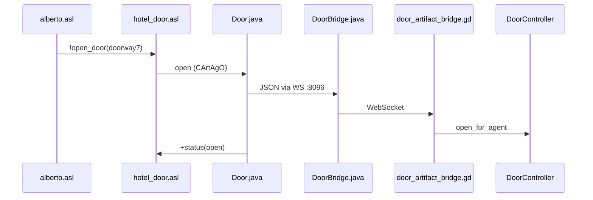

<a id="english"></a>
**🇬🇧 English** · [🇮🇹 Italiano](#italiano)

# MAS JaCaMo — Hotel Valtieri (VEsNA)

**Multi-agent** module of the investigative prototype. It has two roles:

1. **VEsNA** — drives four NPCs (3D bodies) and shared artifacts (doors, digitalis vial, bathroom ambience) connected to the Godot game in [`../game/`](../game/README.md);
2. **ChatBDI** — a **natural-language dialogue** layer that lets the player interrogate the NPCs and a **Game Master** agent by typing in English: the sentence is classified, routed to the right functor via *embedding* and translated to/from KQML messages using Ollama (generation on **Ollama Cloud**, embedding **locally**).

**Stack:** JaCaMo 1.2 · Jason (AgentSpeak) · CArtAgO · 3D bodies via WebSocket (**VEsNA** framework) · **ChatBDI** (NL↔BDI interpreter) · **Ollama**: generation on **Ollama Cloud** (`gpt-oss:120b-cloud`, via `ollama signin`) and **local embedding** (`nomic-embed-text`).

---

## Table of contents

1. [Prerequisites and startup](#1-prerequisites-and-startup)
2. [MAS configuration (`vesna.jcm`)](#2-mas-configuration-vesnajcm)
3. [Source layout](#3-source-layout)
4. [Role of the AgentSpeak files](#4-role-of-the-agentspeak-files)
5. [Coupling with Godot](#5-coupling-with-godot)
6. [Door and movement flow](#6-door-and-movement-flow)
7. [Events from the player (Alberto)](#7-events-from-the-player-alberto)
8. [Build and dependencies](#8-build-and-dependencies)
9. [Extending the MAS](#9-extending-the-mas)
10. [ChatBDI dialogue system](#10-chatbdi-dialogue-system)
11. [Per-agent dialogue dynamics](#11-per-agent-dialogue-dynamics)
12. [Game Master (final accusation)](#12-game-master-final-accusation)
13. [Known issues (LLM models and routing)](#13-known-issues-llm-models-and-routing)

---

## 1. Prerequisites and startup

| Requirement | Version / note |
|-----------|-----------------|
| **JDK** | 23 (toolchain in `build.gradle`) |
| **Gradle** | default `run` task |
| **Godot** | 4.6, project in `../game/`, scene **`Main.tscn`** running |
| **Ollama** | local server (default `http://localhost:11434`) for **embeddings** **and** as a proxy for the cloud login; an **Ollama Cloud** account authenticated with `ollama signin` for **generation** |

### Ollama configuration: cloud generation, local embedding

Since the migration to **Ollama Cloud**, ChatBDI uses two distinct "engines":

- **Generation** (classification + nl2log + log2nl) → **Ollama Cloud**, model **`gpt-oss:120b-cloud`** (far more capable than the old local `qwen2.5:3b-instruct`).
- **Embedding** (routing / functor choice) → **always local**, model **`nomic-embed-text`**.

So a **local Ollama must still be running** (for embeddings and as the sign-in proxy), plus an Ollama Cloud login:

```powershell
ollama signin                 # one-off: enables the *-cloud models (no API key in the repo)
ollama pull nomic-embed-text  # local embedding for routing (functor choice)
```

The mode is hard-wired in [`Ollama.java`](src/agt/chatbdi/Ollama.java): `USE_OLLAMA_CLOUD = true` and `CLOUD_GEN_MODEL = "gpt-oss:120b-cloud"`. Without an API key, generation is **proxied by the local Ollama** after `signin`; alternatively you can set a direct API key (`Authorization: Bearer` header, endpoint `https://ollama.com/api/`). To go **fully local** again, set `USE_OLLAMA_CLOUD = false` and recompile (it reuses `qwen2.5:3b-instruct`).

### Startup order (IMPORTANT)

This order must be respected: at startup the MAS builds the Ollama models and queries the agents already in the scene.

1. **Ollama** — make sure the **local** server is running (for embeddings) and that you have run `ollama signin` (for cloud generation). `ollama list` must show at least `nomic-embed-text`; `gpt-oss:120b-cloud` is reachable after login.
2. **Godot** — start `../game/` and reach the investigative scene (`Main.tscn`), with the four NPCs under `Main/NPC`, the `DoorArtifactBridge` node and the chat panels.
3. **MAS** — from this folder:

```powershell
cd mind
gradle run
```

The JaCaMo launcher loads [`vesna.jcm`](vesna.jcm), starts the `hotel` MAS and builds the (local) *embedding space*. In **cloud mode** the modelfile system prompts are **read and injected inline** on every call (the cloud endpoint does not expose `/api/create`, so the derived models are not "baked"); in local mode the three derived models are compiled instead. The log must show `[ChatBDI] GENERAZIONE = OLLAMA CLOUD -> model='gpt-oss:120b-cloud' …`, `Considering <agent>` for each one (player included) and `GodotBridge listening on http://127.0.0.1:8090`.

> Changing a `.asl` or a `.txt` modelfile requires a **full MAS restart** to take effect (system prompts and the embedding space are loaded only at startup). Changing a `.java` also requires recompilation (`gradle run` does it).

### Ports to keep free

| Port | Component |
|------:|------------|
| 11434 | **Ollama** local (embedding `nomic-embed-text` + sign-in proxy for cloud generation) |
| 8090 | **GodotBridge** HTTP — Godot chat ↔ ChatBDI (`/dialogue`, `/health`) |
| 8096 | Door bridge Godot ↔ `DoorBridge.java` |
| 9084 | Body / agent **Alberto** |
| 9085 | **Evelina** |
| 9086 | **Clarissa** |
| 9087 | **Vittorio** |

> `player` (ChatBDI interpreter) and `gamemaster` have **no** body: they don't use WebSocket, only MAS-internal messages and the HTTP bridge :8090.

---

## 2. MAS configuration (`vesna.jcm`)

File: [`vesna.jcm`](vesna.jcm) — MAS `hotel`, workspace `wp`.

### Agents

| Agent | Program | Body WS port | Class / architecture |
|--------|-----------|---------------:|-------------|
| `alberto` | [`src/agt/alberto.asl`](src/agt/alberto.asl) | 9084 | `ag-class: vesna.VesnaAgent` |
| `evelina` | [`src/agt/evelina.asl`](src/agt/evelina.asl) | 9085 | `ag-class: vesna.VesnaAgent` |
| `clarissa` | [`src/agt/clarissa.asl`](src/agt/clarissa.asl) | 9086 | `ag-class: vesna.VesnaAgent` |
| `vittorio` | [`src/agt/vittorio.asl`](src/agt/vittorio.asl) | 9087 | `ag-class: vesna.VesnaAgent` |
| `gamemaster` | [`src/agt/gamemaster.asl`](src/agt/gamemaster.asl) | — (no body) | plain Jason agent |
| `player` | [`src/agt/player.asl`](src/agt/player.asl) | — (no body) | `ag-arch: chatbdi.Interpreter` |

Common beliefs of the 4 NPCs: `address(localhost)`, `port(...)`, goal `start`.

- **`player`** is the **ChatBDI interpreter** (it represents the human player): it has no beliefs/plans of its own (see [`player.asl`](src/agt/player.asl)), all the logic lives in the [`chatbdi.Interpreter`](src/agt/chatbdi/Interpreter.java) architecture. When it forwards a message to an NPC, the sender is `player` → NPCs react with `+!kqml_received( player, ... )` plans.
- **`gamemaster`** is a bodyless Jason agent that scores the player's final accusation (§12). It is declared **before** `player` in `vesna.jcm` because the interpreter indexes the agents in its `init()`; additionally the Interpreter re-indexes it afterwards with `ensureAgentIndexed` (a safety net if `gamemaster` starts later).

### Artifacts (workspace)

| Name | Class | Role |
|------|--------|--------|
| `doorway` … `doorway7` | `vesna.playgrounds.hotel.Door` | Doors between zones (salon, corridor, rooms) |
| `door_B2`, `door_B3`, `door_B4` | `Door` | Kitchen ↔ garden (portal), kitchen ↔ salon |
| `boccetta_digitalina` | `HotelGrabbable` | Object in the basement (Alberto's mission) |
| `hotel_ambience` | `HotelAmbience` | Ambience operations (e.g. WC flush) |

The door names match the nodes in `Main/NavigationRegion3D/Doors/` and `Main/Door/` in Godot.

---

## 3. Source layout

```text
mind/
├── build.gradle          # JaCaMo 1.2, Java-WebSocket, run task
├── vesna.jcm             # MAS definition
├── build/                # Gradle output (included for immediate run)
├── .gradle/              # local build cache
└── src/
    ├── agt/
    │   ├── vesna.asl                 # generic navigation (!go_to, BFS, doors)
    │   ├── alberto.asl · evelina.asl · clarissa.asl · vittorio.asl   # NPC: VEsNA body + ChatBDI dialogue
    │   ├── gamemaster.asl            # ChatBDI: scores the final accusation (no body)
    │   ├── player.asl                # ChatBDI: interpreter agent (no body; logic in chatbdi.Interpreter)
    │   ├── chatbdi/                  # === ChatBDI layer (NL <-> BDI) ===
    │   │   ├── Interpreter.java      # agent architecture: pipeline + GodotBridge + embedding space
    │   │   ├── Ollama.java           # Ollama client (classify, embed, generate); GEN/EMB model
    │   │   ├── EmbeddingSpace.java   # per-agent functor/term index; findNearest (routing)
    │   │   ├── Tools.java            # preprocess (functor weighted x4), cosine distance
    │   │   ├── ChatUI.java           # Swing chat (debug; stays alive next to Godot)
    │   │   ├── GodotBridge.java      # HTTP server :8090 (/dialogue, /health) for the Godot chat
    │   │   └── modelfiles/           # system prompt + templates of the 3 LLM models
    │   │       ├── classifier.txt              # tell / askOne / askAll
    │   │       ├── nl2log.txt · nl2logPrompt.txt   # NL -> logic term (extraction)
    │   │       └── log2nl.txt · log2nlPrompt.txt   # logic term -> NL (reply)
    │   ├── vesna/
    │   │   ├── VesnaAgent.java       # WS link to the Godot body
    │   │   ├── WsClient.java · WsClientMsgHandler.java
    │   │   └── via/walk.java         # (+ rotate.java, jump.java stub)
    │   └── playgrounds/
    │       ├── hotel.asl             # includes map + doors + officer
    │       └── hotel/
    │           ├── hotel_map.asl           # RCC topology, walk_poi
    │           ├── hotel_officer.asl       # !cammina_a, patrol
    │           ├── hotel_door.asl          # !open_door
    │           └── hotel_alberto_triggers.asl  # missions + player events
    └── env/
        ├── vesna/
        │   ├── SituatedArtifact.java
        │   └── GrabbableArtifact.java
        └── playgrounds/hotel/
            ├── Door.java
            ├── DoorBridge.java       # WS client → Godot :8096
            ├── HotelGrabbable.java
            └── HotelAmbience.java
```

---

## 4. Role of the AgentSpeak files

| File | Responsibility |
|------|----------------|
| [`vesna.asl`](src/agt/vesna.asl) | `!go_to`, `!follow_path`, door/portal handling, basic grab/release |
| [`hotel_map.asl`](src/agt/playgrounds/hotel/hotel_map.asl) | `map_ntpp`, `map_ec`, `walk_poi` facts, stairs, symbolic doors (including the new `giardino1`/`giardino2` POIs, which make the **garden patrollable**) |
| [`hotel_door.asl`](src/agt/playgrounds/hotel/hotel_door.asl) | `!open_door(Door)` via CArtAgO |
| [`hotel_officer.asl`](src/agt/playgrounds/hotel/hotel_officer.asl) | `!cammina_a`, `!patrol_random_loop`, startup delay |
| [`hotel_alberto_triggers.asl`](src/agt/playgrounds/hotel/hotel_alberto_triggers.asl) | digitalis/pills missions, `player_entered`/`exited`, `!alberto_patrol_loop` |
| [`hotel.asl`](src/agt/playgrounds/hotel.asl) | Aggregator: includes map + door + officer |

**Include order in `alberto.asl`:** `hotel.asl` → `hotel_alberto_triggers.asl` → `vesna.asl`.

### `!start` program per agent

| Agent | initial `ntpp` | `my_room` | After delay |
|--------|-----------------|-----------|------------|
| Alberto | salone | room5 | `!alberto_patrol_loop` |
| Evelina | salone | room1 | `!patrol_random_loop` |
| Clarissa | salone | room4 | `!patrol_random_loop` |
| Vittorio | salone | room3 | `!patrol_random_loop` |

---

## 5. Coupling with Godot

Every name used in `!go_to(name)` in the MAS must resolve in Godot ([`../game/vesna/vesna.gd`](../game/vesna/vesna.gd)):

1. Mission marker (`GRABBABLE_MARKERS`)
2. `NavigationRegion3D/Markers/<name>`
3. Zone default (`ZONE_MARKERS`, e.g. `salone` → `salone_camino`)
4. Door waypoint (`DOOR_MARKERS` + current zone)
5. `MapZone_*` region (`NAV_ALIASES`)

### Zone aliases (excerpt)

| JaCaMo | Godot node |
|--------|------------|
| salone | MapZone_salon |
| cucina | MapZone_kitchen |
| corridoio | MapZone_corridoio |
| room1–room6 | MapZone_room1–6 |
| giardino | MapZone_giardino |
| cantina | MapZone_cantina |

POIs and doors are defined in [`hotel_map.asl`](src/agt/playgrounds/hotel/hotel_map.asl) and duplicated as `Marker3D` under `Main/NavigationRegion3D/Markers/`.

The **Notebook map** (`House/Mappa/MapZone_*`) is a parallel system for the player; the VEsNA regions under `NavigationRegion3D/Regions/` are for NPC navigation.

---

## 6. Door and movement flow



- **Movement:** `VesnaAgent` → `walk.java` → WS message → `vesna.gd` → `NavigationAgent3D` → `movement completed` notification to Jason.
- **Shortest-path planning:** in [`vesna.asl`](src/agt/vesna.asl) the "I'm far away" reasoning no longer takes the **first** path produced by the DFS, but **enumerates all simple paths** (`.findall( pair(L,P), find_path_recursive(...) & .length(P,L) )`) and picks the **shortest** (`.min`). So, for example, to reach the basement the agent takes the **direct staircase** instead of a longer detour (east + crossing).
- **Portal** (`door_B2` / `door_B4`): after opening, Godot teleports the body; `PORTAL_REGION` in `vesna.gd` updates the zone (garden ↔ kitchen).
- **Idempotent artifact reuse:** [`SituatedArtifact.java`](src/env/vesna/SituatedArtifact.java) checks **first** whether it is the *same* agent reusing the artifact (a legitimate case, e.g. re-crossing `door_B4` which it hasn't released yet after the portal teleport) and only **then** applies the capacity limit. Without this reorder a reuse failed on the limit (symptom: *"I cannot use door_B4 at giardino"*).

Door topology (excerpt): `doorway` salon↔bathroom; `doorway2`–`7` corridor↔room6,4,2,1,3,5; `door_B3` salon↔kitchen; `door_B2`/`door_B4` kitchen↔garden.

---

## 7. Events from the player (Alberto)

[`../game/scripts/main_game_runtime.gd`](../game/scripts/main_game_runtime.gd) calls `send_mind_signal` on Alberto's body when:

| Godot event | Jason percept (typical) |
|--------------|-------------------------|
| Digitalis clue inspected | `+digitalina_inspected` |
| WC pills inspected | `+pillole_wc_inspected` |
| Player in `room5` / `cantina` | `+player_entered` / `+player_exited` |

The body sends JSON `{sender:"body", type:"signal", data:{type, status, reason}}`; `VesnaAgent` turns it into a percept.

**Resulting missions (Alberto):**

- Digitalis inspected → move the basement vial → release in room5.
- WC pills inspected → `hotel_ambience` `wc_flush` in the bathroom.

---

## 8. Build and dependencies

[`build.gradle`](build.gradle):

- `org.jacamo:jacamo:1.2`
- `Java-WebSocket` 1.5.6, `org.json` 20230227
- `com.formdev:flatlaf:3.0` and `com.github.rjeschke:txtmark:0.13` — look-and-feel and Markdown rendering for ChatBDI's **debug Swing chat** ([`ChatUI.java`](src/agt/chatbdi/ChatUI.java))
- `run` task: `jacamo.infra.JaCaMoLauncher` with argument `vesna.jcm`

The `build/` and `.gradle/` folders are **not** versioned (git-ignored via `.gitignore`): they are regenerated on the first `gradle run`, which compiles and runs the MAS while downloading the dependencies.

---

## 9. Extending the MAS

For a new interrogable NPC:

1. Add an `agent` block in [`vesna.jcm`](vesna.jcm) (unique WS port, e.g. 9088).
2. Create `src/agt/name.asl` with `include("playgrounds/hotel.asl")` and `include("vesna.asl")`.
3. In Godot: a `CharacterBody3D` node under `Main/NPC` with [`vesna.gd`](../game/vesna/vesna.gd), `port` belief aligned.
4. Update [`hotel_map.asl`](src/agt/playgrounds/hotel/hotel_map.asl) and the markers in `Main.tscn` if new POIs are needed.

For a new door artifact: same name in `vesna.jcm`, `hotel_map.asl`, `NavigationRegion3D/Doors/`, `Main/Door/` and runtime registration in Godot.

### Extending an NPC's dialogue (ChatBDI)

To give an NPC a voice you only need **beliefs** in its `.asl` (Jason semantics answers `askOne`/`askAll` questions, with no plans) and a few lines in the modelfiles. The `@name` in front of the message is automatic: it is the character's `role_key`, which must match the **Jason agent name**.

1. **Beliefs** in the `.asl`: one functor = one keyword of the question, **flat atoms** (e.g. `profession(evelina, gallerist).`, never nested terms like `wife(aurelio)` → they break Ollama's JSON schema).
2. **`log2nl.txt`**: add the line `functor(args), askOne -> "english sentence"` for each new atom (this is what produces the final sentence).
3. **`nl2log.txt`**: add an example only if the value is "special" (dates, strings).
4. **`classifier.txt`**: tweak only if a question gets mistaken for a `tell` (or vice versa).
5. **Godot side**: add the `role_key` to `BRIDGE_ROLE_KEYS` in [`../game/scripts/ui/dialogue_chat_ui.gd`](../game/scripts/ui/dialogue_chat_ui.gd) (on/off switch: if absent, the NPC uses static replies).
6. **Restart the MAS** (models and embedding space are rebuilt only at startup).

To react to a **statement** (not a question) you need instead a `+!kqml_received( player, tell, functor(...), _ )` plan + a **decoy belief** with the same functor (necessary because `tell` routing searches the *terms* space, while plan triggers live in the *plans* space). See §10–§11.

---

## 10. ChatBDI dialogue system

ChatBDI links the player's **natural language** to the agents' BDI logic, using Ollama: **generation on Ollama Cloud** (`gpt-oss:120b-cloud`) and **local embedding** (`nomic-embed-text`). The interpreter agent is **`player`** (architecture [`chatbdi.Interpreter`](src/agt/chatbdi/Interpreter.java)).

### Lifecycle of a message

```
[Godot] NPC chat / Game Master panel
   └─ POST :8090/dialogue { role_key, player_text }
[Java] GodotBridge → Interpreter.sendFromBridge([role_key], text)
   1. classify   (classify-ilf model, classifier.txt) → tell | askOne | askAll
   2. findNearest(nomic-embed-text embedding)          → CHOOSES THE FUNCTOR in the agent's domain
   3. nl2log     (nl-to-logic model, nl2log.txt)       → builds the KQML term (fills the arguments)
   4. send KQML to the agent (sender = "player")
[Jason] the target agent
   • askOne/askAll → answers from its belief base (no plans)
   • tell          → triggers a +!kqml_received( player, tell, ... ) plan
   └─ sends a logic term back to "player"
[Java] Interpreter.checkMail → log2nl (logic-to-nl model, log2nl.txt) → english sentence
   └─ GodotBridge.onAgentReply → HTTP response { ok, reply_nl }
```

### Routing = embedding (the delicate point)

The **functor** is not chosen by an LLM but by **embedding proximity**: [`EmbeddingSpace.findNearest`](src/agt/chatbdi/EmbeddingSpace.java) compares the sentence embedding with that of every functor/term in the agent's domain. In [`Tools.preprocess`](src/agt/chatbdi/Tools.java) the **functor is repeated ×4** (weighted): that's why functor names matter a great deal (see §13). Navigation/infrastructure functors are excluded from the index (`IGNORED_FUNCTORS`).

### Components and parameters

| Element | File | Notes |
|---|---|---|
| Interpreter / pipeline / bridge | [`Interpreter.java`](src/agt/chatbdi/Interpreter.java) | indexes all agents at `init()` (`Considering <ag>`); `ensureAgentIndexed(gamemaster)` |
| Ollama client | [`Ollama.java`](src/agt/chatbdi/Ollama.java) | **cloud generation** `GEN_MODEL = gpt-oss:120b-cloud` (`USE_OLLAMA_CLOUD = true`), **local embedding** `EMB_MODEL = nomic-embed-text`, `temperature = 0`, `seed = 42`; leak-guard on log2nl |
| Embedding space | [`EmbeddingSpace.java`](src/agt/chatbdi/EmbeddingSpace.java) | two subspaces: *terms* (beliefs) and *plans*; per-agent domain; always **local** |
| HTTP bridge | [`GodotBridge.java`](src/agt/chatbdi/GodotBridge.java) | `:8090` `/dialogue`, `/health`; single-flight |
| Modelfile | `modelfiles/*.txt` | system prompt (`*_model`) + per-request template (`*Prompt.txt`) |

**Modelfile system prompts** — behavior depends on the mode:

- **Cloud** (default, `USE_OLLAMA_CLOUD = true`): the cloud endpoint does **not** expose `/api/create`, so the modelfiles are **read once at startup and injected inline** as `system` on every generation call (with `temperature`/`seed` passed as `options`). There are no cloud derived models.
- **Local** (`USE_OLLAMA_CLOUD = false`): the modelfiles are "baked" into the derived models (`classify-ilf`, `nl-to-logic`, `logic-to-nl`) by `Ollama.create()` at startup.

In both cases, editing a modelfile requires a **MAS restart**.

> **Leak-guard (cloud).** The cloud model is non-deterministic and may ignore the final translation rule, returning the **raw logic term** (e.g. `your_lighter(aurelio,mine)`) instead of a sentence. [`Ollama.looksLikeLogicTerm`](src/agt/chatbdi/Ollama.java) detects these cases and replaces them with a courtesy sentence (*"I'm not sure I follow — could you ask me that differently?"*), so logic atoms never leak to the player.

---

## 11. Per-agent dialogue dynamics

> The final sentences are in [`log2nl.txt`](src/agt/chatbdi/modelfiles/log2nl.txt); plans/beliefs in the agents' `.asl`. Everything in **English** (embedding is more reliable when question and functors share the same language).

### Common questions (all agents — `askOne` from beliefs)

| Player question | Functor | Answer |
|---|---|---|
| "Who are you?" | `your_identity` | introduction (e.g. "I'm Alberto, a childhood friend of Aurelio.") |
| "What's your name?" | `name` | the name |
| "What's your job?" | `profession` (Alberto also `job`) | trade / role |
| "How do you know Aurelio?" | `relationship` | relationship with the victim |
| "Where were you last night?" | `where_were_you_last_night` | **alibi/account** of the night |
| "Where are you now?" | `where_are_you_now` :- `ntpp(...)` | **live current position** (changes while patrolling) |
| "Who killed Aurelio?" | `killer` | the character's **suspect** |

### Alberto (the culprit — lies and omits)

Alberto answers questions sticking to the cigar alibi, but **admits** omissions if they are **asserted** to him in a targeted way. Statements (`tell`) use `+!kqml_received( player, tell, <functor>, _ )` plans + a decoy belief with the same functor (for routing):

| Player statement | Decoy functor (tell) | Answer (`log2nl`) |
|---|---|---|
| "you asked Clarissa for the keys" | `asked_for_keys` | `admission(alberto, keys)` — admits he asked for the key |
| "Vittorio saw you in the salon" | `met_vittorio_salon` | `admission(alberto, vittorio)` |
| "you went into Evelina's room" | `entered_evelina_room` | `admission(alberto, evelina)` |
| "Aurelio is dead" | `dead` | `grief(alberto)` — condolences |
| "it was you / you killed him" | `accusation` | `defense(alberto)` — defends himself |
| (any other statement) | fallback | `deflect(alberto)` — vaguely denies |

**Action memory (digitalis and pills).** Here the answer depends on *what Alberto actually did* in the VEsNA simulation:

| Statement | If he did NOT act | If he DID act |
|---|---|---|
| "you moved the digitalis" (`digitalina`) | `calm_denial` (denies) | `nervous_denial` (admits: "yes, that's mine… I moved it") |
| "you flushed his pills" (`pills`) | `calm_denial` | `nervous_denial` ("I didn't even notice them…") |

The **`digitalina_relocated`** and **`pillole_wc_flushed`** flags are asserted **only at mission end** ([`hotel_alberto_triggers.asl`](src/agt/playgrounds/hotel/hotel_alberto_triggers.asl)): the missions start after the player *inspects* the clue in Godot (`+digitalina_inspected` / `+pillole_wc_inspected`, §7) and Alberto really goes to move the vial / flush the pills. So the "nervous" answer coincides with a VEsNA action that actually happened. (The same things **asked** as a question → denial.) Alberto also has `lighter` ("I had spare matches") and accuses **Evelina** (`killer`).

### Evelina / Clarissa / Vittorio (truthful)

They answer all common questions truthfully. Differences:

| Agent | `killer` (suspect) | Pills / digitalis | Generic statements |
|---|---|---|---|
| Evelina | **Vittorio** | `i_know_nothing` ("I know nothing about it") | `honest_reply(evelina)` |
| Clarissa | **Alberto** | `i_know_nothing` | `honest_reply(clarissa)` |
| Vittorio | **Clarissa** | `i_know_nothing` | `honest_reply(vittorio)` |

The fallback `+!kqml_received( player, tell, _, _ ) <- honest_reply(...)` avoids the chat "freezing" when the player *asserts* instead of *asking*.

---

## 12. Game Master (final accusation)

The [`gamemaster.asl`](src/agt/gamemaster.asl) agent, queried from the **ESC** panel in Godot ([`game_master_ui.gd`](../game/scripts/ui/game_master_ui.gd)). It receives **a single type** of input: the final accusation *who / with what / why*, extracted into `solution(Who, What, Why)`.

- **Routing**: in the `gamemaster` domain there is **a single indexed functor**, the neutral decoy belief `solution(no_who, no_what, no_why)` → any accusation routes there (neutral atoms so as not to "steal" points or force the value).
- **Scoring**: weights `who = 50`, `what = 25`, `why = 25`; threshold **70**. Naming the killer (`who`) is mandatory; with `who` + at least one other slot you reach 75 ≥ 70.
- **Synonym tolerance**: the check of accepted values (`alberto`; `digitalina`/`digitalis`/`poison`/…; `avoid_denunciation`/`reported`/`exposed`/…) is done **in the plan bodies** (`.member([...])`), which are **not** indexed for routing — so the accusation words (e.g. "poison") don't pollute the embedding space.
- **Verdicts** (in `log2nl.txt`): `result(gamemaster, solved | not_yet | retry)`.
  - **`solved`** → the sentence starts with the **`[SOLVED]`** sentinel: Godot detects it, strips it and shows the **full story** (authored text, 100% faithful, not LLM-generated).
  - **`not_yet`** → a hint to investigate further.
  - **`retry`** → the extraction is empty / off-topic (or the accusation was classified `askOne`): asks to rephrase. It's the anti-garbage net.

Canonical solution of the case: **Alberto · digitalis · avoid being reported** (Aurelio had discovered the embezzlement of funds and was about to report him).

---

## 13. Known issues (LLM models and routing)

Known limitations, important for evaluating the prototype.

- **Generative model: from small-local to cloud** — originally **`qwen2.5:3b-instruct`** was used locally, because the development GPU (GTX 1050, **2 GB of VRAM**) can't handle larger models: a 7B doesn't fit in VRAM and ends up on CPU/RAM, slowing everything down, and a 3B **paraphrases and "merges"** similar examples. This very limit motivated moving **generation to Ollama Cloud** (`gpt-oss:120b-cloud`): a far more capable model, with no local VRAM constraints. The anti-paraphrase mitigations still apply: `log2nl.txt` as a **rigid lookup table** ("use the matching row, don't mix, don't make things up"), `temperature = 0`, `seed = 42`, and the Game Master's neutral decoy. The cloud model, however, is **non-deterministic** and may ignore the translate-only rule: hence a **leak-guard** was added (§10) that intercepts raw logic terms and replaces them with a courtesy sentence.
- **Routing embedder (still local and small)** — unlike generation (now cloud), embedding stays **local** with `nomic-embed-text`: this is where the "small model" fragility now concentrates. The functor is chosen by embedding proximity, and with a weak model this is the most delicate point. With **`all-minilm`** (used initially) there were collisions: *"Who are you"* ended up on `evelina` (functor = proper name) and got confused with *"where are you now"* (both contain "are you", weighted ×4). Interventions: migration to **`nomic-embed-text`** (stronger and lighter, with `search_document:` / `search_query:` prefixes for asymmetric retrieval) and **functor renaming** to separate intents (e.g. `identity` → `your_identity`, "bare name" decoys → descriptive phrases `entered_evelina_room`/`met_vittorio_salon`/`asked_for_keys`).
- **Classification** — an accusation to the Game Master *must* be a `tell`; if it's read as `askOne` the BB answers with the decoy and scoring doesn't run → mitigated with examples in `classifier.txt` and the `retry` verdict.
- **Latency** — each message is **3 generation passes** (classify + nl2log + log2nl), now on **Ollama Cloud**, plus a **local embedding** for routing. With the cloud, latency no longer depends on the local GPU but on the remote service and the network (typically snappier than the old 3B on 2 GB of VRAM, which could take minutes).
- **Residual fragility** — the choice was to stay "**LLM-only**" (no deterministic keyword router), to keep ChatBDI's LLM-driven nature. As a result routing can still get new sentences wrong: the **diagnostic lever** is the `[LOG] nearest: <functor>` line printed by `Interpreter.generateTerm`, which tells whether the error is one of *routing* (rename the functor) or *answer* (adjust `log2nl.txt`).

---

*MAS documentation — aligned with the Godot 4.6 prototype, JaCaMo 1.2 and the ChatBDI layer (Ollama: cloud generation, local embedding).*

---
---

<a id="italiano"></a>
[🇬🇧 English](#english) · **🇮🇹 Italiano**

# MAS JaCaMo — Hotel Valtieri (VEsNA)

Modulo **multi-agente** del prototipo investigativo. Ha due ruoli:

1. **VEsNA** — pilotaggio di quattro NPC (corpi 3D) e artefatti condivisi (porte, boccetta digitalina, ambiente bagno) collegati al gioco Godot in [`../game/`](../game/README.md);
2. **ChatBDI** — un layer di **dialogo in linguaggio naturale** che permette al giocatore di interrogare gli NPC e un agente **Game Master** scrivendo in inglese: la frase viene classificata, instradata al funtore giusto via *embedding* e tradotta in/da messaggi KQML usando Ollama (generazione su **Ollama Cloud**, embedding in **locale**).

**Stack:** JaCaMo 1.2 · Jason (AgentSpeak) · CArtAgO · corpi 3D via WebSocket (framework **VEsNA**) · **ChatBDI** (interprete NL↔BDI) · **Ollama**: generazione su **Ollama Cloud** (`gpt-oss:120b-cloud`, via `ollama signin`) ed **embedding in locale** (`nomic-embed-text`).

---

## Indice

1. [Prerequisiti e avvio](#1-prerequisiti-e-avvio)
2. [Configurazione MAS (`vesna.jcm`)](#2-configurazione-mas-vesnajcm)
3. [Struttura sorgenti](#3-struttura-sorgenti)
4. [Ruolo dei file AgentSpeak](#4-ruolo-dei-file-agentspeak)
5. [Accoppiamento con Godot](#5-accoppiamento-con-godot)
6. [Flusso porte e movimento](#6-flusso-porte-e-movimento)
7. [Eventi dal giocatore (Alberto)](#7-eventi-dal-giocatore-alberto)
8. [Build e dipendenze](#8-build-e-dipendenze)
9. [Estendere il MAS](#9-estendere-il-mas)
10. [Sistema di dialogo ChatBDI](#10-sistema-di-dialogo-chatbdi)
11. [Dinamiche di dialogo per agente](#11-dinamiche-di-dialogo-per-agente)
12. [Game Master (accusa finale)](#12-game-master-accusa-finale)
13. [Problematiche (modelli LLM e routing)](#13-problematiche-modelli-llm-e-routing)

---

## 1. Prerequisiti e avvio

| Requisito | Versione / nota |
|-----------|-----------------|
| **JDK** | 23 (toolchain in `build.gradle`) |
| **Gradle** | task `run` predefinito |
| **Godot** | 4.6, progetto in `../game/`, scena **`Main.tscn`** in esecuzione |
| **Ollama** | server locale (default `http://localhost:11434`) per gli **embedding** **e** come proxy del login cloud; account **Ollama Cloud** autenticato con `ollama signin` per la **generazione** |

### Configurazione Ollama: generazione su Cloud, embedding in locale

Dalla migrazione a **Ollama Cloud**, ChatBDI usa due "motori" distinti:

- **Generazione** (classificazione + nl2log + log2nl) → **Ollama Cloud**, modello **`gpt-oss:120b-cloud`** (molto più capace del vecchio `qwen2.5:3b-instruct` locale).
- **Embedding** (routing / scelta del funtore) → **sempre in locale**, modello **`nomic-embed-text`**.

Serve quindi **comunque un Ollama locale in esecuzione** (per gli embedding e come proxy del sign-in), più un login a Ollama Cloud:

```powershell
ollama signin                 # una tantum: abilita i modelli *-cloud (nessuna API key nel repo)
ollama pull nomic-embed-text  # embedding locale per il routing (scelta del funtore)
```

La modalità è cablata in [`Ollama.java`](src/agt/chatbdi/Ollama.java): `USE_OLLAMA_CLOUD = true` e `CLOUD_GEN_MODEL = "gpt-oss:120b-cloud"`. Senza API key, la generazione è **proxata dall'Ollama locale** dopo il `signin`; in alternativa si può impostare una API key diretta (header `Authorization: Bearer`, endpoint `https://ollama.com/api/`). Per tornare **tutto locale** basta `USE_OLLAMA_CLOUD = false` e ricompilare (riusa `qwen2.5:3b-instruct`).

### Ordine di avvio (IMPORTANTE)

Va rispettato questo ordine: il MAS, all'avvio, costruisce i modelli Ollama e interroga gli agenti già in scena.

1. **Ollama** — assicurarsi che il server **locale** sia attivo (per gli embedding) e di aver fatto `ollama signin` (per la generazione cloud). `ollama list` deve mostrare almeno `nomic-embed-text`; `gpt-oss:120b-cloud` è raggiungibile dopo il login.
2. **Godot** — avviare `../game/` e raggiungere la scena investigativa (`Main.tscn`), con i quattro NPC sotto `Main/NPC`, il nodo `DoorArtifactBridge` e i pannelli chat.
3. **MAS** — da questa cartella:

```powershell
cd mind
gradle run
```

Il launcher JaCaMo carica [`vesna.jcm`](vesna.jcm), avvia il MAS `hotel` e costruisce l'*embedding space* (locale). In **modalità cloud** i system prompt dei modelfile vengono **letti e iniettati inline** a ogni chiamata (l'endpoint cloud non espone `/api/create`, quindi i modelli derivati non vengono "cotti"); in modalità locale vengono invece compilati i tre modelli derivati. Nel log devono comparire `[ChatBDI] GENERAZIONE = OLLAMA CLOUD -> model='gpt-oss:120b-cloud' …`, `Considering <agente>` per ognuno (player incluso) e `GodotBridge listening on http://127.0.0.1:8090`.

> Cambiare un `.asl` o un modelfile `.txt` richiede un **riavvio completo del MAS** per avere effetto (i system prompt e l'embedding space si caricano solo all'avvio). Cambiare un `.java` richiede anche la ricompilazione (`gradle run` la fa).

### Porte da tenere libere

| Porta | Componente |
|------:|------------|
| 11434 | **Ollama** locale (embedding `nomic-embed-text` + proxy del sign-in per la generazione cloud) |
| 8090 | **GodotBridge** HTTP — chat Godot ↔ ChatBDI (`/dialogue`, `/health`) |
| 8096 | Bridge porte Godot ↔ `DoorBridge.java` |
| 9084 | Corpo / agente **Alberto** |
| 9085 | **Evelina** |
| 9086 | **Clarissa** |
| 9087 | **Vittorio** |

> `player` (interprete ChatBDI) e `gamemaster` **non** hanno un corpo: non usano WebSocket, solo i messaggi interni al MAS e il bridge HTTP :8090.

---

## 2. Configurazione MAS (`vesna.jcm`)

File: [`vesna.jcm`](vesna.jcm) — MAS `hotel`, workspace `wp`.

### Agenti

| Agente | Programma | Porta WS corpo | Classe / architettura |
|--------|-----------|---------------:|-------------|
| `alberto` | [`src/agt/alberto.asl`](src/agt/alberto.asl) | 9084 | `ag-class: vesna.VesnaAgent` |
| `evelina` | [`src/agt/evelina.asl`](src/agt/evelina.asl) | 9085 | `ag-class: vesna.VesnaAgent` |
| `clarissa` | [`src/agt/clarissa.asl`](src/agt/clarissa.asl) | 9086 | `ag-class: vesna.VesnaAgent` |
| `vittorio` | [`src/agt/vittorio.asl`](src/agt/vittorio.asl) | 9087 | `ag-class: vesna.VesnaAgent` |
| `gamemaster` | [`src/agt/gamemaster.asl`](src/agt/gamemaster.asl) | — (nessun corpo) | agente Jason puro |
| `player` | [`src/agt/player.asl`](src/agt/player.asl) | — (nessun corpo) | `ag-arch: chatbdi.Interpreter` |

Belief comuni dei 4 NPC: `address(localhost)`, `port(...)`, goal `start`.

- **`player`** è l'**interprete ChatBDI** (rappresenta il giocatore umano): non ha belief/plan propri (vedi [`player.asl`](src/agt/player.asl)), tutta la logica è nell'architettura [`chatbdi.Interpreter`](src/agt/chatbdi/Interpreter.java). Quando inoltra un messaggio a un NPC, il mittente è `player` → gli NPC reagiscono con piani `+!kqml_received( player, ... )`.
- **`gamemaster`** è un agente Jason senza corpo che valuta l'accusa finale del giocatore (§12). È dichiarato **prima** di `player` in `vesna.jcm` perché l'interprete indicizza gli agenti al suo `init()`; in più l'Interpreter lo re-indicizza a posteriori con `ensureAgentIndexed` (rete di sicurezza se il `gamemaster` parte dopo).

### Artifact (workspace)

| Nome | Classe | Ruolo |
|------|--------|--------|
| `doorway` … `doorway7` | `vesna.playgrounds.hotel.Door` | Porte tra zone (salone, corridoio, camere) |
| `door_B2`, `door_B3`, `door_B4` | `Door` | Cucina ↔ giardino (portal), cucina ↔ salone |
| `boccetta_digitalina` | `HotelGrabbable` | Oggetto in cantina (missione Alberto) |
| `hotel_ambience` | `HotelAmbience` | Operazioni ambiente (es. flush WC) |

I nomi delle porte coincidono con i nodi in `Main/NavigationRegion3D/Doors/` e con `Main/Door/` in Godot.

---

## 3. Struttura sorgenti

```text
mind/
├── build.gradle          # JaCaMo 1.2, Java-WebSocket, task run
├── vesna.jcm             # definizione MAS
├── build/                # output Gradle (incluso per esecuzione immediata)
├── .gradle/              # cache build locale
└── src/
    ├── agt/
    │   ├── vesna.asl                 # navigazione generica (!go_to, BFS, porte)
    │   ├── alberto.asl · evelina.asl · clarissa.asl · vittorio.asl   # NPC: corpo VEsNA + dialogo ChatBDI
    │   ├── gamemaster.asl            # ChatBDI: valuta l'accusa finale (no corpo)
    │   ├── player.asl                # ChatBDI: agente interprete (no corpo; logica in chatbdi.Interpreter)
    │   ├── chatbdi/                  # === layer ChatBDI (NL <-> BDI) ===
    │   │   ├── Interpreter.java      # agent architecture: pipeline + GodotBridge + embedding space
    │   │   ├── Ollama.java           # client Ollama (classify, embed, generate); GEN/EMB model
    │   │   ├── EmbeddingSpace.java   # indice funtori/termini per agente; findNearest (routing)
    │   │   ├── Tools.java            # preprocess (funtore pesato x4), distanza coseno
    │   │   ├── ChatUI.java           # chat Swing (debug; resta viva accanto a Godot)
    │   │   ├── GodotBridge.java      # server HTTP :8090 (/dialogue, /health) per la chat Godot
    │   │   └── modelfiles/           # system prompt + template dei 3 modelli LLM
    │   │       ├── classifier.txt              # tell / askOne / askAll
    │   │       ├── nl2log.txt · nl2logPrompt.txt   # NL -> termine logico (estrazione)
    │   │       └── log2nl.txt · log2nlPrompt.txt   # termine logico -> NL (risposta)
    │   ├── vesna/
    │   │   ├── VesnaAgent.java       # collegamento WS al corpo Godot
    │   │   ├── WsClient.java · WsClientMsgHandler.java
    │   │   └── via/walk.java         # (+ rotate.java, jump.java stub)
    │   └── playgrounds/
    │       ├── hotel.asl             # include mappa + porte + officer
    │       └── hotel/
    │           ├── hotel_map.asl           # topologia RCC, walk_poi
    │           ├── hotel_officer.asl       # !cammina_a, patrol
    │           ├── hotel_door.asl          # !open_door
    │           └── hotel_alberto_triggers.asl  # missioni + eventi player
    └── env/
        ├── vesna/
        │   ├── SituatedArtifact.java
        │   └── GrabbableArtifact.java
        └── playgrounds/hotel/
            ├── Door.java
            ├── DoorBridge.java       # client WS → Godot :8096
            ├── HotelGrabbable.java
            └── HotelAmbience.java
```

---

## 4. Ruolo dei file AgentSpeak

| File | Responsabilità |
|------|----------------|
| [`vesna.asl`](src/agt/vesna.asl) | `!go_to`, `!follow_path`, gestione porte/portal, grab/release base |
| [`hotel_map.asl`](src/agt/playgrounds/hotel/hotel_map.asl) | Fatti `map_ntpp`, `map_ec`, `walk_poi`, scale, porte simboliche (inclusi i nuovi POI `giardino1`/`giardino2`, che rendono il **giardino pattugliabile**) |
| [`hotel_door.asl`](src/agt/playgrounds/hotel/hotel_door.asl) | `!open_door(Door)` via CArtAgO |
| [`hotel_officer.asl`](src/agt/playgrounds/hotel/hotel_officer.asl) | `!cammina_a`, `!patrol_random_loop`, delay avvio |
| [`hotel_alberto_triggers.asl`](src/agt/playgrounds/hotel/hotel_alberto_triggers.asl) | Missioni digitalina/pillole, `player_entered`/`exited`, `!alberto_patrol_loop` |
| [`hotel.asl`](src/agt/playgrounds/hotel.asl) | Aggregator: include map + door + officer |

**Ordine include in `alberto.asl`:** `hotel.asl` → `hotel_alberto_triggers.asl` → `vesna.asl`.

### Programma `!start` per agente

| Agente | `ntpp` iniziale | `my_room` | Dopo delay |
|--------|-----------------|-----------|------------|
| Alberto | salone | room5 | `!alberto_patrol_loop` |
| Evelina | salone | room1 | `!patrol_random_loop` |
| Clarissa | salone | room4 | `!patrol_random_loop` |
| Vittorio | salone | room3 | `!patrol_random_loop` |

---

## 5. Accoppiamento con Godot

Ogni nome usato in `!go_to(nome)` nel MAS deve risolversi in Godot ([`../game/vesna/vesna.gd`](../game/vesna/vesna.gd)):

1. Marker missione (`GRABBABLE_MARKERS`)
2. `NavigationRegion3D/Markers/<nome>`
3. Default zona (`ZONE_MARKERS`, es. `salone` → `salone_camino`)
4. Waypoint porta (`DOOR_MARKERS` + zona corrente)
5. Regione `MapZone_*` (`NAV_ALIASES`)

### Alias zona (estratto)

| JaCaMo | Nodo Godot |
|--------|------------|
| salone | MapZone_salon |
| cucina | MapZone_kitchen |
| corridoio | MapZone_corridoio |
| room1–room6 | MapZone_room1–6 |
| giardino | MapZone_giardino |
| cantina | MapZone_cantina |

POI e porte sono definiti in [`hotel_map.asl`](src/agt/playgrounds/hotel/hotel_map.asl) e duplicati come `Marker3D` sotto `Main/NavigationRegion3D/Markers/`.

La **mappa del Taccuino** (`House/Mappa/MapZone_*`) è un sistema parallelo per il giocatore; le regioni VEsNA sotto `NavigationRegion3D/Regions/` servono alla navigazione NPC.

---

## 6. Flusso porte e movimento


- **Movimento:** `VesnaAgent` → `walk.java` → messaggio WS → `vesna.gd` → `NavigationAgent3D` → notifica `movement completed` a Jason.
- **Pianificazione a cammino minimo:** in [`vesna.asl`](src/agt/vesna.asl) il ragionamento "sono lontano" non prende più il **primo** cammino prodotto dalla DFS, ma **enumera tutti i cammini semplici** (`.findall( pair(L,P), find_path_recursive(...) & .length(P,L) )`) e ne sceglie il **minimo** (`.min`). Così, ad esempio, per raggiungere la cantina l'agente prende la **scala diretta** invece di un giro più lungo (est + attraversamento).
- **Portal** (`door_B2` / `door_B4`): dopo apertura, Godot teleporta il corpo; `PORTAL_REGION` in `vesna.gd` aggiorna la zona (giardino ↔ cucina).
- **Riuso idempotente degli artefatti:** [`SituatedArtifact.java`](src/env/vesna/SituatedArtifact.java) controlla **prima** se è lo *stesso* agente a riusare l'artefatto (caso legittimo, es. riattraversa `door_B4` che non ha ancora liberato dopo il teleport del portale) e solo **dopo** applica il limite di capacità. Senza questo riordino un riuso falliva sul limite (sintomo: *"I cannot use door_B4 at giardino"*).

Topologia porte (estratto): `doorway` salone↔bagno; `doorway2`–`7` corridoio↔room6,4,2,1,3,5; `door_B3` salone↔cucina; `door_B2`/`door_B4` cucina↔giardino.

---

## 7. Eventi dal giocatore (Alberto)

[`../game/scripts/main_game_runtime.gd`](../game/scripts/main_game_runtime.gd) invoca `send_mind_signal` sul corpo Alberto quando:

| Evento Godot | Percezione Jason (tipica) |
|--------------|-------------------------|
| Ispezione indizio digitalina | `+digitalina_inspected` |
| Ispezione pillole WC | `+pillole_wc_inspected` |
| Player in `room5` / `cantina` | `+player_entered` / `+player_exited` |

Il corpo invia JSON `{sender:"body", type:"signal", data:{type, status, reason}}`; `VesnaAgent` lo traduce in percezione.

**Missioni conseguenti (Alberto):**

- Digitalina ispezionata → spostamento boccetta cantina → release in room5.
- Pillole WC ispezionate → `hotel_ambience` `wc_flush` in bagno.

---

## 8. Build e dipendenze

[`build.gradle`](build.gradle):

- `org.jacamo:jacamo:1.2`
- `Java-WebSocket` 1.5.6, `org.json` 20230227
- `com.formdev:flatlaf:3.0` e `com.github.rjeschke:txtmark:0.13` — look-and-feel e rendering Markdown della **chat Swing di debug** di ChatBDI ([`ChatUI.java`](src/agt/chatbdi/ChatUI.java))
- Task `run`: `jacamo.infra.JaCaMoLauncher` con argomento `vesna.jcm`

Le cartelle `build/` e `.gradle/` **non** sono versionate (sono escluse dal `.gitignore`): vengono rigenerate al primo `gradle run`, che compila ed esegue il MAS scaricando le dipendenze.

---

## 9. Estendere il MAS

Per un nuovo NPC investigabile:

1. Aggiungere blocco `agent` in [`vesna.jcm`](vesna.jcm) (porta WS univoca, es. 9088).
2. Creare `src/agt/nome.asl` con `include("playgrounds/hotel.asl")` e `include("vesna.asl")`.
3. In Godot: nodo `CharacterBody3D` sotto `Main/NPC` con [`vesna.gd`](../game/vesna/vesna.gd), belief `port` allineata.
4. Aggiornare [`hotel_map.asl`](src/agt/playgrounds/hotel/hotel_map.asl) e marker in `Main.tscn` se servono nuovi POI.

Per un nuovo artifact porta: stesso nome in `vesna.jcm`, `hotel_map.asl`, `NavigationRegion3D/Doors/`, `Main/Door/` e registrazione runtime in Godot.

### Estendere il dialogo di un NPC (ChatBDI)

Per dare voce a un NPC servono **solo belief** nel suo `.asl` (a domande `askOne`/`askAll` risponde la semantica di Jason, senza piani) e qualche riga nei modelfile. L'`@nome` davanti al messaggio è automatico: è il `role_key` del personaggio, che deve coincidere col **nome dell'agente Jason**.

1. **Belief** nel `.asl`: un funtore = una parola-chiave della domanda, **atomi piatti** (es. `profession(evelina, gallerist).`, mai termini annidati come `wife(aurelio)` → mandano in errore lo schema JSON di Ollama).
2. **`log2nl.txt`**: aggiungere la riga `funtore(args), askOne -> "frase in inglese"` per ogni nuovo atomo (è ciò che produce la frase finale).
3. **`nl2log.txt`**: aggiungere un esempio solo se il valore è "particolare" (date, stringhe).
4. **`classifier.txt`**: ritoccare solo se una domanda viene scambiata per `tell` (o viceversa).
5. **Lato Godot**: aggiungere il `role_key` a `BRIDGE_ROLE_KEYS` in [`../game/scripts/ui/dialogue_chat_ui.gd`](../game/scripts/ui/dialogue_chat_ui.gd) (interruttore on/off: se assente, l'NPC usa risposte statiche).
6. **Riavviare il MAS** (i modelli e l'embedding space si ricostruiscono solo all'avvio).

Per reagire a un'**affermazione** (non a una domanda) serve invece un piano `+!kqml_received( player, tell, funtore(...), _ )` + una **belief-esca** con lo stesso funtore (necessaria perché il routing dei `tell` cerca nello spazio dei *termini*, mentre i trigger dei piani stanno nello spazio dei *piani*). Vedi §10–§11.

---

## 10. Sistema di dialogo ChatBDI

ChatBDI collega il **linguaggio naturale** del giocatore alla logica BDI degli agenti, usando Ollama: **generazione su Ollama Cloud** (`gpt-oss:120b-cloud`) ed **embedding in locale** (`nomic-embed-text`). L'agente interprete è **`player`** (architettura [`chatbdi.Interpreter`](src/agt/chatbdi/Interpreter.java)).

### Pipeline di un messaggio

```
[Godot] chat NPC / pannello Game Master
   └─ POST :8090/dialogue { role_key, player_text }
[Java] GodotBridge → Interpreter.sendFromBridge([role_key], testo)
   1. classify   (modello classify-ilf, classifier.txt) → tell | askOne | askAll
   2. findNearest(embedding nomic-embed-text)           → SCEGLIE IL FUNTORE nel dominio dell'agente
   3. nl2log     (modello nl-to-logic, nl2log.txt)      → costruisce il termine KQML (riempie gli argomenti)
   4. invio KQML all'agente (mittente = "player")
[Jason] l'agente destinatario
   • askOne/askAll → risponde dalla sua base di belief (senza piani)
   • tell          → fa scattare un piano +!kqml_received( player, tell, ... )
   └─ rimanda un termine logico a "player"
[Java] Interpreter.checkMail → log2nl (modello logic-to-nl, log2nl.txt) → frase in inglese
   └─ GodotBridge.onAgentReply → risposta HTTP { ok, reply_nl }
```

### Routing = embedding (il punto delicato)

Il **funtore** non è scelto da un LLM ma per **vicinanza di embedding**: [`EmbeddingSpace.findNearest`](src/agt/chatbdi/EmbeddingSpace.java) confronta l'embedding della frase con quello di ogni funtore/termine del dominio dell'agente. In [`Tools.preprocess`](src/agt/chatbdi/Tools.java) il **funtore viene ripetuto ×4** (pesato): per questo i nomi dei funtori contano moltissimo (vedi §13). Funtori di navigazione/infrastruttura sono esclusi dall'indice (`IGNORED_FUNCTORS`).

### Componenti e parametri

| Elemento | File | Note |
|---|---|---|
| Interprete / pipeline / bridge | [`Interpreter.java`](src/agt/chatbdi/Interpreter.java) | indicizza tutti gli agenti al `init()` (`Considering <ag>`); `ensureAgentIndexed(gamemaster)` |
| Client Ollama | [`Ollama.java`](src/agt/chatbdi/Ollama.java) | **generazione cloud** `GEN_MODEL = gpt-oss:120b-cloud` (`USE_OLLAMA_CLOUD = true`), **embedding locale** `EMB_MODEL = nomic-embed-text`, `temperature = 0`, `seed = 42`; leak-guard su log2nl |
| Spazio embedding | [`EmbeddingSpace.java`](src/agt/chatbdi/EmbeddingSpace.java) | due sottospazi: *termini* (belief) e *piani*; dominio per agente; sempre **locale** |
| Bridge HTTP | [`GodotBridge.java`](src/agt/chatbdi/GodotBridge.java) | `:8090` `/dialogue`, `/health`; single-flight |
| Modelfile | `modelfiles/*.txt` | system prompt (`*_model`) + template per-richiesta (`*Prompt.txt`) |

**System prompt dei modelfile** — il comportamento dipende dalla modalità:

- **Cloud** (default, `USE_OLLAMA_CLOUD = true`): l'endpoint cloud **non** espone `/api/create`, quindi i modelfile vengono **letti una volta all'avvio e iniettati inline** come `system` a ogni chiamata di generazione (con `temperature`/`seed` passati come `options`). Non esistono modelli derivati cloud.
- **Locale** (`USE_OLLAMA_CLOUD = false`): i modelfile vengono "cotti" nei modelli derivati (`classify-ilf`, `nl-to-logic`, `logic-to-nl`) da `Ollama.create()` all'avvio.

In entrambi i casi modificare un modelfile richiede il **riavvio del MAS**.

> **Leak-guard (cloud).** Il modello cloud non è deterministico e può ignorare la regola di traduzione finale, restituendo il **termine logico grezzo** (es. `your_lighter(aurelio,mine)`) invece di una frase. [`Ollama.looksLikeLogicTerm`](src/agt/chatbdi/Ollama.java) rileva questi casi e li sostituisce con una frase di cortesia (*"I'm not sure I follow — could you ask me that differently?"*), così al giocatore non trapelano mai atomi logici.

---

## 11. Dinamiche di dialogo per agente

> Le frasi finali sono in [`log2nl.txt`](src/agt/chatbdi/modelfiles/log2nl.txt); i piani/belief negli `.asl` degli agenti. Tutto in **inglese** (l'embedding è più affidabile mantenendo la stessa lingua di domanda e funtori).

### Domande comuni (tutti gli agenti — `askOne` dalle belief)

| Domanda del giocatore | Funtore | Risposta |
|---|---|---|
| "Who are you?" | `your_identity` | presentazione (es. "I'm Alberto, a childhood friend of Aurelio.") |
| "What's your name?" | `name` | il nome |
| "What's your job?" | `profession` (Alberto anche `job`) | mestiere / ruolo |
| "How do you know Aurelio?" | `relationship` | rapporto con la vittima |
| "Where were you last night?" | `where_were_you_last_night` | **alibi/racconto** della notte |
| "Where are you now?" | `where_are_you_now` :- `ntpp(...)` | **posizione viva** corrente (cambia mentre pattuglia) |
| "Who killed Aurelio?" | `killer` | il **sospetto** del personaggio |

### Alberto (il colpevole — mente e omette)

Alberto risponde alle domande sostenendo l'alibi del sigaro, ma **ammette** le omissioni se gli vengono **affermate** in modo mirato. Le affermazioni (`tell`) usano piani `+!kqml_received( player, tell, <funtore>, _ )` + una belief-esca con lo stesso funtore (per il routing):

| Affermazione del giocatore | Funtore-esca (tell) | Risposta (`log2nl`) |
|---|---|---|
| "you asked Clarissa for the keys" | `asked_for_keys` | `admission(alberto, keys)` — ammette di aver chiesto la chiave |
| "Vittorio saw you in the salon" | `met_vittorio_salon` | `admission(alberto, vittorio)` |
| "you went into Evelina's room" | `entered_evelina_room` | `admission(alberto, evelina)` |
| "Aurelio is dead" | `dead` | `grief(alberto)` — cordoglio |
| "it was you / you killed him" | `accusation` | `defense(alberto)` — si difende |
| (qualsiasi altra affermazione) | fallback | `deflect(alberto)` — nega vagamente |

**Memoria delle azioni (digitalina e pillole).** Qui la risposta dipende da *cosa Alberto ha realmente fatto* nella simulazione VEsNA:

| Affermazione | Se NON ha agito | Se HA agito |
|---|---|---|
| "you moved the digitalis" (`digitalina`) | `calm_denial` (nega) | `nervous_denial` (ammette: "yes, that's mine… I moved it") |
| "you flushed his pills" (`pills`) | `calm_denial` | `nervous_denial` ("I didn't even notice them…") |

I flag **`digitalina_relocated`** e **`pillole_wc_flushed`** sono asseriti **solo a fine missione** ([`hotel_alberto_triggers.asl`](src/agt/playgrounds/hotel/hotel_alberto_triggers.asl)): le missioni partono dopo che il giocatore *ispeziona* l'indizio in Godot (`+digitalina_inspected` / `+pillole_wc_inspected`, §7) e Alberto va davvero a spostare la boccetta / scaricare le pillole. Quindi la risposta "nervosa" coincide con un'azione VEsNA effettivamente avvenuta. (Le stesse cose **chieste** come domanda → negazione.) Alberto inoltre ha `lighter` ("I had spare matches") e accusa **Evelina** (`killer`).

### Evelina / Clarissa / Vittorio (sinceri)

Rispondono con verità a tutte le domande comuni. Differenze:

| Agente | `killer` (sospetto) | Pillole / digitalina | Affermazioni generiche |
|---|---|---|---|
| Evelina | **Vittorio** | `i_know_nothing` ("non ne so nulla") | `honest_reply(evelina)` |
| Clarissa | **Alberto** | `i_know_nothing` | `honest_reply(clarissa)` |
| Vittorio | **Clarissa** | `i_know_nothing` | `honest_reply(vittorio)` |

Il fallback `+!kqml_received( player, tell, _, _ ) <- honest_reply(...)` evita il "freeze" della chat quando il giocatore *afferma* invece di *chiedere*.

---

## 12. Game Master (accusa finale)

Agente [`gamemaster.asl`](src/agt/gamemaster.asl), interrogato dal pannello **ESC** in Godot ([`game_master_ui.gd`](../game/scripts/ui/game_master_ui.gd)). Riceve **un solo tipo** di input: l'accusa finale *chi / con cosa / perché*, estratta in `solution(Who, What, Why)`.

- **Routing**: nel dominio del `gamemaster` c'è **un solo funtore indicizzato**, la belief-esca neutra `solution(no_who, no_what, no_why)` → qualunque accusa instrada lì (atomi neutri per non "rubare" punti né forzare il valore).
- **Scoring**: pesi `who = 50`, `what = 25`, `why = 25`; soglia **70**. Nominare l'assassino (`who`) è obbligatorio; con `who` + almeno un altro slot si arriva a 75 ≥ 70.
- **Tolleranza ai sinonimi**: la verifica dei valori accettati (`alberto`; `digitalina`/`digitalis`/`poison`/…; `avoid_denunciation`/`reported`/`exposed`/…) è fatta **nei body dei piani** (`.member([...])`), che **non** vengono indicizzati per il routing — così le parole dell'accusa (es. "poison") non inquinano l'embedding space.
- **Verdetti** (in `log2nl.txt`): `result(gamemaster, solved | not_yet | retry)`.
  - **`solved`** → la frase inizia con la sentinella **`[SOLVED]`**: Godot la rileva, la rimuove e mostra la **storia completa** (testo autorale, fedele al 100%, non generato dall'LLM).
  - **`not_yet`** → suggerimento a indagare meglio.
  - **`retry`** → l'estrazione è vuota / fuori tema (o l'accusa è stata classificata `askOne`): chiede di riformulare. È la rete anti-garbage.

Soluzione canonica del caso: **Alberto · digitalina · evitare la denuncia** (Aurelio aveva scoperto la sottrazione di fondi e lo avrebbe denunciato).

---

## 13. Problematiche (modelli LLM e routing)

Limiti noti, importanti per la valutazione del prototipo.

- **Modello generativo: dal piccolo-locale al cloud** — in origine si usava **`qwen2.5:3b-instruct`** in locale, perché la GPU di sviluppo (GTX 1050, **2 GB di VRAM**) non regge modelli più grandi: un 7B non entra in VRAM e finisce su CPU/RAM, rallentando tutto, e un 3B **parafrasa e "fonde"** esempi simili. Proprio questo limite ha motivato lo spostamento della **generazione su Ollama Cloud** (`gpt-oss:120b-cloud`): un modello molto più capace, senza vincoli di VRAM locale. Restano valide le mitigazioni anti-parafrasi: `log2nl.txt` come **tabella di lookup rigida** ("usa la riga che combacia, non mescolare, non inventare"), `temperature = 0`, `seed = 42`, e l'esca neutra del Game Master. Il modello cloud però **non è deterministico** e può ignorare la regola di sola-traduzione: per questo è stato aggiunto un **leak-guard** (§10) che intercetta i termini logici grezzi e li sostituisce con una frase di cortesia.
- **Embedder del routing (ancora locale e piccolo)** — a differenza della generazione (ora cloud), l'embedding resta **in locale** con `nomic-embed-text`: è quindi qui che si concentra ora la fragilità da "modello piccolo". Il funtore è scelto per vicinanza di embedding e con un modello debole questo è il punto più delicato. Con **`all-minilm`** (usato inizialmente) si avevano collisioni: *"Who are you"* finiva su `evelina` (funtore = nome proprio) e si confondeva con *"where are you now"* (entrambe contengono "are you", pesato ×4). Interventi: migrazione a **`nomic-embed-text`** (più forte e leggero, con prefissi `search_document:` / `search_query:` per il retrieval asimmetrico) e **rinomina dei funtori** per separare gli intent (es. `identity` → `your_identity`, esche a "nome nudo" → frasi descrittive `entered_evelina_room`/`met_vittorio_salon`/`asked_for_keys`).
- **Classificazione** — un'accusa al Game Master *deve* essere `tell`; se viene letta come `askOne` la BB risponde con l'esca e lo scoring non gira → mitigato con esempi nel `classifier.txt` e con il verdetto `retry`.
- **Latenza** — ogni messaggio sono **3 passaggi di generazione** (classify + nl2log + log2nl), ora su **Ollama Cloud**, più un **embedding locale** per il routing. Con il cloud la latenza non dipende più dalla GPU locale ma dal servizio remoto e dalla rete (tipicamente più reattiva del vecchio 3B su 2 GB di VRAM, che poteva richiedere minuti).
- **Fragilità residua** — si è scelto di restare "**solo LLM**" (niente router deterministico a parole chiave), per mantenere la natura LLM-driven di ChatBDI. Di conseguenza il routing può ancora sbagliare su frasi nuove: la **leva diagnostica** è il log `[LOG] nearest: <funtore>` stampato da `Interpreter.generateTerm`, da cui si capisce se l'errore è di *instradamento* (rinominare il funtore) o di *risposta* (aggiustare `log2nl.txt`).

---

*Documentazione MAS — allineata al prototipo Godot 4.6, JaCaMo 1.2 e al layer ChatBDI (Ollama: generazione cloud, embedding locale).*
